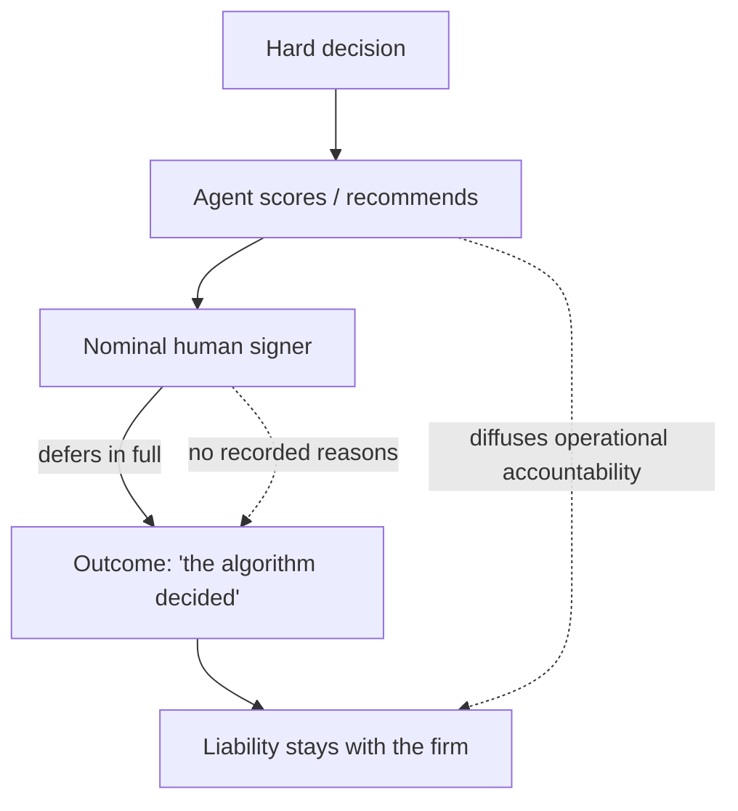

# Accountability Laundering via Algorithm

**Also known as:** Algorithmic Responsibility Diffusion, The Algorithm Decided

**Category:** Anti-Patterns  
**Status in practice:** deprecated

## Intent

Anti-pattern: route a hard decision through an agent so no person owns the outcome, treating the recommendation as the decision while the firm's legal liability stays unchanged.

## Context

An organisation faces decisions that are uncomfortable to own: which staff to cut, which loan to refuse, which supplier to drop. A board or manager introduces an agent that scores or recommends an option. On paper a human signs the decision, but in practice the human follows the recommendation in full and points to it when challenged. The phrase 'the algorithm decided' becomes a shield, and the perceived objectivity of a machine makes the deferral feel defensible.

## Problem

When a decision is routed through an agent purely to avoid owning its outcome, operational accountability dissolves: the signer defers to the recommendation, the builders defer to the signer, and no person can be pointed to. The deferral changes nothing about who is liable. Regulators and courts still attach responsibility to the firm and its officers, so the organisation carries the same exposure with none of the human judgement that would have caught a bad call before it shipped.

## Forces

- A machine recommendation reads as objective, which makes deferring to it feel more defensible than owning a personal judgement.
- Diffusing operational accountability across a tool and several humans reduces the discomfort of a hard call, but it does not move the legal liability, which stays with the firm.
- A genuine human reviewer adds friction and can be blamed, whereas a rubber-stamp reviewer adds neither friction nor real oversight.

## Therefore

Therefore (as a warning, not a recommendation): naming a single accountable owner for the decision is what is dropped, and the agent's recommendation is allowed to stand in for human judgement rather than inform it.

## Solution

The anti-pattern is enacted by inserting an agent at the decision point and then collapsing the distinction between its recommendation and the decision itself. The human in the loop is retained for form but follows the score in essentially every case, so review becomes a signature rather than a judgement. Provenance is thin: the trace shows that an agent scored an option, not why a named person endorsed it. When the outcome is challenged, the organisation points to the model, the signer points to the recommendation, and the diffusion of operational accountability is mistaken for a reduction in liability. The remedy is the inverse: bind every consequential decision to a named accountable owner whose endorsement is recorded with its reasons, treat the agent's output as input to that judgement, and recognise that liability never transfers to a tool.

## Structure

```
Hard decision --routed-to--> Agent (scores/recommends) --recommendation--> Nominal human signer (defers in full) --'the algorithm decided'--> outcome | liability stays with the firm regardless
```

## Diagram



*Routing the decision through the agent diffuses who feels responsible, but liability stays with the firm regardless.*

## Example scenario

A bank wants to cut its loan-approval headcount and rolls out a scoring agent. Officers are told to 'use their judgement', but in practice they approve whatever the score says, because owning a manual rejection is risky and the score feels objective. A rejected applicant complains to the regulator. The bank points to the model, the officer points to the score, and there is no record of why any person endorsed the refusal. The regulator holds the bank liable anyway, and the original quote captures the dynamic exactly: 'Nikt nie chce brac odpowiedzialnosci za trudne decyzje, wiec podstawia sie algorytm.'

## Consequences

**Benefits**

- Short-term: the discomfort of owning a hard call is reduced, because responsibility feels spread across a tool and several people.

**Liabilities**

- Legal and regulatory liability is unchanged: courts and regulators attach responsibility to the firm and its officers, not to the model.
- Human judgement that would have caught a wrong recommendation is removed, because review degrades into a rubber stamp.
- When the outcome is challenged there is no accountable owner and no record of a reasoned human endorsement, only a model score.
- Affected people are denied a meaningful explanation, since 'the algorithm decided' is not a justification a person can contest.

## Failure modes

- Rubber-stamp review — the nominal signer approves the recommendation in essentially every case, so the human-in-the-loop adds no oversight.
- Liability surprise — the firm discovers under audit or litigation that responsibility was never diffused in law, only in feeling.
- Explanation gap — a challenged decision cannot be justified because the only record is a model score, not a reasoned human endorsement.

## What this pattern constrains

No useful constraint; the missing constraint is named-owner accountability — every consequential decision must be bound to a single accountable person whose reasoned endorsement is recorded, and the agent's recommendation must never be treated as the decision itself.

## Applicability

**Use when**

- Recognise this anti-pattern when a model is introduced at a decision point mainly to avoid an individual owning the outcome.
- Recognise it when a human signer follows the recommendation in essentially every case and cites it when challenged.
- Recognise it when a challenged decision can only be explained as 'the algorithm decided', with no record of a reasoned human endorsement.

**Do not use when**

- The agent's output genuinely informs a named owner who can and does override it, and that endorsement is recorded with reasons.
- The decision is low-stakes and reversible, so full-process accountability would be disproportionate.
- The deployment is a deliberate, documented automation with the controller's liability acknowledged and an explanation path for affected people in place.

## Components

- Decision point — the consequential choice (a cut, a refusal, a termination) that someone is reluctant to own
- Scoring agent — the model whose recommendation is treated as the decision rather than as input to it
- Nominal human signer — the person retained in the loop for form who defers to the recommendation in essentially every case
- The shield phrase — 'the algorithm decided', the rhetorical move that deflects ownership when an outcome is challenged
- Liability holder — the firm and its officers, whose legal responsibility is unaffected by the routing

## Tools

- Recommendation or scoring model — produces the option the signer rubber-stamps
- Approval workflow — the sign-off step that records a signature but not a reasoned human endorsement

## Evaluation metrics

- Override rate — fraction of recommendations a human signer actually changes; a near-zero rate signals a rubber stamp
- Named-owner coverage — fraction of consequential decisions bound to a single accountable person with recorded reasons
- Explanation completeness — fraction of challenged decisions justifiable by a reasoned human endorsement rather than a bare model score
- Liability-vs-perception gap — difference between where the organisation believes responsibility sits and where regulation actually places it

## Known uses

- **[Algorithmic decision shielding (corporate-governance commentary)](https://www.zig.pl/baza-wiedzy/jak-zarzad-powinien-dzis-podejmowac-decyzje-o-ai-zeby-nie-odpowiadac-za-nie-jutro)** _available_ — Polish governance writing warns that boards 'substitute the algorithm' (podstawia sie algorytm) for hard decisions so operational responsibility dissolves while the firm's liability is unchanged.
- **[Automated decision-making under GDPR Art. 22 / EU AI Act](https://en.wikipedia.org/wiki/General_Data_Protection_Regulation)** _available_ — Regulation treats consequential automated decisions as the controller's responsibility and grants affected people a right to a meaningful explanation, so routing a decision through a model does not move liability.
- **[EU AI Act Article 14 (human oversight of high-risk AI systems)](https://artificialintelligenceact.eu/article/14/)** _available_ — Mandates the inverse of this anti-pattern: a natural person overseeing a high-risk system must be able 'to decide, in any particular situation, not to use the high-risk AI system or to otherwise disregard, override or reverse the output', so meaningful human accountability cannot be laundered into a model score.
- **[NIST AI Risk Management Framework — GOVERN function](https://www.nist.gov/itl/ai-risk-management-framework)** _available_ — Requires documented roles, responsibilities and explicit executive ownership of AI risk decisions, holding that there is always a named human accountable for an AI system's outcomes rather than the algorithm itself.

## Related patterns

- _complements_ **Human-Agent Trust Exploitation** — Trust exploitation manufactures the machine-deferred confidence at the UX boundary; laundering exploits that same deference at the organisational level to dissolve ownership of a decision.
- _alternative-to_ **Deontic Token Delegation** — Deontic tokens make accountability travel with the work and stay attributable; laundering does the opposite, severing the decision from any owner while the firm's duty is unchanged.
- _complements_ **Black-Box Opaqueness** — Thin traces and missing decision logs are what let an organisation point to a model score instead of a reasoned human endorsement; opacity is the enabling condition for laundering.
- _conflicts-with_ **Human-in-the-Loop** — Genuine human-in-the-loop requires a reviewer who can and does override; laundering keeps the reviewer for form while collapsing review into a rubber stamp, subverting the safeguard it imitates.
- _complements_ **Silent Pilot-to-Production Promotion** — Both let a production-scale decision system escape ownership, and both surface in the same Polish governance source: laundering severs the decision from a named owner; silent promotion severs the deployment from a named production status, so neither trips the controls real stakes demand.

## References

- [Jak zarzad powinien dzis podejmowac decyzje o AI, zeby nie odpowiadac za nie jutro?](https://www.zig.pl/baza-wiedzy/jak-zarzad-powinien-dzis-podejmowac-decyzje-o-ai-zeby-nie-odpowiadac-za-nie-jutro) — 2025
- [General Data Protection Regulation (Article 22 — automated individual decision-making)](https://en.wikipedia.org/wiki/General_Data_Protection_Regulation) — 2025
- [Automation bias](https://en.wikipedia.org/wiki/Automation_bias) — 2025
- [Moral Crumple Zones: Cautionary Tales in Human-Robot Interaction](https://estsjournal.org/index.php/ests/article/view/260) — Madeleine Clare Elish, 2019
- [The responsibility gap: Ascribing responsibility for the actions of learning automata](https://link.springer.com/article/10.1007/s10676-004-3422-1) — Andreas Matthias, 2004
- [AI Risk Management Framework (AI RMF 1.0) — GOVERN function (accountability and named roles)](https://www.nist.gov/itl/ai-risk-management-framework) — NIST, 2023
