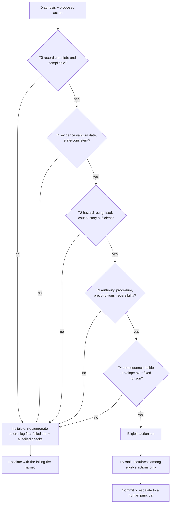

# Action-Admissibility Tiering

**Also known as:** Non-Compensatory Admissibility Ladder, Eligibility Before Ranking, Tiered Action Eligibility Gate

**Category:** Safety & Control  
**Status in practice:** emerging

## Intent

Gate a proposed physical action through an ordered ladder of independent, non-compensatory admissibility tests, and rank actions by usefulness only among those that passed every tier.

## Context

An agent advises or acts inside a plant, a vehicle, or a robot, where a command changes the state of equipment that people stand next to. The operation is already governed by written procedures, delegated authority levels, instrument health rules, and safety envelopes that predate the agent. A diagnosis and a proposed intervention arrive together in one recommendation, and the surrounding stack — the regulatory controller, the interlocks, the operator — has to decide whether the intervention may be carried out at all. Each of those questions has a different owner and a different source of truth: the historian for evidence, the procedure book for permitted actions, the authority matrix for who may act, the process model for what happens next.

## Problem

A correct diagnosis does not make the recommended intervention admissible. The same right answer can rest on a suspect flow measurement, exceed the delegated authority of the actor proposing it, violate a written procedure, be irreversible in a state where recovery matters, or arrive after the process has crossed a boundary it cannot come back from. A single flat check collapses all of these into one accept or reject verdict and cannot say which concern failed. Worse, when admissibility is folded into a score, a high usefulness rating compensates for a failed authority or evidence check, and an inadmissible action outranks an admissible one. Scoring the diagnosis alone hides the problem entirely, because the unit that hurts the plant is the action, not the answer.

## Forces

- Evidence validity, hazard understanding, authority, procedure and physical consequence are independent concerns owned by different parts of the operation, yet a single verdict flattens them into one number that no owner can audit.
- A weighted score lets a high usefulness rating offset a failed hard check, so any scheme that averages admissibility with utility will eventually rank an inadmissible action first.
- Model restraint is not a control surface: with the executive layer held constant across three robot platforms, out-of-policy action proposal rates differed by up to 4.8x across model backends and 3.4x among frontier models alone, so the gate has to sit outside the model.
- Each added tier blocks more genuinely harmful proposals but also more harmless ones; in a 250-cell distillation study 534 of 590 gate interventions were an artefact of an operating specification sitting on a safety limit, while 318 blocked actively harmful proposals.
- Ordering the tests cheapest-and-most-fundamental first saves the cost of simulating actions that were never permitted, but it also means a report shows only the first wall an action hit unless every check is still evaluated and recorded.

## Therefore

Therefore: separate the proposed action from the diagnosis, run it through ordered hard gates for evidence validity, hazard understanding, authority and procedure, and physical consequence, and let a usefulness ranking apply only to the actions that cleared every gate.

## Solution

Make the proposed action, not the diagnosis, the unit that is judged, and evaluate it against a versioned profile of the specific plant or platform rather than against general judgement. Order the checks as hard gates. A first gate gets the record itself into a checkable shape: required fields, identifiers, references that resolve against the declared profile. A second gate asks whether the evidence behind the decision is available, in date, and consistent with the represented state of the process. A third gate asks whether the hazard was recognised and the causal story is strong enough to justify this intervention rather than an escalation. A fourth gate asks whether the action is admissible at all for this actor and this state — permitted action family, delegated authority, procedure conformance, preconditions, reversibility, recovery path, escalation obligation. A fifth gate asks what the action does physically: consequence checks against the safety envelope over a verification horizon that the profile fixes and the proposing system cannot shorten. Only actions that clear every gate enter a ranking of usefulness, and a failed gate yields no aggregate score at all rather than a low one, so an ineligible action never competes with an eligible one. Run the gates deterministically from declared rules and human-authored profile content instead of asking another model to judge them, record the first tier that failed alongside the full set of failed checks, and keep the trace so a reviewer can reconstruct why an action was admitted, blocked, or ranked as it was.

## Structure

```
Diagnosis + proposed action -> T0 record integrity -> T1 evidence and state validity -> T2 hazard and causal understanding -> T3 admissibility (authority, procedure, preconditions, reversibility) -> T4 physical consequence over a fixed horizon. Any hard-gate failure yields ineligible + no aggregate. Survivors only -> T5 utility ranking -> commit or escalate. T6 trace records why.
```

## Diagram



*Hard gates run in order and none of them can be offset by a later one; only survivors are ranked, and a blocked action carries the tier that stopped it.*

## Example scenario

A plant assistant spots that a reactor is losing cooling and recommends opening a bypass valve to dump heat. The diagnosis is right, but the flow reading it relied on has been flagged as suspect since the morning shift, and the bypass is a valve that only a shift supervisor may move. The ladder blocks the recommendation at the evidence tier and names the stale instrument, so the operator fixes the measurement first instead of acting on a plausible-sounding suggestion.

## Consequences

**Benefits**

- An inadmissible action can no longer outrank an admissible one, because usefulness is computed only inside the eligible set and a failed gate produces no score to compare.
- The block is diagnosable: the report names the first tier that failed and the full set of failed checks, so a suspect instrument, a missing authority and a procedure violation are distinguishable causes rather than one opaque rejection.
- Expensive checks run last, so consequence simulation is spent only on actions that already have valid evidence and standing authority behind them.
- The gate content lives in a versioned, human-authored profile outside the model, which keeps the safety behaviour stable when the model backend is swapped.
- Blocking and diagnosing stay separate from acting, so the regulatory control layer underneath is left unchanged and remains the last line of defence.

**Liabilities**

- The ladder over-blocks when the operating specification sits on a safety limit: in the distillation study 534 of 590 interventions were that geometry, so a well-behaved operating point became inoperable while only 318 interventions caught genuinely harmful proposals.
- Every gate needs a plant-specific profile of instruments, procedures, authority levels and envelopes that a human engineer has to author and keep current; a stale profile blocks correct actions and admits obsolete ones.
- A strict ordering reports only the first wall an action hit unless all checks are still evaluated, which can hide several independent defects behind one early failure.
- The consequence tier is only as good as its process model, and a model that mispredicts the response horizon will admit an action that is unsafe later than the horizon looks.
- Deterministic execution of the declared rules does not make the encoded engineering judgement correct; reproducibility is not certification, and the tiers do not replace functional-safety assessment.

## Failure modes

- Admissibility is folded into a weighted score, so a high usefulness rating compensates for a failed authority or evidence check and the ineligible action is recommended anyway.
- Only the diagnosis is evaluated, the intervention is never judged separately, and a correct fault identification ships with an intervention that violates the procedure it was meant to satisfy.
- The proposing system is allowed to set or shorten the consequence-verification horizon, and a delayed unsafe consequence falls outside the window it chose.
- A model is used as the judge for the hard gates, so the same failure that produced the inadmissible proposal also clears it.
- The profile is written once and never revised after a procedure change, so the ladder keeps admitting actions that the plant no longer permits.
- Blocks are logged as a single count without the failing tier, so nobody can tell over-blocking from genuine prevention and the gate is eventually switched off.

## What this pattern constrains

An action that fails any hard tier cannot proceed and must not receive an aggregate score that lets a later tier offset the failure; usefulness may never be compared across actions that failed an earlier tier; and the proposing system cannot select its own tier thresholds or shorten the consequence-verification horizon fixed by the plant profile.

## Applicability

**Use when**

- A proposed action changes the state of physical equipment, and being wrong costs more than being slow.
- Written procedures, delegated authority levels and safety envelopes already govern the operation and can be encoded per site or per platform.
- The concerns behind a rejection have different owners, and an operator needs to know which one failed rather than only that something did.
- Several candidate interventions compete and a usefulness ranking would otherwise let an inadmissible option win.

**Do not use when**

- Actions are cheap and reversible, where a single reversibility check or a re-sample is the lighter control.
- No versioned plant or platform profile exists and none can be authored, since every tier depends on declared, human-reviewed content.
- The gate would sit in a control loop faster than the checks can run, in which case the interlock layer, not an admissibility ladder, is the right place.
- The operating specification routinely sits on a safety limit, where the ladder blocks well-behaved set points as often as harmful ones and needs the specification fixed first.

## Components

- Action record — the proposed intervention separated from the diagnosis and made the unit that is judged
- Versioned plant or platform profile — human-authored instruments, procedures, authority levels, envelopes and horizons the tiers evaluate against
- Evidence and state validity tier — checks availability, provenance, temporal validity and consistency with the represented process state
- Hazard and causal understanding tier — checks that the decision-relevant hazard was recognised and escalates when the causal story is too thin to justify acting
- Admissibility tier — checks delegated authority, permitted action family, procedure conformance, preconditions, reversibility and recovery path
- Physical consequence tier — checks the predicted trajectory against the safety envelope over a horizon the profile fixes rather than the proposer
- Eligibility rule — a hard-gate failure yields no aggregate score, so ineligible actions never enter the ranking
- Utility ranker — orders the surviving actions by usefulness, efficiency and disruption
- Trace record — first failed tier, complete failed-check set and gate explanations, kept so a reviewer can reconstruct the decision

## Tools

- Rule engine over a versioned profile — executes the hard gates deterministically from declared checks instead of asking a model to judge them
- Process simulator or digital twin — computes the consequence tier's predicted trajectory and safety margins
- Historian and instrument-health feed — supplies the evidence tier with provenance, timestamps and sensor validity flags
- Authority and procedure registry — encodes who may move what and under which written procedure
- Audit log with gate explanations — records the tier vector, the first failure and the margins behind each verdict

## Evaluation metrics

- Blocked-harm rate — share of gate interventions that stopped an action that would have caused real harm
- Over-block rate — share of interventions that stopped an action which was in fact admissible, the dominant cost in the distillation study
- First-failed-tier distribution — which concern is actually rejecting actions, and therefore where the operation or the profile needs work
- Diagnosis-action decoupling rate — share of correct diagnoses whose proposed intervention was nonetheless inadmissible
- Escalation appropriateness — share of insufficient-understanding cases handed to a human instead of acted on
- Profile staleness — age of the encoded procedures and authority levels against the current revision in the plant

## Known uses

- **[ADMITBench](https://arxiv.org/abs/2608.03866)** _pure-future_ — Reference framework that evaluates industrial LLM advisories at the level of the proposed action, with tiers T0-T4 as non-compensatory hard gates, T5 as ranking among eligible actions only, and T6 as traceability; a failed hard gate yields no aggregate score. Release 0.1.0 is explicitly a research implementation and not an authorisation for physical execution.
- **[Safety-gated agentic supervisory control on Skogestad's Column A](https://arxiv.org/abs/2607.27849)** _pure-future_ — Places a rule-based forked-twin counterfactual gate with nine pinned constraints between an open-weight LLM supervisor and an unchanged regulatory control layer; 318 of 590 gate interventions blocked actively harmful proposals while 534 were an artefact of the specification sitting on a safety bound.
- **[ROSClaw executive layer for ROS 2](https://arxiv.org/abs/2603.26997)** _available_ — Model-agnostic executive layer performing pre-execution action validation inside a configurable safety envelope with structured audit logging, deployed on wheeled, quadruped and humanoid platforms; out-of-policy action proposal rates varied by up to 4.8x across four model backends under the same executive layer.

## Related patterns

- _specialises_ **Stochastic-Deterministic Boundary (SDB)** — That names the four-part contract shape of the proposer-verifier seam; this specifies the ordered content of the verifier for physical actions and forbids compensation between its parts.
- _uses_ **Simulate Before Actuate** — Physical-consequence simulation is the last hard tier here, reached only after evidence, hazard understanding, authority and procedure have already cleared, so the simulator is not spent on actions that were never permitted.
- _complements_ **Reversibility-Aware Action Filter** — That treats reversibility as the single dimension and re-samples the policy until a reversible action is found; here reversibility is one clause of the admissibility tier alongside authority, procedure and preconditions.
- _complements_ **Risk-Tiered Action Autonomy** — That tiers by financial materiality to decide who may release an action; this tiers by independent admissibility tests to decide whether the action is eligible at all. A plant can run both.
- _complements_ **Policy-as-Code Gate** — Supplies the externally-authored, versioned rule surface that the authority and procedure tier evaluates, though a flat policy set on its own cannot express the ordering or the non-compensatory rule.
- _complements_ **Affordance Grounding Before Action** — Screens whether the scene physically supports an action; this ladder asks whether the operation permits it, which is a separate question from whether the body can do it.
- _complements_ **Typed Refusal Codes** — Gives the block a machine-readable reason so the failing tier and the failing check reach the caller instead of an unexplained rejection.
- _complements_ **Human-in-the-Loop** — The escalation obligation inside the admissibility tier routes an action to a human principal when causal understanding is insufficient rather than letting the agent proceed on a weak story.

## References

- [ADMITBench: A Safety-Governed Reference Framework for Evaluating the Admissibility of Industrial LLM Advisories](https://arxiv.org/abs/2608.03866) — Yash Misra, Javal Vyas, Siddharth Gutta, Mehmet Mercangoez, 2026
- [Safety-Gated Agentic Supervisory Control on a Coupled Distillation Benchmark: Regime Map, Auditable Gate, and Co-Design Findings](https://arxiv.org/abs/2607.27849) — Christian Rosenthal, 2026
- [ROSClaw: An OpenClaw ROS 2 Framework for Agentic Robot Control and Interaction](https://arxiv.org/abs/2603.26997) — Irvin Steve Cardenas, Marcus Anthony Arnett, Natalie Catherine Yeo, Lucky Sah, Jong-Hoon Kim, 2026
- [IEC 61511: Functional safety - Safety instrumented systems for the process industry sector](https://webstore.iec.ch/en/publication/5527)
