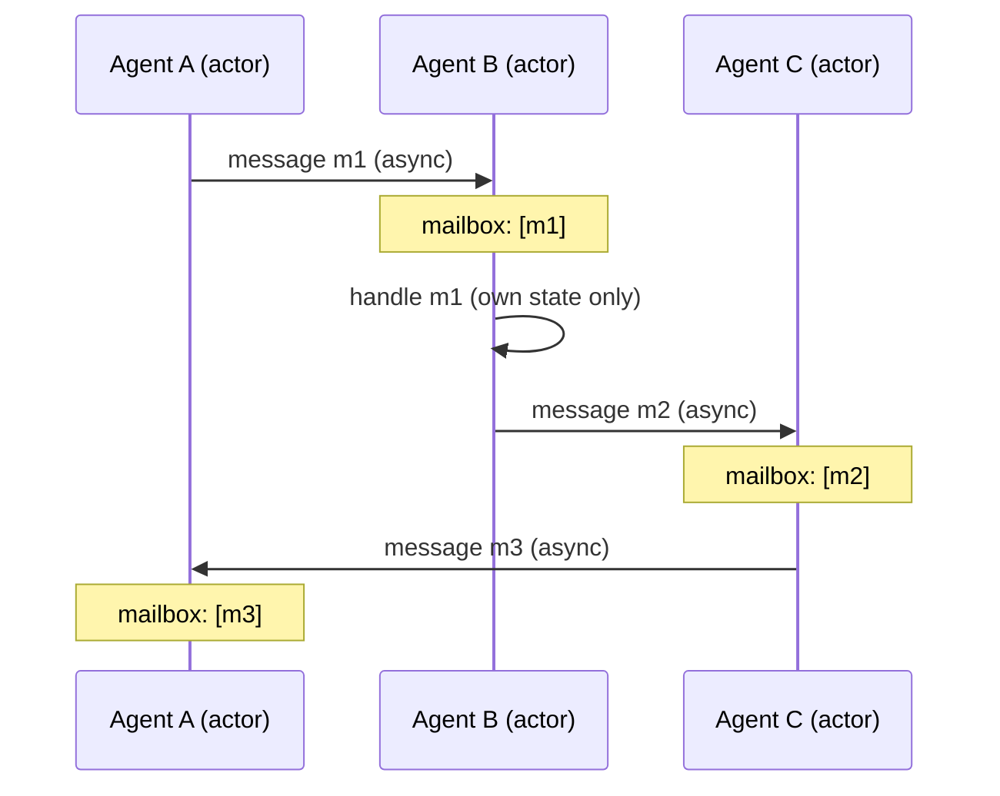

# Actor-Model Agents

**Also known as:** Actor Agents, Mailbox Agents, Message-Passing Agents

**Category:** Multi-Agent  
**Status in practice:** emerging

## Intent

Implement each agent as an independent actor with its own mailbox, processing asynchronous messages one at a time and never sharing mutable state with peers.

## Context

A team is building a multi-agent system where several agents must run at the same time, react to events as they arrive, and keep going even when one of them crashes. There is no single conversational chair driving turn order, and the agents may live in different processes or on different machines.

## Problem

If the agents are modelled as a request-and-response conversation, they are pinned to one thread of control and cannot easily run concurrently. If they share mutable state — a common dictionary, a shared queue, a global cache — concurrent reads and writes produce race conditions, and a crash in one agent corrupts state the others were relying on. Ad-hoc locking solves neither problem cleanly: it slows the system down and still leaves failure containment as an afterthought.

## Forces

- Concurrency and asynchrony are natural to agent systems but hostile to shared-state programming.
- Actor-style isolation makes per-agent failure containment straightforward.
- Sequential conversations are easier to reason about than concurrent mailboxes — but they do not scale to many agents.
- A mailbox queue per agent costs memory and needs back-pressure rules.

## Applicability

**Use when**

- Agents must run concurrently with isolated state.
- The system must survive partial failures of individual agents.
- Communication is naturally event- or message-driven rather than turn-based dialogue.
- The agent population is expected to scale to dozens or more participants.

**Do not use when**

- The interaction is a strict two-agent dialogue with a single thread of control (see autogen-conversational).
- The team has no actor-runtime experience and the application is small enough that a sequential loop suffices.
- Strong cross-agent transactions are required and saga-style compensation is not acceptable.

## Therefore

Therefore: give each agent a mailbox, process its messages one at a time, and forbid shared mutable state across agents, so that concurrency, isolation, and partial-failure handling come from the actor discipline rather than ad-hoc locking.

## Solution

Model each agent as an actor: a process or coroutine with its own mailbox, its own local state, and a message-handler that runs messages in receive order. Agents communicate only by sending messages — directly to a known agent id, or by publishing to a topic (see topic-based-routing). The runtime supervises actor lifecycles, restarts on crash, and routes messages across processes or machines. Pair with role-assignment when agents do have stable personas, and with supervisor when a coordinator is needed.

## Structure

Agent A (mailbox A) ↔ Agent B (mailbox B) ↔ Agent C (mailbox C). All communication via send(agent_id, message); no shared state.

## Example scenario

A monitoring system has a perception agent that ingests telemetry, an analysis agent that hypothesises causes, and a remediation agent that proposes actions. Each runs as its own actor with a mailbox. Telemetry arrives as messages to perception; perception emits analysis-request messages; analysis emits remediation-proposal messages. When the analysis actor crashes on a malformed input the supervisor restarts it with an empty mailbox; perception and remediation keep running. None of the three actors shares mutable state.

## Diagram

## Consequences

**Benefits**

- Concurrent agents without ad-hoc locks or shared-state hazards.
- Per-actor crash recovery — one agent's failure does not corrupt peers.
- Distributable across processes and machines under the same programming model.
- Fits event-driven and pub/sub shapes naturally.

**Liabilities**

- Message-driven debugging is harder to follow than a linear conversation.
- Each agent needs its own mailbox queue with back-pressure rules.
- Cross-agent transactions are not first-class — saga-style compensation is required.

## What this pattern constrains

Agents do not share mutable state and may not call each other synchronously; all cross-agent interaction must go through asynchronous mailbox messages.

## Known uses

- **AutoGen Core** — AutoGen Core documents explicitly that agents are developed using the Actor model. *Available* — [link](https://microsoft.github.io/autogen/stable/user-guide/core-user-guide/index.html)
- **Akka / Pekko + LLM tool integrations** — JVM actor runtimes used as the substrate for multi-agent LLM systems. *Available* — [link](https://doc.akka.io/libraries/akka-core/current/typed/actors.html)
- **[Sparrot](https://marco-nissen.com/sparrot/)** — *Available* — Peer messaging is mailbox-based: each peer (atelier, others) has an inbox folder and the agent processes messages one at a time with no shared mutable state across peers.

## Related patterns

- *complements* → [topic-based-routing](topic-based-routing.md)
- *complements* → [event-driven-agent](event-driven-agent.md)
- *specialises* → [inter-agent-communication](inter-agent-communication.md)
- *complements* → [supervisor](supervisor.md)
- *alternative-to* → [autogen-conversational](autogen-conversational.md)

## References

- *doc*: [AutoGen Core — Concepts](https://microsoft.github.io/autogen/stable/user-guide/core-user-guide/index.html) — Microsoft
- *paper*: [A Universal Modular ACTOR Formalism for Artificial Intelligence (IJCAI 1973) — overview](https://en.wikipedia.org/wiki/Actor_model) — Hewitt, Bishop, Steiger, 1973

**Tags:** multi-agent, actor-model, concurrency, autogen
