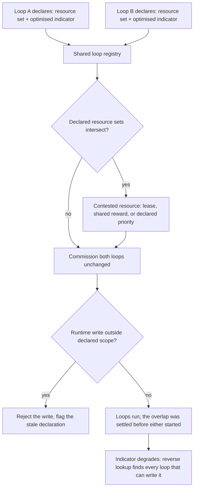

# Actuation-Scope-Registered Control Loops

**Also known as:** Declared Write-Scope Registry, Loop Actuation Registry, Closed-Loop Conflict Declaration

**Category:** Multi-Agent  
**Status in practice:** emerging

## Intent

Have every long-lived automated loop declare, in a registry all loops share, the resources it may actuate and the indicator it optimises, so overlapping actuation scope is detectable before any loop runs.

## Context

A plant — a mobile network, a cluster, a building, a fleet — is run by several closed loops that each observe, decide and act without waiting for a person. Each loop was specified separately: a different team, a different vendor, a different procurement cycle, each handed one indicator to defend and one set of control handles to defend it with. Every loop is well tuned against its own objective and passes its own tests. Nothing in the way they were commissioned records which control handles two loops both consider theirs, because no artefact spans them.

## Problem

When two loops can write the same resource, one loop's corrective action is the next loop's disturbance. Neither loop is faulty and neither raises an error: each observes a deviation it was built to correct, corrects it, and is undone by the other, so the contested parameter oscillates and the indicators every loop was built to protect all degrade together. The conflict is invisible to per-loop monitoring, which is the only monitoring anyone owns. It also resists diagnosis after the fact: with several objectives active at once the same symptom drifts across several indicators, and attributing a degradation to the right one is a separate inference problem rather than a lookup. Central arbitration of every action would remove the conflict by construction, but it is impractical at scale when the control period is short and the loops are many.

## Forces

- Centralised optimisation avoids conflict by construction but is impractical in large deployments for time-critical work, so coordination has to live in the loops themselves rather than in one global scheduler.
- Each loop is individually correct and individually stable, so no loop's own tests, alarms or dashboards show anything wrong; the pathology exists only in the relation between loops.
- Loops built by separate teams or vendors have no common owner who could impose an ordering, and each team reasonably believes it owns the handle it was told to control.
- A declaration of write scope is cheap to author and cheap to intersect, but a loop that writes outside its declared set makes the check return a false clean, which is worse than no check.
- Direct overlap — two loops writing the same parameter — falls out of the declarations by set intersection, while coupling that runs through the physical process rather than through a shared handle does not, so a static check narrows the problem without closing it.
- Resolving an overlap costs the losing loop some of its control authority, so a settlement that improves the shared indicators can still reduce how reliably any single loop meets its own target.

## Therefore

Therefore: make each loop declare its actuable resources and its optimised indicator in a registry the loops share, intersect those declarations before commissioning, and admit a loop into a contested resource only under an agreed lease, shared reward or priority.

## Solution

Give every loop a declaration and put the declarations in one place. The declaration names the loop, the resources it is permitted to actuate, the indicator it optimises, and its priority relative to other loops; it is written during preparation, before the loop is commissioned, and it is versioned like any other artefact. Commissioning then becomes a check rather than a hope: intersect the candidate loop's declared write set with the write set of every loop already registered. An empty intersection admits the loop unchanged. A non-empty intersection is a conflict found on paper, and it is settled before either loop starts — by a time-bounded lease over the contested resource, by replacing the two local objectives with a shared reward so the loops cooperate over that resource instead of each chasing a local optimum, or by a declared priority that says which loop yields. Two loops may still share a resource, but never on the terms each would have chosen alone. At runtime a monitor compares observed writes against the declaration and rejects or flags an actuation outside the declared scope, which is what keeps the registry honest as loops are retuned. The declaration is also the diagnostic index: when an indicator degrades, the set of loops that can write the implicated resource is a lookup rather than an investigation.

## Structure

```
Per-loop declaration {loop id, actuable resource set, optimised indicator, priority, version} --> shared registry. Commissioning gate: pairwise intersection of declared resource sets. Empty intersection --> commission unchanged. Non-empty intersection --> contested-resource arrangement (lease | shared reward | declared priority) --> commission. Runtime scope monitor compares observed writes against the declaration and rejects undeclared actuation; degraded indicator --> reverse lookup over the registry for every loop that can write the implicated resource.
```

## Diagram



*Each loop's declared resource set and objective go into one registry, so an intersection of those sets is a conflict found at commissioning time rather than an incident found afterwards.*

## Example scenario

An office building runs two automated loops. One lowers the blinds when solar gain rises, because it is scored on cooling energy; the other raises them when desk-level light drops, because it is scored on lighting energy. Neither loop's design ever recorded that both write the same blind motor. On a bright afternoon the blinds cycle up and down for hours, both energy figures get worse, and the facilities team finds the cause only after the motors start to fail.

## Consequences

**Benefits**

- Overlapping actuation becomes a static property that can be checked at commissioning, so a class of incident is found on paper instead of in production.
- Attribution after a degradation is a lookup over declared write sets rather than an inference across several simultaneously active objectives; a benchmark of the multi-intent case reports 9.4% to 45.8% better attribution of a degradation to the correct objective when disambiguation is modelled explicitly, which is the gap a declaration closes by construction for the direct case.
- Coordination stays local to the loops that actually share a resource, so nothing has to run at the rate of a global scheduler.
- The declaration doubles as documentation of what each automated loop is allowed to touch, which is the artefact a change review or an audit otherwise has to reconstruct.

**Liabilities**

- The check is only as good as the declarations; a loop retuned to write a new handle without updating its entry produces a clean intersection over a stale set.
- Coupling through the plant rather than through a shared handle — two loops writing different parameters whose effects meet in the process — is invisible to a set intersection and still needs runtime detection.
- Settling a contested resource takes control authority away from at least one loop; a study of conflict mitigation between independently authored radio-access applications reports better network performance from balancing them against a small negative effect on reliability.
- Declaring scope for loops that already run means retrofitting entries for systems whose owners have moved on, and the entries most likely to be wrong are exactly the oldest ones.
- A registry invites the assumption that a registered overlap has been resolved, when all that is recorded is that someone saw it.

## Failure modes

- The registry exists but is advisory, so a loop is commissioned with an overlapping write set because the intersection report had no gate attached to it.
- Declarations list resource types rather than the specific instances a loop will act on, so two loops that write the same instance show a clean intersection.
- A loop's declaration is written once at commissioning and never updated, and the drift between declared and actual write scope grows silently until an incident exposes it.
- The contested resource is settled by a priority that always favours the same loop, so the yielding loop quietly stops meeting its target and nobody is measuring that.
- Two loops write different parameters that meet in the process, the intersection is empty, and the conflict is treated as impossible because the check said so.

## What this pattern constrains

A loop may not actuate any resource it has not declared in the shared registry, and no loop may be commissioned while its declared resource set intersects another loop's without an agreed arrangement for the contested resource; where scopes overlap the loops must not each optimise their own indicator independently.

## Applicability

**Use when**

- Two or more long-lived automated loops act on the same plant and were specified by different teams, vendors or procurement cycles.
- A loop can write a resource that another loop also treats as its own control handle.
- Conflicts show up as degraded indicators rather than as errors, so no loop's own monitoring reports a fault.
- The plant has no commissioned arbitration layer, such as a selector network or override hierarchy, that already decides which loop wins a contested handle.
- Central arbitration of every action is impractical because the control period is short or the number of loops is large.

**Do not use when**

- The plant already carries a commissioned selector or override hierarchy that settles contention deterministically, in which case that existing arbitration should be used rather than a second mechanism.
- Exactly one loop writes each resource and the loops are otherwise isolated from one another.
- The loops genuinely share a single objective, so aligning them on a common goal is simpler than constraining their write scopes.
- The coupling runs entirely through the physical process rather than through a shared write target, which an intersection of declared resource sets cannot detect.
- The loops are short-lived tasks rather than perpetual controllers, where a transaction or a lock is the cheaper answer.

## Components

- Actuation scope declaration — a per-loop record naming every resource the loop may write, the indicator it optimises and its priority
- Shared loop registry — the single versioned place every declaration lives, readable by all loop owners and by the commissioning gate
- Static overlap checker — intersects declared resource sets pairwise and reports every resource claimed by more than one loop
- Commissioning gate — refuses to admit a loop whose declared scope overlaps a registered loop until that overlap has an agreed arrangement
- Contested-resource arrangement — the negotiated terms for a shared resource: a time-bounded lease, a shared reward, or a declared priority
- Runtime scope monitor — compares observed writes against the declaration and rejects or flags actuation outside the declared set
- Reverse index — resolves a degraded indicator to the set of loops permitted to write the implicated resource

## Tools

- ETSI ZSM closed-loop model — a standardised schema for declaring a loop's goal, managed entities and conflict-avoidance priority during the preparation phase
- O-RAN Near-RT RIC conflict mitigation component — the deployment surface where overlapping control-parameter writes between independently authored applications are detected and resolved
- Policy engine or admission controller — enforces the commissioning gate mechanically instead of by review
- Distributed lease or lock service — implements exclusive, time-bounded access to a contested resource
- Multi-agent reinforcement learning with a shared reward — makes loops that must share a resource cooperate rather than each chase a local optimum
- Configuration audit trail — reconciles observed writes against declarations so a stale entry is detected before it produces a false clean

## Evaluation metrics

- Declared-scope coverage — share of running loops that carry a current declaration of resource set and objective
- Undeclared actuation rate — writes observed to resources absent from the acting loop's declaration
- Static overlap count at commissioning — resources claimed by more than one loop and found before either runs
- Conflict escape rate — incidents whose root cause was two loops writing one resource, as a share of all overlaps
- Contested-parameter oscillation — reversal rate or variance of a shared control handle over a window
- Attribution accuracy — how often a degradation is traced to the correct one of several simultaneously active objectives
- Yield cost — how much target attainment the yielding loop gives up under an agreed arrangement

## Known uses

- **[ETSI ZSM closed-loop automation (GS ZSM 009-1)](https://www.etsi.org/deliver/etsi_gs/ZSM/001_099/00901/01.01.01_60/gs_ZSM00901v010101p.pdf)** _available_ — The closed-loop model makes a goal, a manageable entity list and a target entity list mandatory attributes of every closed loop, and adds a closedLoopPriority whose stated purpose is to avoid conflicting actions to the same managed entity; the priority is set in the preparation phase, before the loop operates. A pre-execution coordination service then retrieves action plans carrying target resources and scheduled execution time and checks for conflicting actions before the loops execute them.
- **[O-RAN Near-Real-Time RAN Intelligent Controller conflict mitigation](https://www.o-ran.org/specifications)** _available_ — O-RAN places a dedicated conflict mitigation component in the Near-RT RIC because independently authored xApps adjust overlapping control parameters; the specifications classify the outcome as direct, indirect and implicit conflicts, of which only the direct kind follows from comparing declared parameter sets.
- **[Kubernetes Vertical and Horizontal Pod Autoscalers](https://github.com/kubernetes/autoscaler/blob/master/vertical-pod-autoscaler/docs/known-limitations.md)** _available_ — The vertical autoscaler's documented limitations state that it should not be used with the horizontal autoscaler on the same resource metric, that the two together on separate metrics are supported, and that multiple vertical autoscaler objects matching the same pod have undefined behavior — the same overlap rule carried as prose guidance rather than as a declaration a cluster can check.
- **[QLC distributed closed-loop architecture for B5G slice auto-scaling](https://arxiv.org/abs/2107.13268)** _pure-future_ — A Q-learning architecture in which loops sharing a resource are made to cooperate rather than each pursue a local optimum, validated on a network-slice auto-scaling model; centralised optimisation is ruled out in the same work as impractical in large-scale networks for time-critical applications.

## Related patterns

- _alternative-to_ **Control-Loop-Mapped Agent Chain** — Both put several automated loops on one plant, and the difference is whether an arbitrator already exists. There the plant is a commissioned control chain whose min and max selectors, split-range rule and override hierarchy already record which loop wins a shared manipulated variable, and the contribution is putting one agent on each existing loop and letting that selector network settle their competing proposals. Here there is no such selector: the loops were built independently by different teams or vendors, each believing it owned the resource, and the conflict surfaces only as degraded indicators. One pattern exploits an arbitration mechanism that exists; this one makes the missing one checkable by requiring each loop to declare its actuation scope up front.
- _complements_ **Symptom-Remediation Thrashing** — There one stateless loop oscillates against itself, re-applying a fix to a root cause it cannot see. Here every loop is individually correct and stable and the oscillation is purely relational, so carrying state within a loop does not help and the remedy is a declared write scope shared between loops.
- _complements_ **Race Conditions on Shared Tool Resources** — That anti-pattern is a runtime lost write between concurrent actors on one resource, fixed by compare-and-swap or a single writer. This pattern is the design-time question of which perpetual loops may write the resource at all, answered before any of them starts.
- _complements_ **Hidden State Coupling** — The same undeclared-dependency failure one level down: there a workflow reads or writes shared state that its signature never names, here a long-lived loop actuates a resource its declaration never names.
- _complements_ **Agent Capability Manifest** — A manifest declares what an agent can do so that callers can discover and bind to it; this registry declares what a loop may write and which indicator it optimises so that overlap between loops becomes a set intersection. Discovery versus conflict detection, using the same declaration discipline.
- _complements_ **Priority Matrix (Conflict Resolution)** — Supplies the resolution rule once a conflict class is known; the registry is what turns an unknown overlap into a named conflict class early enough for a rule to be written for it.
- _alternative-to_ **Joint Commitment Team** — Those agents share one goal from the outset and the contract is about notifying each other when belief in that goal changes. These loops have permanently different objectives and are never going to agree, so the contract constrains write access to a contested resource instead of aligning intent.

## References

- [A Distributed Intelligence Architecture for B5G Network Automation](https://arxiv.org/abs/2107.13268) — Sayantini Majumdar, Riccardo Trivisonno, Georg Carle, 2021
- [Conflict Mitigation Framework and Conflict Detection in O-RAN Near-RT RIC](https://arxiv.org/abs/2305.07117) — Cezary Adamczyk, Adrian Kliks, 2023
- [MILD: Multi-Intent Learning and Disambiguation for Proactive Failure Prediction in Intent-based Networking](https://arxiv.org/abs/2602.14283) — Md. Kamrul Hossain, Walid Aljoby, 2026
- [ETSI GS ZSM 009-1: Zero-touch network and Service Management (ZSM); Closed-Loop Automation; Part 1: Enablers](https://www.etsi.org/deliver/etsi_gs/ZSM/001_099/00901/01.01.01_60/gs_ZSM00901v010101p.pdf) — 2021
- [Vertical Pod Autoscaler — Known limitations](https://github.com/kubernetes/autoscaler/blob/master/vertical-pod-autoscaler/docs/known-limitations.md)
