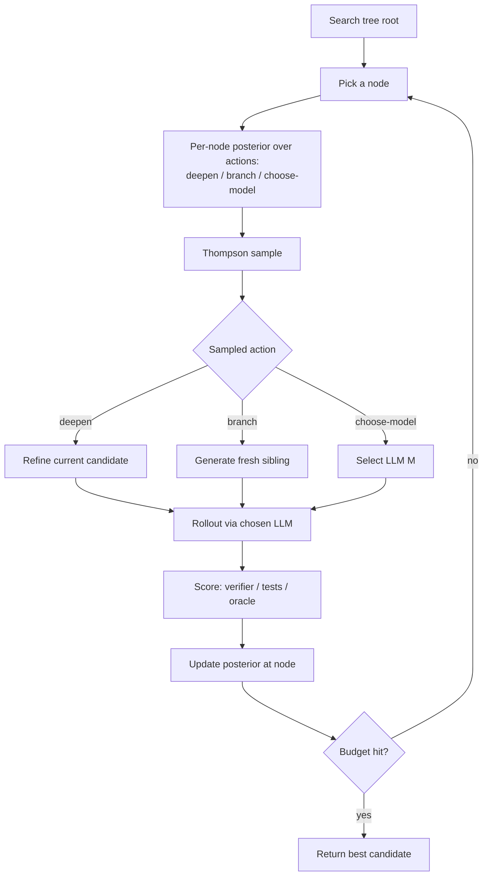

# Adaptive Branching Tree Search

**Also known as:** AB-MCTS, 適応的分岐モンテカルロ木探索, TreeQuest, Multi-LLM AB-MCTS

**Category:** Planning & Control Flow
**Status in practice:** experimental

## Intent

At each node of an inference-time search tree, use Thompson sampling to decide adaptively whether to deepen an existing answer or branch a fresh attempt, optionally choosing per-node which underlying LLM to invoke as a third search axis.

## Context

A team is using a large language model to attack problems whose outputs can be scored — running code against tests, checking a math answer, or grading an abstract-reasoning puzzle. They have a fixed budget of model calls to spend at inference time and want to spend it better than a flat sampling pass would. Several models with different strengths may be available at once, and the controller can choose which to call at each step.

## Problem

Existing inference-time search schemes commit to a fixed shape. Monte Carlo Tree Search over language-model rollouts uses a fixed branching factor and treats every node the same; tree-of-thoughts expands at a fixed width; best-of-N is flat and never refines anything. None of these adapt the trade-off between trying more fresh attempts and refining a promising one based on what the scores are actually telling the controller, and none can pick a different model for a hard node. On difficult problems this leaves a lot of compute on payoff-poor branches.

## Forces

- Width (more fresh attempts) and depth (refining existing ones) compete for the same budget.
- The right width/depth balance differs per node and is not known in advance.
- Multiple LLMs have complementary failure modes; picking the right one per node is itself a search axis.
- Thompson sampling is principled but adds bookkeeping over plain MCTS.
- Inference-time compute is expensive; wasted rollouts hurt directly.

## Therefore

Therefore: at each tree node sample from a Thompson-sampling posterior over the actions "deepen this branch" versus "branch a fresh attempt" (and optionally "with model M"), so the search adaptively allocates width, depth, and model-choice based on observed payoffs rather than fixed branching parameters.

## Solution

Each node in the search tree maintains posterior estimates over the value of its possible actions. Actions are: refine the current candidate (deepen), generate a fresh sibling (branch), and — in the multi-LLM variant — which model to call. At each step the controller draws a Thompson sample from the per-action posterior and picks the highest sampled value; the resulting rollout's score updates the posterior. Over many rollouts the tree concentrates compute on the branches and models that are paying off. The score function must be either verifiable (compiler, test, oracle) or a trusted evaluator. The framework runs until a budget or success threshold is hit.

## Structure

```
Root -> per-node {posterior over (deepen | branch | choose-model)} -> Thompson sample -> rollout via chosen LLM -> score -> posterior update.
```

## Diagram



*Each node samples width vs depth (and optionally LLM) from a Thompson posterior, updated by rollout scores.*

## Example scenario

A team tackles ARC-AGI-2 puzzles with three different LLMs. They drop the puzzles into TreeQuest, which builds a search tree where each node decides via Thompson sampling whether to refine the current candidate program, generate a fresh sibling, and which of the three models to use. After a fixed compute budget the tree has concentrated rollouts on the branches that scored well — and on the model that turned out to handle that puzzle family best — producing higher pass rates than flat best-of-N at the same cost.

## Consequences

**Benefits**

- Adaptive width/depth balance outperforms fixed-shape search on hard problems.
- Per-node model choice exploits complementary strengths of multiple LLMs.
- Thompson sampling gives a principled exploration-exploitation trade-off.
- Compute concentrates on payoff-rich branches automatically.

**Liabilities**

- Requires a usable score function; without one, the posteriors are noise.
- Bookkeeping is heavier than plain MCTS or best-of-N.
- Inference cost is still high; the pattern reduces waste but does not make search cheap.
- Multi-LLM variant adds operational complexity (different APIs, latencies, pricing).

## What this pattern constrains

The controller must update posteriors from observed rollout scores before drawing the next sample; node expansion must not exceed the declared budget; the agent itself cannot bypass the Thompson sample to pick a favoured branch directly.

## Applicability

**Use when**

- A reliable score function (verifier, tests, oracle) is available.
- The task benefits from a mix of refinement and fresh attempts.
- Multiple LLMs are available and their strengths differ across the input distribution.

**Do not use when**

- No usable score function exists; the posteriors collapse to noise.
- Latency budgets forbid multi-rollout search.
- A single best-of-N pass already saturates the score.

## Known uses

- **[Sakana AI TreeQuest](https://sakana.ai/ab-mcts-jp/)** — *Available* — Open-source (Apache 2.0) framework implementing AB-MCTS and Multi-LLM AB-MCTS; benchmarked on ARC-AGI-2.

## Related patterns

- *specialises* → [lats](lats.md) — AB-MCTS replaces LATS's fixed-branching MCTS with adaptive Thompson-sampled width/depth.
- *alternative-to* → [tree-of-thoughts](tree-of-thoughts.md) — ToT uses fixed branching; AB-MCTS adapts branching to payoffs.
- *generalises* → [best-of-n](best-of-n.md) — Best-of-N is the flat zero-depth case of this pattern.
- *specialises* → [test-time-compute-scaling](test-time-compute-scaling.md) — A specific scheme for spending inference-time compute.
- *complements* → [self-consistency](self-consistency.md) — Self-consistency provides a voting score function that AB-MCTS can drive search against.

## References

- (blog) Sakana AI, *AB-MCTS: 推論時の試行錯誤を効率化する新たなAIアルゴリズム*, 2025, <https://sakana.ai/ab-mcts-jp/>
- (blog) gihyo.jp, *Sakana AIが新アルゴリズムAB-MCTSを発表*, 2025, <https://gihyo.jp/article/2025/07/sakana-ai-ab-mcts-algorithm>
- (blog) WIRED Japan, *Sakana AIの新アルゴリズム*, 2025, <https://wired.jp/article/sakana-ai-new-algorithm/>

**Tags:** inference-time-search, mcts, thompson-sampling, multi-llm, test-time-compute
