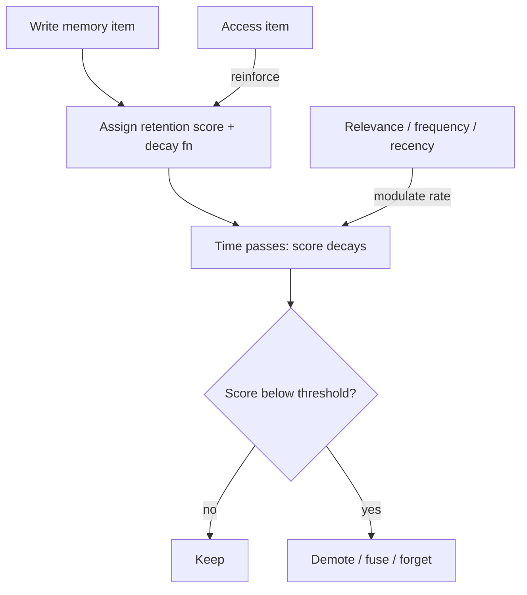

# Adaptive Memory Decay

**Also known as:** Memory Forgetting Curve, Reinforcement-Modulated Decay

**Category:** Memory  
**Status in practice:** emerging

## Intent

Give each long-term memory item a retention score that decays over time through a function modulated by relevance, access frequency, and recency, so unreinforced items fade or fuse while items that are used persist.

## Context

An agent accumulates long-term memory across many sessions: facts, preferences, summaries, observations. The store grows without bound, and not everything in it stays useful — some items were always marginal, others were true once and have gone stale. Retrieval quality starts to suffer as old low-value items pollute results.

## Problem

An append-only long-term store treats a fact written once and never used again the same as a fact reinforced every session, so the store grows without bound and stale or marginal items dilute retrieval. Hard size caps evict by crude rules and continuous time alone forgets useful-but-rarely-touched facts; neither tracks how important an item actually is. What the store needs is a retention signal that strengthens with use and weakens with neglect, the way human memory consolidates what is rehearsed and lets the rest fade, so capacity is spent on what stays relevant.

## Forces

- Unbounded retention pollutes retrieval and raises cost; aggressive forgetting drops facts that turn out to matter.
- Recency, relevance, and access frequency each carry part of the importance signal, and no single one suffices.
- A decaying score must be cheap to update on every access without a heavyweight consolidation pass.
- Staleness in high-relevance items is not fixed by decay alone, since they keep being reinforced.

## Applicability

**Use when**

- A long-term memory store grows across sessions and stale items degrade retrieval.
- Importance varies and is better inferred from use than declared at write time.
- Per-item retention scoring can be updated cheaply on access.

**Do not use when**

- The store is small and bounded, so forgetting buys nothing.
- Every item must be retained for audit or compliance regardless of use.
- The dominant problem is staleness in frequently-used items, which decay does not address.

## Therefore

Therefore: attach a decaying retention score to each memory item, modulate the decay by relevance, access frequency, and recency, and let items fall below thresholds to be demoted, fused, or forgotten unless use reinforces them.

## Solution

On write, give each item a retention score and a decay function — typically exponential — whose rate is modulated by signals: semantic relevance to the agent's active goals, how often the item is accessed, and how recently. Each access reinforces the score; neglect lets it decay. When a score crosses a low threshold the item is demoted to colder storage, fused with similar items, or dropped. The result is a forgetting curve per item rather than a global cap or a fixed time-to-live. Production memory layers such as Mem0 and Zep apply decay of this kind; FadeMem formalises the biologically-inspired version. Note the open limitation: decay handles low-relevance items well but does not by itself fix staleness in items that stay high-relevance and keep being reinforced. Compose with dream-consolidation-cycle for idle-time fusion and with cluster-capped-insight-store where a hard ceiling is also needed.

## Variants

- **Exponential decay with reinforcement** — Each item decays exponentially and each access resets or boosts the score, producing a classic forgetting curve. Use when access frequency is the strongest available importance signal.
- **Relevance-modulated decay** — The decay rate is scaled by semantic relevance to the agent's active goals, so off-topic items fade faster than on-topic ones. Use when the agent has a clear, shifting notion of what is currently relevant.
- **Decay-to-fusion** — Items nearing threshold are merged with similar items rather than dropped, preserving the gist while shedding volume. Use when losing the gist of faded items is costlier than the space they take.

## Diagram

## Example scenario

A personal-assistant agent has remembered, over a year, thousands of facts about its user — some reinforced weekly, many written once and never touched again. Retrieval starts surfacing year-old throwaway details over current ones. The team adds adaptive memory decay: each item carries a retention score that decays unless accessed, with the rate eased for items relevant to active goals and frequently used. Stale one-off facts fall below threshold and are fused or dropped, the store stops growing without bound, and retrieval sharpens — while a rarely-used but important fact remains a known risk the team monitors.

## Consequences

**Benefits**

- Store size stabilises without a crude global cap, because unused items decay out on their own.
- Retrieval quality holds up as stale low-value items fade and reinforced items stay sharp.
- Importance is inferred from use rather than declared up front, so the store self-curates.

**Liabilities**

- A rarely-accessed but genuinely important fact can decay below threshold and be lost.
- Tuning the decay rate and the modulation weights is its own ongoing calibration problem.
- Decay does not fix staleness in high-relevance items that keep being reinforced while their content goes out of date.

## What this pattern constrains

A memory item may not persist on age alone; it is retained only while its reinforcement-modulated score stays above threshold, and an unreinforced item must decay toward demotion, fusion, or removal.

## Components

- Retention score — per-item value that rises with use and falls with neglect
- Decay function — typically exponential, whose rate is modulated by item signals
- Modulation signals — semantic relevance, access frequency, and recency
- Threshold handler — demotes, fuses, or removes items whose score falls below a cutoff

## Tools

- Long-term memory store — holds items with their retention scores, such as Mem0 or Zep
- Decay scheduler — applies the decay function and updates scores on access
- Relevance scorer — supplies the semantic-relevance signal that modulates the decay rate

## Evaluation metrics

- Store size over time — whether decay holds the store stable without a hard cap
- Retrieval quality vs an append-only baseline — does forgetting improve or harm recall of useful items
- Important-item loss rate — share of later-needed items that had decayed out
- High-relevance staleness rate — reinforced items whose content has gone out of date

## Known uses

- **[Mem0](https://mem0.ai/blog/state-of-ai-agent-memory-2026)** — *Available* — Production memory layer that applies decay to low-relevance memories; its 2026 state-of-memory report names staleness in high-relevance memories as an open problem.
- **[FadeMem](https://arxiv.org/abs/2601.18642)** — *Pure-future* — Formalises biologically-inspired forgetting with adaptive exponential decay modulated by semantic relevance, access frequency, and temporal patterns.

## Related patterns

- *complements* → [dream-consolidation-cycle](dream-consolidation-cycle.md)
- *alternative-to* → [cluster-capped-insight-store](cluster-capped-insight-store.md)
- *alternative-to* → [tool-result-eviction](tool-result-eviction.md)
- *complements* → [sleep-time-compute](sleep-time-compute.md)

## References

- (paper) *FadeMem: Biologically-Inspired Forgetting for Efficient Agent Memory* 2026,, <https://arxiv.org/abs/2601.18642>
- (blog) Mem0, *State of AI Agent Memory 2026: Benchmarks, Architectures & Production Gaps* 2026,, <https://mem0.ai/blog/state-of-ai-agent-memory-2026>

**Tags:** memory, forgetting, decay, long-term-memory, consolidation
