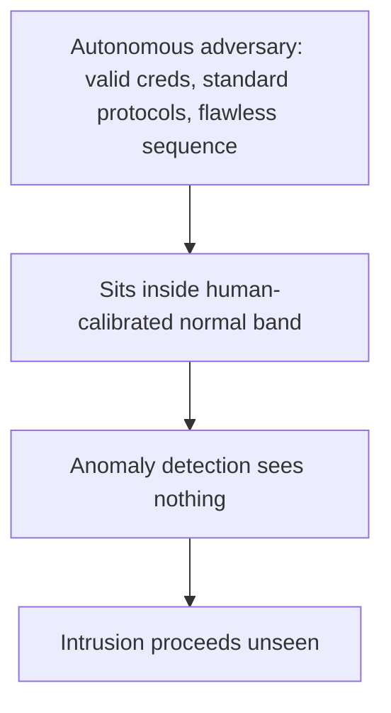

# Adversary-Indistinguishability Blind Spot

**Also known as:** Non-Anomalous Autonomous Attacker, Agent-Clean Intrusion

**Category:** Anti-Patterns  
**Status in practice:** emerging

## Intent

Anti-pattern: rely on behavioral-anomaly detection calibrated to irregular human behaviour, so an autonomous adversary acting with legitimate credentials, standard protocols, and superhuman consistency is less anomalous than a human and slips past unseen.

## Context

Defenders detect intrusions partly with behavioural-anomaly tooling — SIEM and EDR systems that baseline normal activity and flag deviations. Those baselines are built around how humans behave: irregular hours, fat-finger errors, unusual sequences, exploratory mistakes. Attacks increasingly run as autonomous agents that operate with valid credentials over standard protocols.

## Problem

An autonomous attacker is not more anomalous than a human — it is less. It runs flawless, consistent sequences with legitimate credentials and standard tool calls, so it sits well inside the normal band that anomaly detection is tuned to, and the very tooling meant to catch intrusions is structurally blind to it. The blind spot exists precisely because the adversary is an agent: the cleaner and more consistent its behaviour, the more normal it looks, while a human doing the same actions would have tripped the irregularity heuristics. Detection calibrated to human irregularity therefore misses the threat it most needs to see.

## Forces

- Anomaly detection works by flagging deviation from a human baseline, but an agent's behaviour deviates less, not more.
- Legitimate credentials and standard protocols give an agent adversary a profile that looks like sanctioned automation.
- Superhuman consistency — no fat-finger errors, no exploratory detours — reads as normal to tooling that expects human noise.
- Re-baselining detection to catch consistent, legitimate-looking activity risks flagging the sanctioned automation that looks identical.

## Therefore

Therefore: do not assume behavioural-anomaly detection calibrated to human irregularity will catch an autonomous adversary; add signals that do not depend on human-style irregularity — provenance, intent, rate, and capability scoping — and treat agent-clean behaviour as something to verify, not to trust.

## Solution

Stop equating 'looks normal' with 'is safe' when the adversary can be an agent. Supplement human-irregularity anomaly detection with signals that an autonomous attacker cannot make look human: cryptographic provenance and identity for which automation is acting, intent and authorisation checks on sequences rather than per-action normality, rate and volume baselines specific to legitimate automation, and tight capability scoping so a credential-legitimate agent still cannot reach a lethal combination of actions. Treat flawless, high-consistency activity as a category to verify against its authorised purpose rather than as evidence of benignity. The defence is to detect on what an agent adversary cannot fake, not on the human-noise signature it never had.

## Structure

```
Autonomous adversary (legit creds, standard protocols, flawless consistency) -> sits inside human-calibrated normal band -> anomaly detection sees nothing -> intrusion unseen (BROKEN) ; Corrected: provenance + intent/authorisation + automation-specific rate baselines + capability scoping
```

## Diagram



*An agent adversary's consistent, credential-legitimate behaviour is less anomalous than a human's, so detection tuned to human irregularity stays blind.*

## Example scenario

A red team runs an autonomous agent that logs in with stolen but valid credentials and performs a long, flawless sequence of standard API calls to stage data for exfiltration. The SOC's anomaly tooling, tuned to flag odd hours and erratic human behaviour, sees a consistent, well-formed session and raises nothing. A human doing the same clumsily would have tripped alerts; the agent's very consistency is what keeps it invisible.

## Consequences

**Liabilities**

- A competent autonomous intrusion proceeds undetected because it never trips the human-irregularity heuristics.
- Investment in anomaly tooling gives false assurance against exactly the adversary it cannot see.
- The cleaner the attacker's tradecraft, the safer it looks, inverting the usual detection signal.
- By the time effects are noticed, the agent may have acted at machine speed and covered its tracks.

## Failure modes

- Normality camouflage — the adversary's consistent, credential-legitimate behaviour sits inside the trusted band.
- Human-baseline mismatch — detection tuned to human irregularity has no signal for agent-clean activity.
- False assurance — anomaly tooling reports nothing and is taken as evidence of safety.
- Provenance gap — there is no check of which automation is acting, only whether the actions look normal.

## What this pattern constrains

Behavioural-anomaly detection calibrated to human irregularity must not be treated as sufficient against an autonomous adversary; flawless credential-legitimate activity cannot be assumed benign, and detection has to add provenance, intent, rate, and capability-scoping signals an agent attacker cannot fake.

## Applicability

**Use when**

- Recognising this blind spot when intrusion detection relies on deviation from a human behavioural baseline.
- Reviewing a SOC whose anomaly tooling has no signal for credential-legitimate, highly consistent automated activity.
- Diagnosing why a known autonomous-agent intrusion produced no anomaly alerts.

**Do not use when**

- Detection already keys on provenance, intent, automation-specific rate baselines, and capability scoping rather than human irregularity alone.
- The environment has no autonomous-agent threat in scope.
- All automation is strongly attested, so credential-legitimate agent activity is already distinguished from sanctioned automation.

## Components

- Behavioural-anomaly detection — the SIEM/EDR tooling baselined on human activity
- Human-irregularity baseline — the normal band the detection is calibrated to
- Autonomous adversary — the agent attacker acting with valid credentials and standard protocols
- Missing agent-aware signals — the absent provenance, intent, rate, and capability checks
- False-assurance loop — the silence of anomaly tooling taken as evidence of safety

## Tools

- SIEM or EDR anomaly detection — the human-calibrated tooling this anti-pattern over-trusts
- Provenance and identity attestation — the corrective signal of which automation is acting
- Capability-scoping and rate controls — corrective limits that do not rely on human-style anomalies

## Evaluation metrics

- Agent-intrusion detection rate — share of autonomous-attacker activity caught by current tooling
- Anomaly-score gap — difference in anomaly score between an agent and a human doing the same actions
- Provenance coverage — fraction of automated activity with attested identity and authorisation
- Time-to-detect for credential-legitimate automated intrusions

## Known uses

- **[Sysdig autonomous-agent intrusion report](https://www.techtimes.com/articles/317423/20260530/ai-vs-ai-cybersecurity-sysdig-documents-first-llm-agent-intrusion-wild.htm)** _available_ — Documents the first in-the-wild autonomous LLM-agent intrusion and notes that an agent running code perfectly thousands of times in sequence looks normal to detection systems while executing an attacker's will.
- **[MCP agentic red-teaming study](https://arxiv.org/pdf/2511.15998)** _available_ — Shows malicious operations using legitimate tool-calling mechanisms blend indistinguishably from benign agent behaviour.

## Related patterns

- _complements_ **Trajectory Anomaly Monitor** — Trajectory-anomaly-monitor watches your own agent's trajectory for misalignment; this anti-pattern is the blind spot where the adversary is an agent and looks non-anomalous to human-calibrated detectors.
- _complements_ **Agent-Speed Incident-Response Gap** — Both are agent-era defence gaps; the speed gap is that response is too slow for agent-speed attacks, this is that detection is blind to a non-anomalous autonomous attacker.
- _complements_ **Sandbox Escape Monitoring** — Sandbox-escape monitoring treats boundary violations as telemetry; this names why behavioural-anomaly detection alone misses a credential-legitimate agent adversary that never trips an obvious boundary.
- _complements_ **Lethal Trifecta Threat Model** — The trifecta blocks injection-driven exfiltration by separating capabilities; this names a detection blind spot that persists even when the attacker is an autonomous agent acting legitimately.

## References

- [AI vs AI Cybersecurity: Sysdig Documents First LLM-Agent Intrusion in the Wild](https://www.techtimes.com/articles/317423/20260530/ai-vs-ai-cybersecurity-sysdig-documents-first-llm-agent-intrusion-wild.htm) — 2026
- [Hiding in the AI Traffic: Abusing MCP for LLM-Powered Agentic Red Teaming](https://arxiv.org/pdf/2511.15998) — 2025
