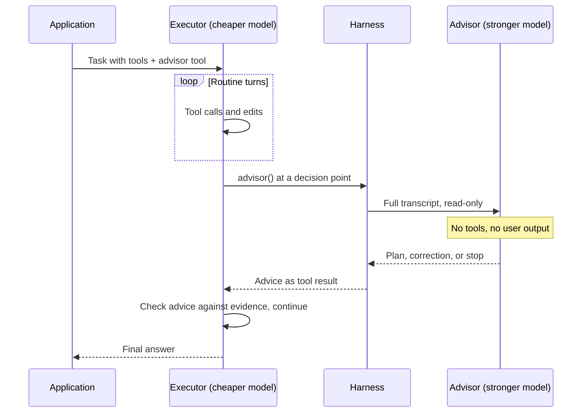

# Advisor Consult

**Also known as:** Advisor Strategy, Advisor Tool, Executor-Advisor Split, Strong-Model Consult

**Category:** Routing & Composition  
**Status in practice:** emerging

## Intent

Let a lower-cost executor model run the whole task and, at decision points it chooses, consult a stronger advisor model that reads the full transcript and returns guidance only, never actions.

## Context

A long agentic task such as a refactor, a browsing session or a multi-step research run consists mostly of mechanical turns: read a file, call a tool, apply an edit. A few turns decide the outcome, for example choosing an approach, diagnosing an error that keeps coming back, or judging whether the work is actually finished. A smaller model handles the mechanical turns well and cheaply, while a frontier model handles the decisive turns better but costs several times more per token.

## Problem

Running the strongest model on every turn pays frontier prices for work that a smaller model does just as well. Routing each request to a model tier up front does not help, because the hard moments appear in the middle of a run and cannot be predicted from the request. Delegating a hard sub-task to a stronger sub-agent hands over control and forces the parent to summarise its context into a task string, losing the tool results and failed attempts that make the decision hard. Planning once with a strong model and executing with a weak one fixes the plan before the executor has met the problems the plan did not foresee.

## Forces

- Most turns in a long run are routine, so token spend is dominated by turns that do not need the strongest model.
- The turns that decide the outcome cannot be identified before the run starts; they surface as the executor meets the task.
- A useful second opinion needs the evidence the executor has gathered, including failed attempts, not a summary the executor chose to write.
- The party that knows when it is stuck is the executor, yet a weaker model is also the one least able to recognise its own blind spots.
- Advice that the executor must obey can be wrong about local facts it never observed, while advice it may ignore is only as useful as the executor's willingness to act on it.

## Therefore

Therefore: keep the cheaper model in control of the whole run and give it a single consult tool that hands the stronger model a read-only view of the full transcript, returns a plan, a correction or a stop signal as text, and puts control straight back in the executor's hands.

## Solution

Expose the advisor to the executor as one tool with no meaningful arguments. When the executor calls it, the harness, not the executor, assembles the advisor's input from the full transcript: the system prompt, tool definitions, prior tool calls and their results. The advisor runs as a separate inference pass under its own instructions, with no tools of its own, and returns guidance text such as a plan, a course correction or a recommendation to stop. That text is inserted as the tool result and the executor continues in the same request. The executor decides when to consult; typical moments are before committing to an approach, when an error recurs, and before declaring the task done. Because the advice is guidance rather than a command, the executor still checks it against what it has observed and surfaces a conflict when a recommended step fails or contradicts the files. A per-request cap on consultations bounds cost, and advisor tokens are metered separately from executor tokens so the trade-off stays visible. Where the executor under-consults, a single nudge early in the run, or a forced call at a known decision point, restores the call rate.

## Structure

```
Executor loop (cheap model, owns tools and user-facing output) -> advisor() tool call at a self-chosen decision point -> harness builds advisor input from the full transcript -> advisor model (no tools, no output to the user) returns plan | correction | stop -> tool result inserted -> executor resumes. Cap: max consults per request. Metering: advisor tokens reported separately.
```

## Diagram



*The executor keeps control of the run and every tool; the advisor only reads the transcript at a moment the executor chooses and returns text.*

## Example scenario

A coding agent running on a mid-size model is fixing a flaky test in a large repository. Most of its work is reading files and running the test suite. After the same timeout error appears three times, it asks the advisor, which reads everything the agent has tried and points out that the test depends on a shared fixture the agent never looked at. The agent opens the fixture, fixes it, and finishes without the stronger model ever touching a file.

## Consequences

**Benefits**

- Quality on hard tasks rises toward that of the stronger model while most tokens are billed at the executor's rate.
- The advisor judges from the actual evidence, including failed attempts, because it reads the transcript rather than a hand-written brief.
- Control never leaves the executor, so there is no handoff to coordinate, no second agent loop to debug and no merge of two conversations.
- Adding or removing the advisor is a one-line change to the tool list, which makes it cheap to run the same workload with and without it.

**Liabilities**

- Each consult re-reads the whole transcript at the advisor's input price, so late consults on a long run are the most expensive ones.
- The weaker model decides when to ask, and it is the model least able to notice what it does not know, so under-consulting is the typical failure.
- The executor's stream pauses while the advisor runs, adding latency at exactly the moments the run was already slow.
- The gain shrinks as the executor's own capability approaches the advisor's, so the pairing must be re-measured on every model upgrade.

## Failure modes

- The executor never calls the advisor on a task it is quietly getting wrong, because it does not recognise the decision as hard.
- A nudge fires before the executor has read the problem, so the advisor is consulted on an empty transcript and returns generic advice.
- The executor treats the advice as binding and follows a recommended step even after the tool output shows the step failed.
- The executor ignores a correct stop signal and keeps working, so the consult cost is paid and the benefit is lost.
- No per-request cap is set, and an executor that consults on every turn costs more than running the stronger model throughout.

## What this pattern constrains

The advisor must not call tools, write to the user or take over the run: it only reads the executor's transcript and returns guidance text, and control returns to the executor after every consult, at most a capped number of times per request.

## Applicability

**Use when**

- Long agentic runs where most turns are mechanical but a few decisions determine the outcome.
- A cheaper model handles the routine turns well, and a clearly stronger model is available for the same provider or harness.
- The hard moments cannot be predicted from the request, so up-front routing would either overpay or underperform.
- The second opinion needs the gathered evidence, including failed attempts, not a summary.

**Do not use when**

- Tasks are short, so there is little to plan and the consult overhead outweighs its benefit.
- Every turn needs the strongest model, in which case switching the main model is simpler.
- The executor is already close to the advisor in capability, so consults add cost with little gain.
- The transcript cannot be shared with a second model for data-handling reasons.
- The hard part is a well-bounded sub-task that should run in its own loop with its own tools, which is agent-as-tool embedding.

## Components

- Executor model — the cheaper model that owns the loop, the tools and all user-facing output
- Advisor tool — a single tool with no meaningful arguments whose call signals that a consult is wanted now
- Transcript assembler — the harness step that gives the advisor the full conversation, so the executor cannot filter what the advisor sees
- Advisor model — the stronger model that reads the transcript without tools and returns a plan, a correction or a stop signal
- Consult cap — a per-request limit after which consult calls return an error and the executor carries on alone
- Split metering — separate token accounting for executor and advisor so the cost trade-off stays measurable

## Tools

- Claude API advisor tool — server-side implementation with max_uses, advisor-side prompt caching and separately reported advisor usage
- Claude Code /advisor — command, setting and flag that attach an advisor model to an interactive or headless coding session
- Agent frameworks with provider tool pass-through — such as Agno, which can declare the advisor tool on an agent
- Tracing and cost dashboards — show when consults happened and what they cost relative to the executor's spend

## Evaluation metrics

- Task pass rate with and without the advisor — the quality the consult buys on the same workload
- Cost per completed task — executor plus advisor spend, compared with running the stronger model throughout
- Consults per task — too few suggests under-asking, too many suggests the executor tier is too weak
- Advice uptake rate — how often the executor's next actions follow the advice, and how often following it helped
- Unconsulted failure rate — failed runs in which the executor never asked, which measures the self-triggering gap
- Consult latency — pause added to the run per consult

## Known uses

- **[Claude API advisor tool (advisor_20260301)](https://platform.claude.com/docs/en/agents-and-tools/tool-use/advisor-tool)** _available_ — Server-side tool: the executor emits a call with an empty input, the server runs the advisor model over the executor's full transcript without tools, and the advice returns as a tool result in the same request; max_uses caps consults and advisor tokens are reported separately.
- **[Claude Code /advisor](https://code.claude.com/docs/en/advisor)** _available_ — Pairs the main model with a stronger advisor that Claude consults before committing to an approach, when an error recurs, or before declaring a task done; the advisor receives the full conversation, including every tool call and result.
- **[Agno](https://docs.agno.com/examples/models/anthropic/advisor)** _available_ — Documents an agent configured with a Claude Sonnet executor and an advisor_20260301 tool pointing at an Opus advisor model.
- **[COTA (Comparison-Only Tiny Advisor)](https://arxiv.org/abs/2608.21027)** _pure-future_ — Research variant with the capability gap reversed: a tiny comparator advises a larger actor at runtime with non-binding alternatives and the actor replans, showing the pattern rests on who holds control rather than on which model is larger.

## Related patterns

- _alternative-to_ **Agent-as-Tool Embedding** — Both expose a second model as a tool, but with opposite boundaries: an embedded sub-agent runs its own loop and tools and hides its turns from the parent, while an advisor has no loop or tools and reads the caller's full transcript. Embedding delegates work; the advisor lends judgement.
- _alternative-to_ **Plan-and-Execute** — Plan-and-execute uses the strong model once, before the run; the advisor is consulted in the middle of the run, when the executor has met the problems the plan did not foresee.
- _complements_ **Multi-Model Routing** — Routing picks one model per request before the run; the advisor keeps a single cheap model on the whole run and buys stronger judgement only at the turns that need it. The two stack: route easy requests to a small model with no advisor, hard ones to a mid-tier executor with one.
- _alternative-to_ **Complexity-Based Routing** — A complexity classifier must predict difficulty from the request alone; the advisor defers that call to the executor, which sees difficulty as it arises.
- _complements_ **Top-Tier Model For Everything (Cost)** — The advisor is a direct remedy for this anti-pattern: frontier-model judgement is kept for decision points instead of being paid for on every turn.
- _complements_ **Evaluator-Optimizer** — An evaluator critiques on a fixed loop regardless of need; the advisor speaks only when the executor asks, and can be asked for a completion check before the executor declares the task done.
- _complements_ **Degenerate-Output Detection** — That pattern can escalate the output itself to a stronger model; the advisor never produces the output, it only changes what the executor does next.
- _specialises_ **Adaptive Compute Allocation** — A specific way to vary compute per task: the extra compute is a stronger model's read of the transcript, spent at points the executor selects.
- _complements_ **Step Budget** — A per-request consult cap is a step budget for the advisor, bounding the one cost the executor controls.
- _complements_ **Reflexive Metacognitive Agent** — The advisor's value depends on the executor knowing when it is out of its depth; an explicit self-model of competence gives it a better trigger than a nudge.

## References

- [The advisor strategy: Give Sonnet an intelligence boost with Opus](https://claude.com/blog/the-advisor-strategy) — 2026
- [Advisor tool - Claude Platform Docs](https://platform.claude.com/docs/en/agents-and-tools/tool-use/advisor-tool) — 2026
- [Escalate hard decisions with the advisor tool - Claude Code Docs](https://code.claude.com/docs/en/advisor) — 2026
- [Don't Solve, Just Compare: Tiny Advisors for Runtime Intervention in LLM Agents](https://arxiv.org/abs/2608.21027) — Yanze Jiang, Mingxuan Li, Yuhao Wang, Shengfang Zhai, Jiaheng Zhang, 2026
- [Learning to Decode Collaboratively with Multiple Language Models](https://arxiv.org/abs/2403.03870) — Shannon Zejiang Shen, Hunter Lang, Bailin Wang, Yoon Kim, et al., 2024
- [FrugalGPT: How to Use Large Language Models While Reducing Cost and Improving Performance](https://arxiv.org/abs/2305.05176) — Lingjiao Chen, Matei Zaharia, James Zou, 2023
