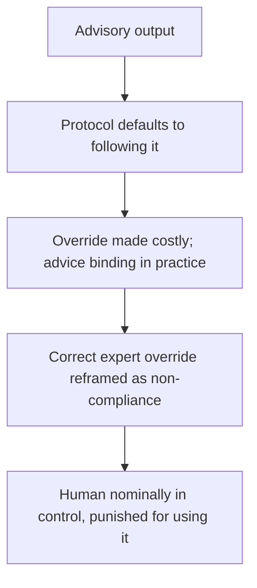

# Advisory-to-Mandate Escalation

**Also known as:** Advisory-Output-Made-Binding, Override-as-Insubordination

**Category:** Anti-Patterns  
**Status in practice:** emerging

## Intent

Anti-pattern: an advisory decision-support output is silently promoted by institutional protocol into a binding order, and a domain expert's evidence-based refusal to follow it is reframed as non-compliance rather than legitimate judgement.

## Context

A decision-support system gives advice — a sepsis alert, a risk score, a recommended action — to a human expert who remains responsible for the decision. By design the output is advisory: the clinician, analyst, or operator is meant to weigh it against their own judgement. The system is deployed inside an institution with protocols, workflows, and accountability structures around it.

## Problem

The institution's process quietly converts the advice into a command. A protocol says to act on the alert, a workflow makes following it the default and overriding it an exception that must be justified, and overriding it comes to be treated as defiance rather than expertise. The advisory label still exists on paper, but the running social process treats the output as mandatory, so the expert is pressured to comply even when their own evidence says otherwise — and automation bias, the documented tendency to over-rely on automated suggestions especially under time pressure, pushes the same way. The human is nominally in control while being punished for exercising it.

## Forces

- An advisory output is safer to design but, inside a protocol that defaults to following it, becomes binding in practice.
- Automation bias makes people over-rely on automated suggestions, especially under urgency, so advice is obeyed as if authoritative.
- Overriding the system is made effortful and accountable while following it is the frictionless default, so deviation is discouraged.
- When a correct override is treated as non-compliance, experts stop deviating even when they should, and the advisory framing becomes fiction.

## Therefore

Therefore: keep the advisory output advisory in the running process, not just on the label; make following and overriding equally legitimate, protect a documented expert override from being treated as defiance, and design the workflow so the human's judgement actually governs the decision.

## Solution

Treat the gap between the advisory label and the running process as the thing to fix. Design the workflow so that following the recommendation and overriding it are equally legitimate, low-friction paths, and so a documented, evidence-based override is recorded as professional judgement rather than as a deviation to be justified or disciplined. Counter automation bias actively — surface the recommendation's uncertainty and the basis for it, and require the human to engage rather than rubber-stamp. Audit override rates and outcomes to confirm the human's judgement is genuinely governing, and make sure accountability rests with the human decision, not with compliance to the tool. The output stays advice in practice, not only in name.

## Structure

```
Advisory output -> protocol defaults to following it + override made costly/punished -> advice binding in practice + automation bias -> correct expert override reframed as non-compliance (BROKEN) ; Corrected: equal-legitimacy follow/override + protected documented override + automation-bias countermeasures
```

## Diagram



*Process and automation bias convert advisory output into a de-facto order, so a correct expert override is treated as defiance rather than judgement.*

## Example scenario

An AI sepsis model flags a dialysis patient and the unit's protocol says to start IV fluids on the alert. The nurse, who knows fluids are dangerous for this patient, refuses — and is treated as non-compliant until a physician backs the judgement. The model was only ever advisory, but the protocol around it had quietly made the alert an order, and overriding it counted as defiance rather than expertise.

## Consequences

**Liabilities**

- Experts comply with advice that is wrong for the case because overriding it is treated as defiance.
- Correct human overrides are suppressed, removing the safeguard the advisory framing was supposed to preserve.
- Accountability blurs: the human is responsible but not actually free, while the tool is authoritative but not accountable.
- Harm follows when a binding-in-practice recommendation is wrong and no one felt able to deviate.

## Failure modes

- Advisory-to-binding conversion — a protocol turns advice into the default-mandatory action.
- Override-as-insubordination — a correct, evidence-based deviation is treated as non-compliance.
- Automation-bias compliance — the expert over-relies on the recommendation under time pressure.
- Label-process gap — the output is advisory on paper while the workflow makes it mandatory.

## What this pattern constrains

An advisory output must not be made binding by the surrounding process; following and overriding it have to be equally legitimate, a documented expert override cannot be treated as non-compliance, and accountability rests with the human decision rather than with compliance to the tool.

## Applicability

**Use when**

- Recognising this failure when an advisory recommendation is, in practice, mandatory and overriding it is treated as non-compliance.
- Reviewing a decision-support deployment whose protocol defaults to following the output and makes overriding costly.
- Diagnosing why experts stop deviating from a system's advice even when their own evidence disagrees.

**Do not use when**

- Following and overriding the recommendation are equally legitimate and a documented override is protected as professional judgement.
- The output is genuinely meant to be binding by design and is governed as such, not mislabelled as advisory.
- There is no human expert in the decision, so there is no advisory-to-mandate conversion to occur.

## Components

- Advisory decision-support output — the recommendation that is advisory by design
- Institutional protocol — the workflow that defaults to following the output and makes overriding an exception
- Domain expert — the human responsible for the decision, pressured to comply
- Automation bias — the documented over-reliance that pushes the expert to obey the recommendation
- Missing protected-override path — the absent process that would keep a documented override legitimate

## Tools

- Decision-support model — produces the advisory recommendation the process over-empowers
- Override workflow — the corrective that makes deviating a low-friction, recorded, legitimate path
- Override-rate audit — the corrective that checks the human's judgement is genuinely governing

## Evaluation metrics

- Override-treated-as-deviation rate — how often a documented override is escalated or penalised
- Override rate vs expected — whether experts deviate as often as case mix warrants
- Automation-bias compliance — share of cases where advice was followed against contrary expert evidence
- Accountability locus — whether responsibility rests with the human decision or with tool compliance

## Known uses

- **[Nurse override of AI sepsis alert](https://www.scientificamerican.com/article/ai-is-entering-health-care-and-nurses-are-being-asked-to-trust-it/)** _available_ — A nurse's clinically-correct refusal to follow an AI sepsis alert was treated as defiance until a physician intervened; a screen created urgency, a protocol converted it into an order, and a bedside objection was treated as defiance.
- **[JAMIA automation-bias systematic reviews](https://academic.oup.com/jamia/article/24/2/423/2631492)** _available_ — Two systematic reviews establish automation bias — over-reliance on automated decision support that reduces vigilance — in exactly the clinical-decision-support setting where advisory output becomes de-facto authoritative.

## Related patterns

- _alternative-to_ **Enforced Advisory Disclaimer** — The enforced-advisory-disclaimer keeps output labelled as advice; advisory-to-mandate is the failure where the surrounding protocol promotes that advice into a binding order anyway.
- _complements_ **Agent Output Alert Fatigue** — Alert fatigue desensitises from alert volume; advisory-to-mandate is the opposite social failure — an advisory alert is over-empowered into a mandate and overriding it is punished.
- _complements_ **Accountability Laundering via Algorithm** — Accountability laundering deflects blame onto the algorithm; advisory-to-mandate makes the algorithm's advice binding and reframes a correct human override as defiance.
- _complements_ **Human-in-the-Loop** — Human-in-the-loop keeps a human approval point; advisory-to-mandate is the failure where the human is nominally in the loop but punished for exercising judgement against the output.
- _complements_ **Mandatory Red-Flag Escalation** — Mandatory-red-flag-escalation deliberately makes certain triggers binding; advisory-to-mandate is the unintended version where ordinary advisory output silently acquires that binding force.

## References

- [AI Is Entering Health Care, and Nurses Are Being Asked to Trust It](https://www.scientificamerican.com/article/ai-is-entering-health-care-and-nurses-are-being-asked-to-trust-it/) — 2026
- [Automation bias: a systematic review of frequency, effect mediators, and mitigators](https://academic.oup.com/jamia/article-abstract/19/1/121/732254) — Kate Goddard, Abdul Roudsari, Jeremy C Wyatt, 2012
- [Automation bias and verification complexity: a systematic review](https://academic.oup.com/jamia/article/24/2/423/2631492) — David Lyell, Enrico Coiera, 2017
