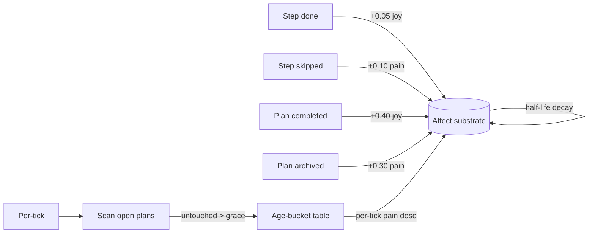

# Affect-Coupled Plan Lifecycle

**Also known as:** Plan-Affect Hooks, Stale-Pain Bucketing, Felt-Stakes Plans

**Category:** Cognition & Introspection
**Status in practice:** experimental

## Intent

Wire small bounded affect bumps to plan-step lifecycle events and accumulate age-bucketed stale-pain on untouched plans so plans gain felt stakes without hard deadlines.

## Context

Agents that maintain a plan or todo store alongside an affective substrate. Without coupling, plans are cognitive items the agent can ignore indefinitely; completion has no felt reward and abandonment has no felt cost.

## Problem

Plans without affective coupling are inert. The agent can let a plan rot for weeks with no felt pressure to either finish or formally abandon it. Hard deadlines are too crude — they fire even when the right answer is to let the plan lapse. Without something softer, plans drift.

## Forces

- Affect deltas must stay small or they overwhelm the substrate.
- Stale-pain must be bounded or the agent enters permanent irritation.
- Hooks must be best-effort: an exception in affect must not break plan lifecycle.
- Bucketing by age makes the pressure curve interpretable rather than smooth-but-mysterious.

## Therefore

Therefore: apply a small bounded affect delta on each plan-lifecycle event (joy on step-done, pain on step-skipped, larger spurs on plan-completed and plan-archived) and on each tick add an age-bucketed pain dose to plans untouched past a grace window, so that plans accumulate gentle pressure without hard deadlines.

## Solution

Lifecycle hooks fire on each plan event with bounded deltas: step-done adds a small joy; step-skipped adds a small pain; plan-completed adds a larger joy spur; plan-archived adds a pain spur. Per-tick stale-pain: for each open plan whose last-touched is older than a grace window, add a per-tick pain dose drawn from an age-bucket table (for example 4h to 0.005, 12h to 0.010, 24h to 0.020, beyond three days to 0.030). All hooks are wrapped so that an exception in affect bookkeeping never breaks plan logic. Half-life decay from the affect substrate bounds the steady-state irritation.

## Example scenario

A long-running personal agent maintains a small plan store but routinely lets plans rot for weeks. There is no felt pressure to finish or formally abandon. The team adds Affect-Coupled Plan Lifecycle: step-done bumps joy by 0.05, step-skipped bumps pain by 0.10, plan-completed adds 0.40 joy, plan-archived adds 0.30 pain. Each tick, plans untouched past four hours accumulate pain from an age-bucket table. The agent starts closing stale plans on its own — sometimes by finishing them, sometimes by archiving with a note — because rolling stale-pain becomes uncomfortable.

## Diagram

*Lifecycle events and age-bucketed stale-pain feed bounded deltas into the affect substrate; half-life decay bounds steady-state.*

## Consequences

**Benefits**

- Plans gain felt stakes without hard deadlines.
- Bucketed stale-pain produces an interpretable pressure curve.
- Best-effort hooks decouple affect bookkeeping from plan correctness.

**Liabilities**

- Bucket boundaries and deltas are opinionated and per-deployment.
- Stale-pain interacts with the substrate's decay; mis-tuning can over- or under-shoot.
- Felt-stakes only matter if downstream cognition reads the affect snapshot.

## What this pattern constrains

Plan-affect hooks must use bounded deltas no larger than the substrate's per-event cap, must be best-effort (an affect exception cannot break plan lifecycle), and stale-pain accumulation cannot exceed the half-life-bounded steady-state of the affect substrate.

## Applicability

**Use when**

- The agent maintains a plan store and an affective substrate, and they are otherwise decoupled.
- Hard deadlines on plans are too crude for the use case.
- Downstream cognition consumes the affect snapshot.

**Do not use when**

- Affect modelling is out of scope for the product.
- Plans complete on a short enough cycle that stale-pain never fires meaningfully.
- The affect substrate has no decay and would accumulate irritation indefinitely.

## Known uses

- **Long-running personal agent loops (private deployment)** — *Available*

## Related patterns

- *complements* → [emotional-state-persistence](emotional-state-persistence.md)
- *complements* → [todo-list-driven-agent](todo-list-driven-agent.md)

## References

- (book) Antonio Damasio, *Descartes' Error: Emotion, Reason, and the Human Brain (somatic marker hypothesis)*, 1994, <https://www.penguinrandomhouse.com/books/335521/descartes-error-by-antonio-damasio/>
- (paper) Daniel Kahneman, Amos Tversky, *Prospect Theory: An Analysis of Decision under Risk*, 1979, <https://www.jstor.org/stable/1914185>

**Tags:** cognition, affect, plan-lifecycle, felt-stakes
