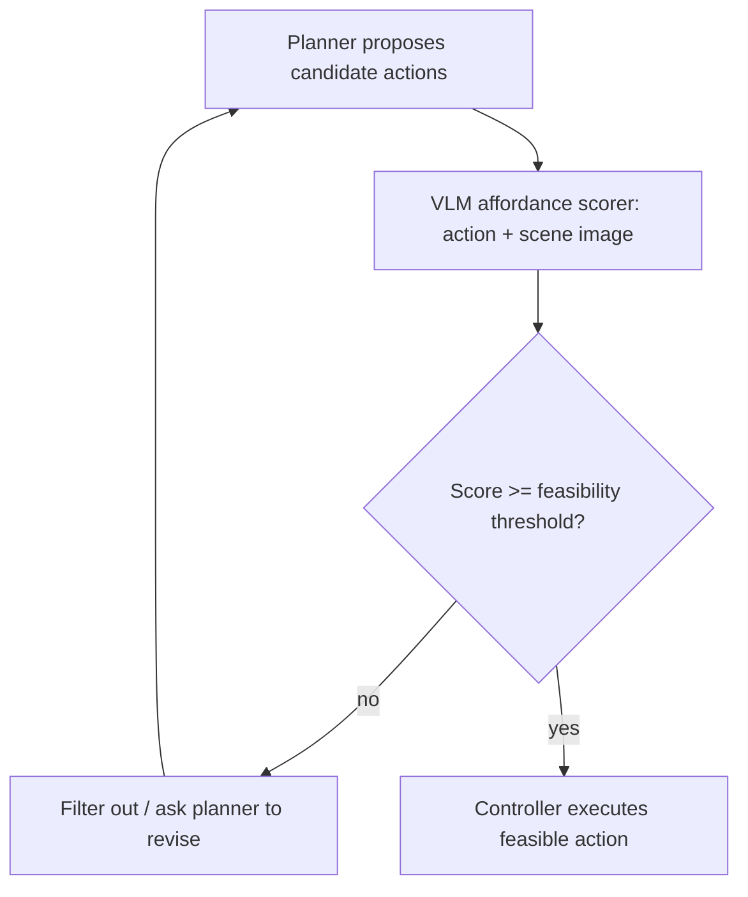

# Affordance Grounding Before Action

**Also known as:** Affordance Prompting, Feasibility Screen, Affordance Gate

**Category:** Tool Use & Environment  
**Status in practice:** experimental

## Intent

Have a vision-language model ground each candidate action against the current scene and predict its affordance, so that actions the environment cannot physically support are discarded before any reach the controller.

## Context

An embodied agent — a robot arm, a mobile manipulator, a GUI or device controller — plans an action from a high-level goal and a view of the scene. The planner reasons in language about what to do next, but language plans drift from what the body and the scene actually allow. A target may sit out of reach, an object may be too large for the gripper, a surface may not be graspable, or a referenced widget may not exist on screen. Executing such an action wastes a real interaction step and can leave the world in a worse state.

## Problem

A language planner proposes actions from intent, not from what the scene affords, so it readily emits commands the agent cannot carry out: grasp an object beyond reach, place on a surface that does not exist, click a control that is off screen. Checking feasibility only after execution is slow and sometimes destructive, while encoding every physical pre-condition by hand is brittle across scenes and embodiments. The agent needs to know, from the current perception, whether each proposed action is even possible before it spends a real step on it.

## Forces

- A language planner reasons about goals and steps but has weak grounding in the geometry, reachability, and physics of the specific scene in front of it.
- Validating an action by executing it costs a real interaction step and can be irreversible, so failed actions are expensive.
- Hand-coding pre-conditions per object and per embodiment does not transfer; a learned visual predictor generalises but adds latency and can mis-score.

## Therefore

Therefore: insert a perception-side gate where a vision-language model scores each candidate action's affordance against the current image, and only actions that pass the feasibility threshold are forwarded to the controller.

## Solution

For each candidate action the planner proposes, render a grounded query to a vision-language model that pairs the action with the current scene image and asks whether the agent's body can perform it here — is the target reachable, graspable, clickable, large enough, on a valid surface. The model returns an affordance score or a yes/no feasibility judgement, optionally with the grounded location. Candidates that fall below the threshold are filtered out and the planner is asked to revise; candidates that pass are forwarded to the low-level controller for execution. The check is pure perception: it reads the scene as it is and predicts feasibility, without rolling out the action's downstream consequences or maintaining a simulator of the environment.

## Structure

```
Planner -> candidate actions -> VLM affordance scorer (action + scene image) -> filter below threshold -> feasible actions -> controller
```

## Diagram



*Each candidate action is scored for affordance against the current scene; only feasible actions reach the controller.*

## Example scenario

A tabletop robot is told to put the mug on the top shelf. Its planner proposes grasping the mug and placing it on the shelf. Before either runs, a vision-language model looks at the camera image and scores each action: the grasp is feasible because the mug is in reach and gripper-sized, but the place is scored infeasible because the top shelf is above the arm's reach. The place action is filtered out, and the planner is asked to revise toward a reachable shelf instead of wasting a move the arm could never complete.

## Consequences

**Benefits**

- Physically impossible actions are caught from perception before they cost a real interaction step or damage the scene.
- The visual feasibility predictor transfers across objects and layouts better than hand-coded pre-conditions.
- The planner stays focused on intent while a separate grounded check enforces what the body and scene allow.

**Liabilities**

- A miscalibrated scorer either blocks valid actions, stalling the agent, or passes infeasible ones, defeating the gate.
- Each candidate adds a vision-language inference, raising per-step latency and cost.
- The gate screens feasibility now, not safety or downstream effects; a feasible action can still be the wrong or harmful one.

## Failure modes

- Over-blocking — the scorer marks reachable, graspable actions as infeasible and the agent never makes progress.
- False affordance — the scorer passes an action the body cannot execute, so the failure surfaces only at the controller.
- Grounding mismatch — the predicted affordance location does not match the object the planner meant, gating the wrong action.
- Threshold drift — a fixed feasibility threshold tuned on one scene type silently mis-screens on a different one.

## What this pattern constrains

Only actions the scene affords reach the controller; the agent may not execute a candidate action until the vision-language affordance check passes the feasibility threshold, and a candidate scored below threshold must be filtered or revised rather than attempted.

## Applicability

**Use when**

- An embodied or device agent plans actions in language but executes against a physical or on-screen scene with reach, geometry, or existence constraints.
- Failed actions are expensive or irreversible, so screening infeasible candidates from perception is worth a per-step inference.
- A vision-language model can ground the action against the scene and predict feasibility better than hand-coded pre-conditions.

**Do not use when**

- The action space is fully reliable, so every proposed action is already known to be executable.
- The real concern is an action's downstream consequences or safety, where a side-effect simulator or a policy gate fits better than a feasibility screen.
- Per-candidate vision-language latency is unaffordable and a cheap geometric reachability check would suffice.

## Components

- Planner — proposes candidate actions from the goal and the scene, without strong physical grounding
- VLM affordance scorer — pairs each candidate action with the current scene image and predicts a feasibility score or judgement
- Feasibility gate — filters out candidates below the threshold and forwards passing ones to the controller
- Revision loop — asks the planner for an alternative when a candidate is screened out
- Low-level controller — executes only the actions that pass the affordance check

## Tools

- Vision-language model — grounds a candidate action against the scene image and predicts its affordance
- Scene camera / screenshot capture — supplies the current visual observation the scorer reads
- Affordance / grounding head — returns the feasible location or score for the action on the perceived object

## Evaluation metrics

- Infeasible-action catch rate — fraction of physically impossible actions screened out before execution
- Over-block rate — fraction of feasible actions wrongly rejected by the gate
- Wasted-step reduction — drop in executed-then-failed actions versus a no-gate baseline
- Per-step gate latency — added inference time the affordance check costs each step

## Known uses

- **[LLM+A (Affordance Prompting)](https://arxiv.org/abs/2404.11027)** _pure-future_ — Prompts a vision-language model to predict affordance values for candidate robot manipulation actions against the current scene, screening physically infeasible actions before execution.
- **[OVAL-Prompt](https://arxiv.org/abs/2404.11000)** _pure-future_ — Open-vocabulary affordance localisation that prompts a VLM to ground where on an object an action is feasible, supplying the grounded affordance the gate screens on.
- **[SayCan](https://say-can.github.io/)** _available_ — A language model proposes candidate skills while learned affordance functions score each one for what the robot can actually execute in the current state, so only feasible actions are selected — the canonical affordance gate.
- **[VoxPoser](https://voxposer.github.io/)** _available_ — An LLM and a VLM compose 3D value maps that ground affordances and constraints from the scene observation, steering trajectory synthesis toward what the environment physically affords.
- **[ReKep](https://rekep-robot.github.io/)** _available_ — Large vision models and VLMs ground RGB-D observations into relational keypoint constraints that encode what manipulation a scene affords, screening actions against perceived feasibility before motion.

## Related patterns

- _complements_ **Simulate Before Actuate** — Both screen actions before execution, but simulate-before-actuate runs a deterministic side-effect simulation; the affordance gate is a perception-side feasibility check with no simulator.
- _alternative-to_ **World Model as Tool** — World-model-as-tool rolls out an action's future consequences via a generative simulator; the affordance gate predicts present feasibility from the scene image without any rollout.
- _alternative-to_ **Mental-Model-In-The-Loop Simulator** — The simulator scores multi-step strategy outcomes; the affordance gate scores whether a single candidate action is physically possible right now.
- _complements_ **Canonical-Entity Grounding** — Both ground a proposed action against an authority before acting; canonical-entity-grounding resolves business identifiers, the affordance gate resolves physical feasibility against the scene.

## References

- [Empowering Large Language Models on Robotic Manipulation with Affordance Prompting](https://arxiv.org/abs/2404.11027) — 2024
- [OVAL-Prompt: Open-Vocabulary Affordance Localization for Robot Manipulation through LLM Affordance-Grounding](https://arxiv.org/abs/2404.11000) — 2024
- [Do As I Can, Not As I Say: Grounding Language in Robotic Affordances](https://arxiv.org/abs/2204.01691) — Michael Ahn, Anthony Brohan, Noah Brown, et al., 2022
- [VoxPoser: Composable 3D Value Maps for Robotic Manipulation with Language Models](https://arxiv.org/abs/2307.05973) — Wenlong Huang, Chen Wang, Ruohan Zhang, Yunzhu Li, Jiajun Wu, Li Fei-Fei, 2023
- [ReKep: Spatio-Temporal Reasoning of Relational Keypoint Constraints for Robotic Manipulation](https://arxiv.org/abs/2409.01652) — Wenlong Huang, Chen Wang, Yunzhu Li, Ruohan Zhang, Li Fei-Fei, 2024
