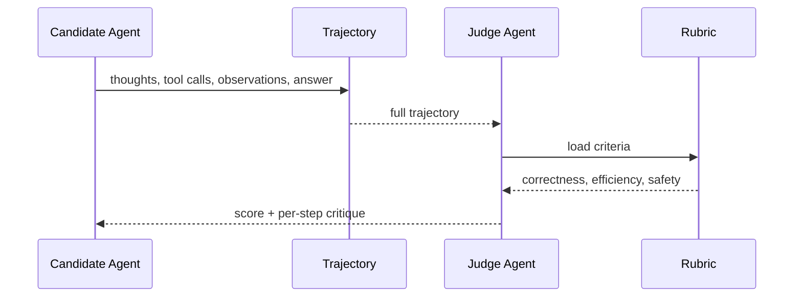

# Agent-as-a-Judge

**Also known as:** Trajectory Evaluator, Judge Agent

**Category:** Governance & Observability  
**Status in practice:** emerging

## Intent

Evaluate an agent's full trajectory (steps, tool calls, intermediate states) by another agent rather than scoring only the final output.

## Context

Agent evaluations (SWE-Bench, agentic benchmarks) where the final output is one signal among many and the trajectory contains evaluable structure.

## Problem

LLM-as-judge evaluates only the final answer; agentic tasks succeed or fail along the trajectory in ways the final answer hides.

## Forces

- Trajectory evaluation is more expensive than answer-only judging.
- Judge agents have their own biases and failure modes.
- Trajectory schemas vary per agent framework.

## Therefore

Therefore: feed the candidate's full trajectory (thoughts, tool calls, observations, final answer) into a separate judge agent scoring against an explicit rubric, so that process quality is graded alongside the answer rather than inferred from it.

## Solution

A judge agent receives the candidate agent's full trajectory: thoughts, tool calls, observations, intermediate state, and final answer. It evaluates against a rubric covering correctness, efficiency, and process quality. Outputs a structured verdict with rationale.

## Example scenario

A team running a coding-agent benchmark notices that two agent versions get the same final answer but one wastes twenty extra tool calls and once tried to write outside the workspace. Scoring only the final patch, both look equal. They wire in an Agent-as-Judge that reads each full trajectory — every thought, tool call, and observation — and rates correctness, efficiency, and safety against a rubric. The wasteful version drops to a lower verdict and is sent back for tuning before the change merges.

## Diagram

## Consequences

**Benefits**

- Catches process-level failures that hide behind right answers.
- Inspectable judge rationales.

**Liabilities**

- Cost: trajectory evaluation is expensive.
- Judge calibration on trajectory rubrics is its own dataset effort.

## What this pattern constrains

The judge sees the full trajectory, not just the final output; answer-only evaluation is not used in this pattern.

## Applicability

**Use when**

- Agent tasks succeed or fail along their trajectory in ways the final answer cannot reveal.
- You have access to the full trajectory (thoughts, tool calls, observations) of the candidate agent.
- Process-quality signals (efficiency, redundant steps, unsafe actions) matter for the eval verdict, not just correctness.

**Do not use when**

- Only the final output is checkable and the trajectory carries no evaluable structure.
- Trajectory evaluation cost is unjustified for the use case (cheap LLM-as-judge on the answer suffices).
- Judge-agent calibration cannot be funded as its own dataset effort.

## Known uses

- **MetaGPT Agent-as-a-Judge** — *Available*
- **SWE-Bench-style agentic benchmarks** — *Available*

## Related patterns

- *specialises* → [llm-as-judge](llm-as-judge.md)
- *uses* → [eval-harness](eval-harness.md)
- *uses* → [decision-log](decision-log.md)

## References

- (paper) Zhuge, Zhao, Ashley, Wang, Khizbullin, Xiong, Liu, Chang, Zhang, Yang, Liu, Huang, Schmidhuber, *Agent-as-a-Judge: Evaluate Agents with Agents*, 2024, <https://arxiv.org/abs/2410.10934>

**Tags:** eval, judge, trajectory
