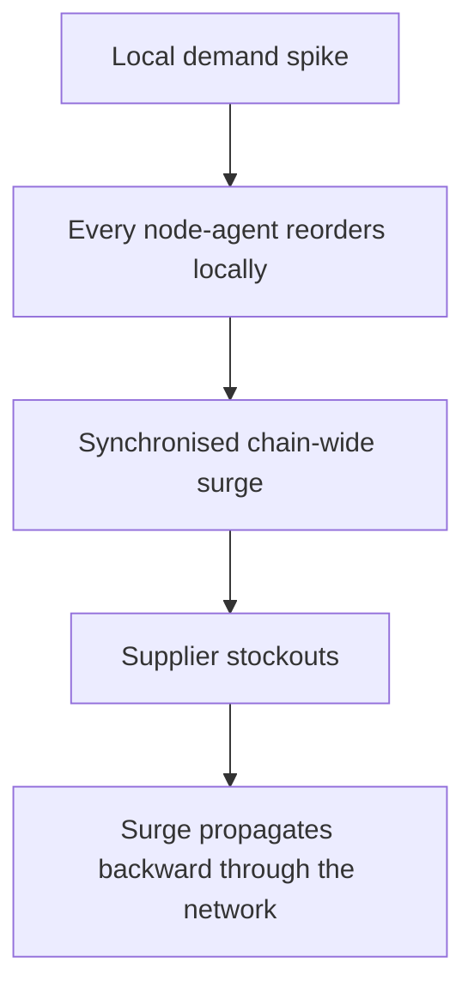

# Agent Bullwhip Effect

**Also known as:** Self-Induced Demand Amplification, Policy-Induced Order Variability

**Category:** Anti-Patterns  
**Status in practice:** emerging

## Intent

Anti-pattern: distributed supply-chain or replenishment agents, each optimising locally, amplify order variability through their own decision policy, so a local demand spike triggers synchronised chain-wide reordering and supplier stockouts that propagate backward.

## Context

Multiple agents run a supply chain or replenishment network, each responsible for one node — a store, a warehouse, a supplier — and each reordering to optimise its own stock against observed demand. The agents act in parallel on the same upstream signal. Classical supply-chain theory already knows that ordering policies can amplify demand variability upstream — the bullwhip effect.

## Problem

When each agent optimises its own node against a demand spike, their reorders synchronise: a small bump at the stores becomes a large coordinated order upstream, which causes supplier stockouts that ripple backward through the network. The amplification does not come from any agent failing or hallucinating — each is doing its job correctly — it comes from the agents' collective decision policy reacting to the same signal at once. The more agents and the tighter their coupling to demand, the larger the swing, and the variability the network creates is the agents' own, not the customers'.

## Forces

- Each agent optimising its own node locally is individually correct, yet the aggregate of those local optima amplifies the shared signal.
- Reacting quickly to a demand spike is good for one node but, done by all nodes at once, manufactures a coordinated surge upstream.
- The amplified variability is generated by the agents' policy, distinct from the variability inherited from real customer demand.
- Damping the reaction reduces the swing but slows each node's response to genuine demand changes.

## Therefore

Therefore: treat the order variability the agents generate as a system-level quantity to control, not a sum of local optimisations; dampen the demand signal, coordinate or stagger reordering, and separate policy-induced variability from real customer demand.

## Solution

Recognise that a network of locally-optimising agents can amplify the very signal it reacts to, and design against it at the system level rather than per node. Add explicit demand-signal dampening so a spike at one node does not translate into a full synchronised reorder upstream, and coordinate or stagger the agents' ordering so they do not all react in lockstep. Measure and separate the variability the agents' policy introduces from the variability inherited from real customer demand, and tune the policy to minimise the former. The control lives in the collective ordering policy and its damping, not in any single agent's local optimisation.

## Structure

```
Local demand spike -> every node-agent reorders locally (each optimal) -> synchronised chain-wide surge -> supplier stockouts propagate backward (BROKEN: self-amplified variability) ; Corrected: demand dampening + staggered/coordinated ordering
```

## Diagram



*Locally-optimal reorders synchronise into a chain-wide surge; the amplified variability is generated by the agents' policy, not by customer demand.*

## Example scenario

A grocery chain runs a replenishment agent per store and per depot. A short promotion spikes demand for one product at many stores at once; every store-agent reorders aggressively, the depot-agents see the combined surge and over-order from the supplier, and the supplier stocks out. When the promotion ends, the inflated orders unwind into overstock. Customer demand barely moved; the swing was the agents' own.

## Consequences

**Liabilities**

- Supplier stockouts and overstock swings grow with the network, driven by the agents' own ordering rather than real demand.
- Costs rise on both sides: emergency restocking when surges hit, write-downs when the overshoot unwinds.
- Because each agent is locally correct, the cause is hard to attribute and easy to blame on demand volatility.
- Adding more autonomous nodes worsens the swing rather than smoothing it.

## Failure modes

- Synchronised reorder — all node-agents react to the same spike at once, manufacturing a coordinated upstream surge.
- No demand dampening — the raw spike is passed straight through to upstream orders.
- Variability mis-attribution — policy-induced swings are blamed on customer demand, so the policy is never corrected.
- Scale-out amplification — adding agents increases the amplitude instead of averaging it out.

## What this pattern constrains

Reordering policy must not be left to per-node local optimisation alone; the demand signal is dampened and ordering is coordinated or staggered so the network cannot amplify its own variability, and policy-induced variability is tracked separately from real customer demand.

## Applicability

**Use when**

- Recognising this failure when a network of replenishment or ordering agents amplifies a demand signal into upstream surges and stockouts.
- Reviewing a multi-agent supply chain where each node optimises locally with no system-level damping.
- Diagnosing supplier stockouts and overstock swings larger than the underlying customer demand change.

**Do not use when**

- Ordering is centrally coordinated or the demand signal is dampened so the network cannot amplify its own variability.
- There is a single ordering decision rather than many parallel locally-optimising agents.
- The observed variability genuinely comes from customer demand, not the agents' policy.

## Components

- Node agents — per-store, per-warehouse, or per-supplier agents each reordering to optimise their own stock
- Shared demand signal — the upstream signal all the agents react to at once
- Missing demand dampening — the absent smoothing that would stop a spike becoming a synchronised surge
- Missing coordination — the absent staggering or system-level policy across the node agents
- Variability attribution — the separation of policy-induced swings from real customer demand, here absent

## Tools

- Replenishment policy — the per-node ordering logic that, uncoordinated, amplifies the signal
- Demand-signal smoother — the corrective damping applied before a spike becomes an order surge
- Network simulator — tests the collective ordering policy for amplification before deployment

## Evaluation metrics

- Order-variability amplification — ratio of upstream order variance to customer demand variance
- Policy-induced variability share — fraction of total variability attributable to the agents' ordering rather than demand
- Stockout and overstock incidents — supplier-side swings traced to synchronised reordering
- Amplification vs node count — how the swing changes as autonomous nodes are added

## Known uses

- **[Flowr retail supply-chain agents](https://arxiv.org/pdf/2604.05987)** _available_ — Production report where rapid demand spikes triggered synchronised replenishment across the chain, causing supplier stockouts that propagated backward; the team added explicit demand-signal dampening to prevent the bullwhip effect.
- **[Reliability of autonomous supply-chain agents](https://arxiv.org/html/2605.17036)** _available_ — Names the 'agent bullwhip effect' as variability created by the agent's own decision policy, separate from variability inherited from customer demand.

## Related patterns

- _complements_ **Cascading Agent Failures** — Cascading failures propagate one agent's error to peers; the bullwhip amplifies a legitimate demand signal through the agents' own ordering policy, not an error.
- _complements_ **Compound Error Degradation** — Compound-error multiplies per-step error along one trajectory; the bullwhip amplifies a demand signal across a network of parallel agents.
- _complements_ **Multi-Agent on Sequential Workloads** — Sequential degradation loses accuracy when a sequential task is split; the bullwhip amplifies variability across distributed locally-optimising agents.

## References

- [Flowr: Scaling Up Retail Supply Chain Operations Through Agentic AI in Large Scale Supermarket Chains](https://arxiv.org/pdf/2604.05987) — 2026
- [Reliability and Effectiveness of Autonomous AI Agents in Supply Chain Management](https://arxiv.org/html/2605.17036) — 2026
