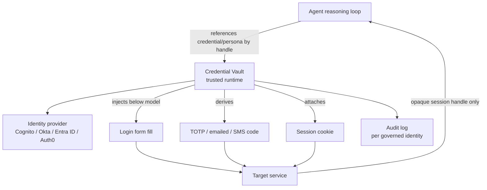

# Agent Credential Vault

**Category:** Safety & Control  
**Status in practice:** emerging

## Intent

Broker the agent's credentials at action time through a managed vault of passwords, MFA secrets, and digital personas, so secrets never enter the prompt or context and the agent authenticates as a governed identity.

## Context

An agent automates work that requires authenticating to real services: logging into websites, filling sign-in forms, completing 2FA challenges, or signing up under an identity. The agent is driven by a model whose context is logged, traced, and sent to a third-party provider, and the same agent may face hostile inputs from the pages it operates. The credentials it needs are high-value: passwords, TOTP seeds, email and phone identities used for verification.

## Problem

If the agent is handed raw passwords, MFA seeds, or persona details in its prompt, those secrets land in the model context and from there in chat logs, trace exports, eval datasets, and the provider's infrastructure, where rotation cannot recall the copies already scattered. A prompt injection on an operated page can also coax the model into disclosing whatever credentials it can see. A reference-only scheme (a typed token the runtime resolves) handles API tokens but not the messy reality of web automation: a login form needs a username and password typed into fields, a verification step needs a one-time code read from an email or SMS the agent controls, and a sign-up needs a coherent identity. Without a runtime that supplies all of this without ever exposing the values to the model, every authenticated action is a leak waiting to happen and the agent has no stable, attributable identity.

## Forces

- Web login and 2FA need concrete credential values delivered to fields and challenges, not just an API token reference.
- Any secret the model can read can be logged, traced, or extracted by injection.
- A vault that injects below the model adds a trusted component that must itself be hardened and audited.
- Personas and stored credentials raise policy and consent questions about who the agent is acting as.

## Applicability

**Use when**

- The agent must authenticate to real services with passwords, MFA, or session cookies.
- Web automation requires typing credentials into forms or clearing emailed/SMS one-time codes.
- The agent needs a stable, governed identity whose access can be scoped, rotated, and revoked.
- Credentials must stay out of the prompt, traces, and the model provider's infrastructure.

**Do not use when**

- The agent only calls APIs that a reference-based secrets-handling scheme already covers.
- No authenticated actions are performed at all.
- A delegated short-lived token model fully expresses the needed authority without storing standing credentials.
- Storing real passwords or personas is barred by policy or the target's terms of service.

## Therefore

Therefore: place a vault between the agent and every authenticated action, so the runtime resolves passwords, MFA codes, and persona identities and applies them at the moment of use while the model only ever sees an opaque handle.

## Solution

Run a credential vault as a trusted runtime component the agent invokes by reference. The vault stores per-site passwords, TOTP/MFA seeds, session cookies, and digital personas (email, phone, identity attributes) bound to a governed agent identity. When the agent reaches an authenticated step, it names the credential or persona it needs; the vault injects the value directly into the target — typing into a login form, deriving the current TOTP code, reading and submitting a one-time code sent to the persona's mailbox, or attaching the session — without surfacing the value in the model context or tool arguments the model can read. The agent authenticates as an identity the vault governs, so access can be granted, scoped, rotated, and revoked centrally, and each use is logged against that identity. The vault integrates with existing identity providers (Cognito, Okta, Entra ID, Auth0) for the agent's own identity and for issuing or holding the credentials it brokers.

## Example scenario

A web agent must log into a SaaS dashboard, clear an emailed 2FA code, and export a report. Instead of receiving the password in its prompt, the agent calls the vault by reference for that site; the vault types the stored password into the login form, derives or fetches the one-time code from the persona's mailbox, submits it, and hands back only a session handle. The password and the code never appear in the model context, the trace, or any tool argument the model can read, and the login is logged against the agent's governed identity.

## Diagram

## Consequences

**Benefits**

- Passwords, MFA seeds, and persona details never enter the model context, traces, or provider infrastructure.
- The agent has a governed identity whose access can be scoped, rotated, and revoked centrally.
- Covers messy web auth — form fill, TOTP, emailed/SMS codes, cookies — not only API token references.
- Each authenticated action is attributable to the vault-held identity for audit.

**Liabilities**

- The vault is a high-value trusted component and a single point of compromise if breached.
- Stored personas and credentials raise consent, terms-of-service, and accountability questions about whom the agent acts as.
- Injecting into live pages and challenges is brittle as sites change and add bot defenses.
- Centralizing real credentials concentrates regulatory and breach-notification exposure.

## What this pattern constrains

Secrets must never enter the prompt or model context; the agent may reference a credential or persona by handle but cannot read raw passwords, MFA seeds, or persona secrets, which the vault injects at action time under a governed, revocable identity.

## Known uses

- **[Notte](https://github.com/nottelabs/notte)** — *Available* — Bundles an Agent Vault (per-site passwords), Agent Persona (email, phone, automated 2FA handling), and cookie/auth-session upload that the web agent draws on automatically without the credentials entering the prompt.
- **[Amazon Bedrock AgentCore Identity](https://docs.aws.amazon.com/bedrock-agentcore/latest/devguide/what-is-bedrock-agentcore.html)** — *Available* — Agent identity, access, and authentication management with credential providers compatible with Cognito, Okta, Entra ID, and Auth0, governing the identity the agent authenticates as.

## Related patterns

- *complements* → [secrets-handling](secrets-handling.md) — Secrets-handling keeps API tokens out of context via typed references; the vault extends that to web passwords, MFA, and personas it injects at action time.
- *complements* → [delegated-agent-authorization](delegated-agent-authorization.md) — Delegation issues scoped short-lived tokens for the principal's authority; the vault holds and brokers concrete credentials and the agent's own governed identity.
- *complements* → [session-scoped-payment-authorization](session-scoped-payment-authorization.md) — Both bound what an agent can do under a managed envelope — one for spend, one for credential access — under a governed identity.

## References

- (repo) *Notte — open web agent framework with Agent Vault and Persona*, <https://github.com/nottelabs/notte>
- (doc) *What is Amazon Bedrock AgentCore (Identity, credential providers)*, <https://docs.aws.amazon.com/bedrock-agentcore/latest/devguide/what-is-bedrock-agentcore.html>

**Tags:** credentials, identity, safety, authentication, secrets
