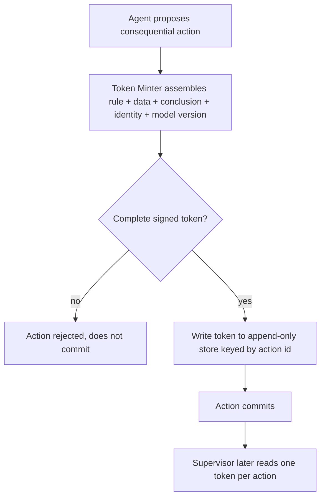

# Decision Token

**Also known as:** Per-Action Authored Justification, Decision Token (Authored Justification)

**Category:** Governance & Observability  
**Status in practice:** emerging

## Intent

Mint a self-contained record at the moment a consequential action executes, bundling the rule that fired, the exact data read, the conclusion reached, and the authorizing identity.

## Context

An agent takes consequential actions in a regulated setting such as a bank approving a transfer, an insurer settling a claim, or a clinical tool flagging a case. A supervisor can later demand, for any single action, a defensible account of why it happened, and that account must hold up even after the model has been updated, the prompt has changed, and the surrounding logs have rotated.

## Problem

An action-only record proves that the agent did something but not that the action was justified, and reconstructing the justification later depends on logs that were never designed to carry it, a model version that may no longer exist, and inference about what the model was probably weighing. When a supervisor asks why one specific transfer was approved, an after-the-fact narrative assembled from scattered traces is both expensive to produce and easy to dispute, because nothing ties the rule, the data, and the conclusion together at the instant the action committed.

## Forces

- A defensible account is cheap to capture at execution time, when the rule, the input data, and the conclusion are all in hand, and expensive to reconstruct afterward from logs that rotate and models that change.
- A regulator wants one self-contained artifact per action, not a query across several systems that each hold a fragment of the story.
- Capturing the full justification inline on every action adds storage and latency, so the granularity of what counts as consequential must be chosen deliberately.
- The token must bind to the specific model version and data snapshot that produced it, or its account drifts out of date the moment the system is upgraded.

## Therefore

Therefore: at execution time, emit a signed token per consequential action that names the rule that fired, the exact data read, the conclusion reached, and the authorizing identity, and treat that token, not a later log reconstruction, as the artifact handed to a supervisor.

## Solution

Wrap every consequential action so that committing the action and minting its Decision Token are a single step. The token captures, in human-readable form, the policy or rule that fired, the precise inputs the agent read, the conclusion it reached, the identity that authorized the action, and the model version and timestamp that produced it. The token is signed and written to append-only storage keyed by action identifier, so it stands on its own without depending on surrounding logs. Because the justification is authored at the moment of execution rather than reconstructed later, the artifact handed to a supervisor is the token itself, and an action that cannot mint a complete token does not commit.

## Structure

```
Agent --proposes--> Action; at commit, Token Minter assembles {rule fired, data read, conclusion, authorizing identity, model version, timestamp}, signs it, and writes it to the append-only Token Store keyed by action id; the Action commits only if the Token was written; a supervisor later reads one Token per action.
```

## Diagram



*Minting the signed Decision Token and committing the action are one step; an action with no complete token does not commit.*

## Example scenario

A bank's agent approves a EUR 40,000 transfer. In the same step that commits the transfer, it mints a signed Decision Token: rule fired is 'large-transfer review under threshold EUR 50,000', data read is the customer's 90-day balance and prior payee history, conclusion is 'within established pattern, approved', authorizing identity is the agent's service account under policy v7, model digest and timestamp attached. Months later a supervisor asks why that one transfer was approved, and the bank hands over the token rather than reconstructing the reasoning from scattered logs.

## Consequences

**Benefits**

- Any single action has a self-contained, signed account of why it happened, produced at execution time rather than reconstructed from rotated logs.
- A supervisor receives one artifact per action instead of a cross-system query, lowering the cost and the disputability of an explanation.
- Binding the model version and data snapshot into the token keeps the account valid after the model or prompt changes.

**Liabilities**

- Minting a full token on every consequential action adds storage and per-action latency that grows with action volume.
- A token is only as honest as the conclusion text the agent writes into it; a confident but wrong rationale is recorded as faithfully as a correct one.
- Choosing what counts as consequential is a judgement call, and drawing the line too narrowly leaves un-tokenized actions a supervisor can still ask about.

## Failure modes

- Rationalization gap — the conclusion field records a fluent justification that does not match the data the agent actually read.
- Granularity miss — a consequential action is classified as routine and commits without minting a token, leaving an unexplainable gap.
- Stale binding — the token omits the model version or data snapshot, so its account cannot be tied to what actually produced the decision.

## What this pattern constrains

A consequential action cannot commit unless a complete, signed Decision Token naming the rule fired, the data read, the conclusion, and the authorizing identity is written to the token store in the same step; post-hoc reconstruction does not satisfy this requirement.

## Applicability

**Use when**

- Individual agent actions are consequential and a supervisor may later demand a defensible account of any single one.
- The justification must survive model updates, prompt changes, and log rotation, so it has to be captured and bound at execution time.
- A self-contained per-action artifact is preferable to a cross-system reconstruction when an action is questioned.

**Do not use when**

- Actions are low-stakes or reversible and an aggregate reasoning trace for retrospective debugging is enough.
- Per-action token minting adds latency or storage the workload cannot absorb and there is no external accountability requirement.
- A standard append-only audit log already satisfies every supervisor question without a self-contained per-action record.

## Components

- Token Minter — assembles the rule that fired, the data read, the conclusion, the authorizing identity, and the model version into a token at execution time
- Decision Token — the signed, self-contained per-action justification record handed to a supervisor on its own
- Action wrapper — couples committing a consequential action to writing its token, so an action without a complete token does not commit
- Append-only token store — keeps tokens immutable and keyed by action identifier for later retrieval
- Consequentiality classifier — decides which actions are consequential enough to require a token
- Signing key and model-version binding — ties each token to the identity and the model snapshot that produced it

## Tools

- Tool-calling LLM — proposes the action and authors the human-readable conclusion written into the token
- Append-only or WORM datastore — stores tokens immutably keyed by action id
- Cryptographic signing service — signs each token so its authorship and integrity can be checked later

## Evaluation metrics

- Token coverage — fraction of consequential actions that committed with a complete token versus those that slipped through untokenized
- Reconstruction-free explanation rate — fraction of supervisor questions answered from the token alone without cross-system reconstruction
- Rationalization-gap rate — fraction of audited tokens whose conclusion field does not match the data read
- Per-action minting overhead — added latency and storage per consequential action

## Known uses

- **[Backbase Agentic AI Compliance](https://www.backbase.com/blog/agentic-ai-compliance-banking)** _available_ — Banking compliance framing in which every Decision Token carries a human-readable justification naming the specific rule triggered, the data the agent read, and the conclusion it reached.
- **[Model risk governance practice (GARP risk insights)](https://www.garp.org/risk-intelligence)** _available_ — Risk-management guidance that authored, per-decision explainability captured at execution time is more defensible to a supervisor than explanations retrofitted after the fact.

## Related patterns

- _complements_ **Decision Log** — The decision log persists the reasoning trace for retrospective review; a Decision Token is a self-contained, signed per-action artifact minted at execution time and handed to a supervisor on its own.
- _complements_ **Provenance Ledger** — A provenance ledger is an append-only audit trail of all decisions and state changes; the token is the per-action justification record a ledger entry can reference rather than reconstruct.
- _alternative-to_ **Deontic Token Delegation** — Deontic tokens carry transferable obligations and permissions down a delegation chain; a Decision Token instead records why one already-authorized action was justified at the moment it ran.
- _complements_ **Policy-Gated Agent Action (KRITIS)** — The policy gate decides whether an action may proceed and tags the run for reconstruction; the Decision Token captures the authored justification of the conclusion the agent reached on the data it read.

## References

- [Agentic AI Compliance in Banking](https://www.backbase.com/blog/agentic-ai-compliance-banking) — 2025
- [GARP Risk Insights](https://www.garp.org/risk-intelligence) — 2025
