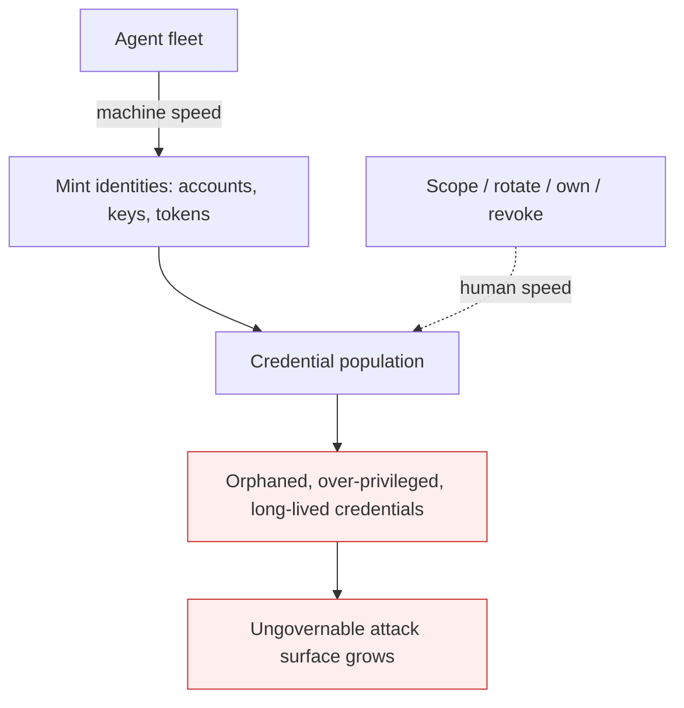

# Agent Identity Sprawl

**Also known as:** Non-Human Identity Sprawl, NHI Sprawl

**Category:** Anti-Patterns  
**Status in practice:** deprecated

## Intent

Anti-pattern: an agent fleet mints non-human identities at machine speed while scoping, rotation, ownership, and revocation stay human-speed, so over-privileged long-lived credentials accumulate, outlive their agents, and widen an ungovernable attack surface.

## Context

An organisation scales from a few agents to a fleet. Each agent, sub-agent, and tool integration needs an identity and credentials to act — a service account, an API key, an OAuth token. Provisioning these is automated and instant; governing them — scoping least privilege, rotating secrets, tracking ownership, revoking on retirement — still runs through human-speed review.

## Problem

Identity creation happens at machine speed and identity governance happens at human speed, and the gap compounds. Over-broad, long-lived credentials are minted faster than anyone scopes, rotates, or retires them; tokens outlive the agents they were issued for; ownership of a given credential becomes unknown. The attack surface grows week over week because nothing reconciles created identities against active, owned, and least-privileged ones, and no human-speed approval process can keep pace with the rate of creation. The result is a population of orphaned, over-privileged non-human identities that no one is tracking and no one can confidently revoke.

## Forces

- Agents need identities to act, and provisioning is automated, so creation is effectively unbounded.
- Scoping, rotation, ownership, and revocation are governance work that stays human-speed.
- Least-privilege scoping per agent is slower than issuing a broad credential that just works.
- The creation-versus-revocation rate mismatch means the orphaned-credential population only grows.

## Applicability

**Use when**

- An agent fleet provisions identities and credentials faster than they are scoped, rotated, or retired.
- Auditing standing access reveals orphaned or over-privileged non-human identities of unknown ownership.
- Identity governance runs through human-speed review while creation is automated.

**Do not use when**

- Identity lifecycle is automated and reconciled at the same rate as creation.
- The deployment is a single agent or a small fixed set with managed credentials.
- Credentials are already short-lived, least-privilege, owned, and revoked on retirement.

## Therefore

Therefore: govern non-human identities at the rate they are created — automate least-privilege scoping, short-lived rotation, ownership tracking, and revocation on agent retirement — so the credential population stays reconciled instead of sprawling.

## Solution

Make identity lifecycle keep pace with identity creation. Issue short-lived, least-privilege credentials by default rather than broad long-lived ones; bind every identity to an owning agent and a retirement trigger so it is revoked when the agent is decommissioned; continuously reconcile created identities against active, owned, scoped ones and flag orphans. The mechanism to fix is the creation-versus-revocation rate mismatch, so the controls must themselves run at machine speed. Mitigation patterns: agent-credential-vault for scoped, rotated, brokered secrets per agent; delegated-agent-authorization for narrowly scoped, time-bound grants. This is the fleet-scale lifecycle failure those per-agent patterns do not by themselves prevent.

## Diagram

## Example scenario

A platform team scales from a handful of agents to hundreds, each spinning up service accounts and API keys on demand. Provisioning is instant; nobody is scoping or retiring the credentials, which are broad and long-lived. A quarterly audit finds thousands of tokens, many tied to agents that no longer exist and owned by no one, any of which would grant an attacker standing access. The team moves identity issuance to short-lived least-privilege credentials bound to an owning agent and revoked on retirement, and adds continuous reconciliation — so governance finally runs at the speed identities are created.

## Consequences

**Liabilities**

- Orphaned, over-privileged credentials accumulate and outlive the agents that needed them.
- Ownership of a given identity becomes unknown, so revocation is risky and often skipped.
- The attack surface widens continuously, and a single leaked long-lived token grants broad standing access.

## Failure modes

- Orphan accumulation — credentials persist after their agents are gone, with no owner to revoke them
- Over-privilege drift — broad grants issued for convenience are never narrowed
- Revocation paralysis — unknown ownership makes teams afraid to revoke, so nothing is retired

## What this pattern constrains

No useful constraint; the missing constraint is machine-speed identity governance — least-privilege scoping, rotation, ownership, and revocation that keep pace with the rate at which agents mint identities.

## Components

- Identity minting — automated, machine-speed provisioning of service accounts, keys, and tokens
- Governance backlog — human-speed scoping, rotation, ownership, and revocation that falls behind
- Orphaned credential — a long-lived identity that outlives its agent and its known owner
- Reconciliation gap — the missing continuous check of created against active, owned, scoped identities

## Tools

- Non-human identity inventory — continuously reconciles created identities against active, owned ones
- Short-lived credential broker — issues least-privilege, rotating secrets per agent
- Revocation automation — retires credentials when their owning agent is decommissioned

## Evaluation metrics

- Creation-vs-revocation rate — identities minted versus retired per period
- Orphaned-identity count — credentials with no active owning agent
- Least-privilege coverage — share of identities scoped to minimum needed privilege
- Credential lifetime distribution — how long tokens live versus how long their agents do

## Known uses

- **[Cloud Security Alliance — non-human identity governance whitepaper](https://labs.cloudsecurityalliance.org/research/csa-whitepaper-nonhuman-identity-agentic-ai-governance-v1-cs/)** — *Available* — Names the non-human identity governance vacuum for agentic systems and the gap between machine-speed creation and human-speed governance.
- **[Fortra / Unite.AI analysis](https://www.unite.ai/agentic-ai-turns-nhi-sprawl-into-an-ungovernable-attack-surface/)** — *Available* — Observes that machine-speed identity creation cannot be governed by human-speed approval processes, turning NHI sprawl into an ungovernable attack surface.

## Related patterns

- *alternative-to* → [agent-credential-vault](agent-credential-vault.md)
- *complements* → [agent-privilege-escalation](agent-privilege-escalation.md)
- *complements* → [shadow-ai](shadow-ai.md)

## References

- (blog) Unite.AI / Fortra, *Agentic AI Turns NHI Sprawl Into an Ungovernable Attack Surface*, <https://www.unite.ai/agentic-ai-turns-nhi-sprawl-into-an-ungovernable-attack-surface/>
- (blog) InformationWeek, *Non-human identity sprawl is agentic AI's real risk*, <https://www.informationweek.com/risk-management/non-human-identity-sprawl-is-agentic-ai-s-real-risk>
- (doc) Cloud Security Alliance, *The Non-Human Identity Governance Vacuum*, <https://labs.cloudsecurityalliance.org/research/csa-whitepaper-nonhuman-identity-agentic-ai-governance-v1-cs/>

**Tags:** anti-pattern, security, non-human-identity, credentials, fleet-governance
