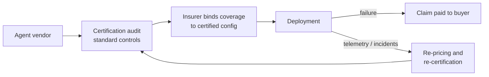

# Agent Liability Insurance

**Also known as:** Agentic AI Insurance, Insurance-Backed Agent Certification, AI Liability Coverage

**Category:** Governance & Observability  
**Status in practice:** emerging

## Intent

Transfer the residual risk of autonomous agent failure to an insurer through agent-specific coverage, with an auditable certification standard gating insurability, so unbounded liability becomes a bounded, priced cost.

## Context

An enterprise buying or deploying an autonomous agent carries a failure risk that no amount of evaluation removes: the agent can give wrong advice, leak data, or execute a harmful action at machine speed. Traditional insurance lines — cyber, technology errors-and-omissions, product liability — were written for deterministic software and human professionals, and they map poorly onto a system that plans and acts on its own. Procurement stalls on one question: who pays when the agent errs.

## Problem

The vendor cannot credibly accept unlimited liability for a stochastic system, and the buyer cannot quantify an exposure that ranges from a mispriced refund to a regulatory breach. Contract negotiations trap both sides between a liability cap the buyer rejects and an indemnity the vendor cannot survive, while existing policies either exclude autonomous behaviour or misprice it. The residual risk is real, but nobody in the deal is equipped to carry or measure it.

## Forces

- Residual failure risk is irreducible — even a well-evaluated agent fails at some measurable rate, and the cost of those failures must land somewhere.
- Vendors need bounded liability to stay solvent while buyers need full recourse to adopt, and the gap between the two positions cannot be closed by the contracting parties alone.
- An insurer only prices what it can measure, so coverage pulls audits, telemetry, and incident reporting into the engineering process whether or not the team wanted them.

## Therefore

Therefore: transfer the residual failure risk to an insurer through coverage written for agent behaviour, and let the insurer's certification standard — audited controls, telemetry obligations, incident reporting — determine what is insurable and at what premium.

## Solution

Treat insurability as a deployment gate. The vendor certifies the agent against an auditable standard covering data handling, security, safety, reliability, and accountability controls; the insurer underwrites coverage bound to that certified configuration and prices the premium on measured risk. Because agentic failure cuts across existing lines, coverage is layered — cyber, technology errors-and-omissions, and a dedicated agent-liability layer — with explicit allocation of which policy pays for which failure class, and aggregates that cap correlated exposure. The policy carries continuing obligations: telemetry that feeds actuarial models, incident reporting within a fixed window, and re-certification when the model, toolset, or autonomy scope materially changes. The insurer thereby becomes an external verification actor with capital at stake: its audit findings and premium signal push the engineering organisation toward controls that demonstrably reduce claims.

## Structure

```
Agent vendor -> certification audit against standard -> insurer binds coverage to certified configuration -> deployment; failure -> claim -> insurer pays buyer; telemetry + incidents -> re-pricing and re-certification loop.
```

## Diagram



*Certification gates coverage; coverage gates deployment; telemetry and claims feed back into pricing and re-certification.*

## Example scenario

A startup sells a customer-support agent to banks, and every deal stalls in legal review because nobody will accept liability if the agent promises an unauthorised refund. The vendor certifies the agent against an audited agent-security standard and buys liability coverage bound to that configuration. The bank's exposure is now a bounded, insured amount and the contract closes; months later the agent mis-states a fee policy to a customer, and the resulting loss is paid as a claim rather than fought over.

## Consequences

**Benefits**

- Adoption unblocks: the buyer's exposure becomes a bounded, priced cost instead of an open-ended unknown, and deals stop stalling in legal review.
- The insurer's audit is an independent check with financial skin in the game, harder to game than self-attestation.
- The premium acts as a market signal: measurably safer engineering translates directly into lower cost of coverage.

**Liabilities**

- Premiums, audits, and re-certification add cost and slow the release cadence, especially for teams that change models frequently.
- The certification standard can lag frontier capabilities, forcing a choice between insurability and the newest model or tool.
- Correlated failure is hard to reinsure: many insured deployments share the same foundation model, so one upstream defect can trigger simultaneous claims across the book.

## Failure modes

- Moral hazard — the team treats coverage as a substitute for engineering rigour and relaxes evaluation because the insurer pays for failures.
- Certification theatre — controls are tuned to pass the audit checklist while the deployed configuration drifts from what was certified.
- Accumulation blow-up — a single foundation-model defect fires claims across thousands of insured agents at once, exceeding the insurer's aggregates.
- Coverage dispute — after an incident the insurer argues the failure falls in an excluded line (cyber, human error) and the buyer is left uncovered where layers meet.

## What this pattern constrains

Coverage attaches only to the certified agent configuration: the operator cannot materially change the model, toolset, or autonomy scope without re-certification, must report incidents within the policy window, and deployments outside the certificate carry their liability uninsured.

## Applicability

**Use when**

- Enterprise procurement stalls on liability allocation for agent failures that neither vendor nor buyer can credibly carry.
- The agent operates autonomously enough that residual failure risk survives evaluation and guardrails.
- An auditable standard and telemetry exist (or can be built) so an underwriter can measure and price the risk.

**Do not use when**

- The deployment is low-stakes internal tooling where a failure costs re-work, not third-party loss.
- The configuration changes so frequently that re-certification would gate every release.
- Coverage would be treated as a substitute for evaluation and guardrails rather than a complement to them.

## Components

- Certification standard — the audited control set that defines what is insurable
- Underwriter — prices and carries the residual agent-failure risk
- Coverage allocation map — which policy layer pays for which failure class
- Telemetry and incident channel — operational evidence feeding actuarial pricing
- Re-certification trigger — detects material change to model, tools, or autonomy scope

## Tools

- AIUC-1 — auditable agent standard whose certification is tied to coverage
- Lloyd's of London syndicates — insurance capacity behind agent-liability policies
- Armilla / Munich Re aiSure — carrier products insuring model and agent performance

## Evaluation metrics

- Premium per deployed agent over time — the market's measure of the system's risk
- Claims frequency and severity versus the actuarial model — whether the audit predicts real behaviour
- Time-to-recertify after a material configuration change — the cost the gate adds to release cadence
- Accumulation exposure — insured deployments sharing one foundation model or provider

## Known uses

- **[AIUC (Artificial Intelligence Underwriting Company)](https://aiuc.com/)** _available_ — AIUC-1 standard (51 requirements, 130 controls across six risk pillars) with Lloyd's of London-backed coverage; ElevenLabs first live with AIUC-1-backed agent insurance in February 2026, Intercom's Fin certified.
- **[Armilla (Lloyd's of London coverage)](https://www.armilla.ai/)** _available_ — Affirmative coverage for model performance paired with independent verification — assessments, stress testing, red teaming — with reported limits up to $25M.
- **[Munich Re aiSure](https://www.munichre.com/en/solutions/for-industry-clients/insure-ai.html)** _available_ — Performance guarantees for models and agents underwritten by a global reinsurer, insuring the provider's promise that the system performs as claimed.

## Related patterns

- _complements_ **Eval as Contract** — Eval-as-contract gates releases on an eval suite agreed with the customer; here a third party with capital at stake audits the controls and enforces the contract through premiums and coverage.
- _alternative-to_ **Compliance-Certified Launch Gate** — Both gate deployment on external attestation: the launch gate is a regulator's permission to operate, insurance is a market mechanism that prices residual risk instead of forbidding it.
- _complements_ **Risk-Tiered Action Autonomy** — Grading the agent's permitted action class by materiality is exactly the kind of audited control that reduces insured exposure and the premium the underwriter charges.

## References

- [Insurance of Agentic AI](https://arxiv.org/abs/2606.05449) — Quanyan Zhu, 2026
- [AIUC — AI agent standard & insurance](https://aiuc.com/) — Artificial Intelligence Underwriting Company, 2026
- [Insurers push into AI-agent failures as demand surges for new coverage](https://beinsure.com/news/insurers-push-into-ai-agent-failures/) — Beinsure, 2026
