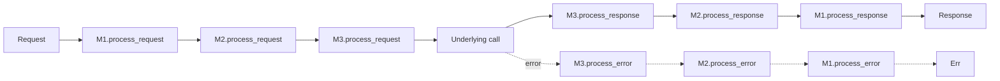

# Agent Middleware Chain

**Also known as:** Agent Interceptor Pipeline, Pre/Post Middleware

**Category:** Governance & Observability  
**Status in practice:** emerging

## Intent

Wrap every model call, tool call, and memory access in a composable pre/execute/post interceptor pipeline so cross-cutting concerns attach without touching agent or orchestrator code.

## Context

An agent runtime accumulates cross-cutting concerns: structured logging of every model call, rate-limit enforcement on third-party APIs, PII redaction on inputs and outputs, guardrail evaluation, latency metrics, an approval gate that may pause a call. Each concern needs to fire on the same set of touchpoints — model calls, tool calls, memory reads/writes — without each concern reimplementing the wiring.

## Problem

If each concern is implemented as a wrapper at the agent or orchestrator layer, the runtime accretes a deep stack of decorators, the order is implicit, and adding or removing a concern requires editing agent code. Worse, concerns differ in shape — some need to see the request before the call, some need to mutate the response, some need to catch errors. Without a uniform middleware surface, each concern carries its own ad-hoc hook code and the cross-cutting layer is no longer composable or testable in isolation.

## Forces

- Pre-execution interceptors (request modification, validation) need the request; post-execution interceptors (response logging, redaction) need the response; error handlers need the exception.
- Ordering matters — guardrails before logging, redaction before persistence.
- Middleware must compose at runtime so a team can add or remove a concern by configuration.
- Each middleware must remain testable in isolation against a synthetic call.

## Applicability

**Use when**

- Multiple cross-cutting concerns need to fire on every model/tool/memory call.
- Order of operations between concerns is policy-relevant.
- Teams need to add or remove concerns by configuration, not code.

**Do not use when**

- Only one or two concerns exist and they can live as simple wrappers.
- Latency budget cannot absorb a chain on every call.
- Concerns are too heterogeneous to fit a single (req, resp, err) contract.

## Therefore

Therefore: define a single middleware contract with process_request, process_response, and process_error methods and route every model and tool call through a configurable chain, so cross-cutting concerns attach uniformly and order is explicit.

## Solution

Define a BaseMiddleware with three hooks: process_request (called before the underlying call, may modify or short-circuit), process_response (called after, may mutate the response), process_error (called on exception). A MiddlewareChain runs the chain forward through process_request, invokes the underlying call, then runs the chain in reverse through process_response. Mount the chain at the runtime layer — every model call, tool call, and memory access flows through it. Cross-cutting concerns are then registered, not coded into agents.

## Example scenario

An agent runtime mounts five middlewares in order: rate-limit, PII-redact-in, guardrail-eval, metrics, approval-gate. Every model and tool call flows through the chain forward, then through the reverse chain on response. Adding a new compliance log later is a single registration in the chain config — no agent code is touched.

## Diagram

## Consequences

**Benefits**

- Cross-cutting concerns are configuration, not code, at the agent layer.
- Order is explicit and reviewable in one place.
- Each middleware is unit-testable against a synthetic call.

**Liabilities**

- A long chain adds latency on every call — the chain itself is now a critical-path component.
- Misordered middleware (redaction after logging) silently leaks the thing it was supposed to hide.
- Implicit dependencies between middlewares (one expects another's mutation) are hard to surface.

## What this pattern constrains

Cross-cutting concerns may not be coded directly into agent or orchestrator logic; they must register through the middleware contract so order is explicit and the chain is reviewable.

## Known uses

- **picoagents (Dibia, Designing Multi-Agent Systems)** — *Available* — <https://github.com/victordibia/designing-multiagent-systems>
- **LangChain Runnable middleware / LangGraph hooks** — *Available*

## Related patterns

- *uses* → [input-output-guardrails](input-output-guardrails.md)
- *complements* → [decision-log](decision-log.md)
- *uses* → [pii-redaction](pii-redaction.md)
- *uses* → [rate-limiting](rate-limiting.md)
- *complements* → [kill-switch](kill-switch.md)
- *composes-with* → [policy-as-code-gate](policy-as-code-gate.md)

## References

- (book) *Designing Multi-Agent Systems*, Victor Dibia, 2025, <https://www.oreilly.com/library/view/designing-multi-agent-systems/9781098150495/>
- (repo) *victordibia/designing-multiagent-systems — picoagents middleware*, <https://github.com/victordibia/designing-multiagent-systems>

**Tags:** middleware, interceptor, cross-cutting
