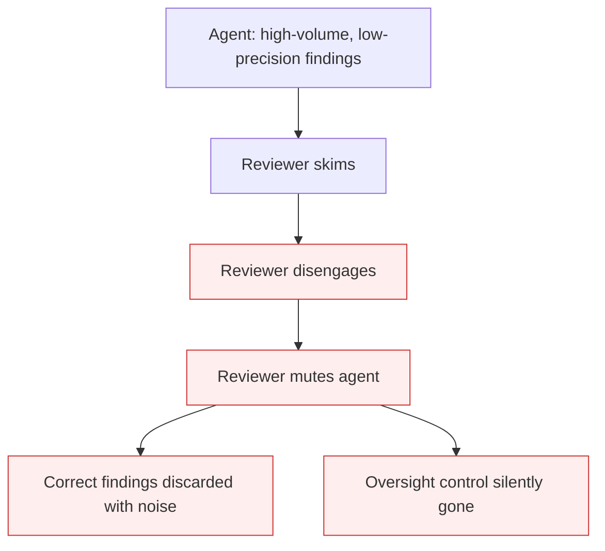

# Agent Output Alert Fatigue

**Also known as:** Boy-Who-Cried-Wolf Agent, AI Review Fatigue

**Category:** Anti-Patterns  
**Status in practice:** deprecated

## Intent

Anti-pattern: an agent emits high-volume, low-precision findings that progressively desensitise its human reviewers until they mute it, so even its correct findings stop landing and the human-oversight control silently disappears.

## Context

An agent is deployed as an assistive reviewer — posting code-review comments, raising alerts, suggesting fixes — behind a human who is meant to read and act on its output. To look thorough, the agent errs toward recall: it surfaces everything that might be an issue. Most of what it raises is noise.

## Problem

When an agent floods reviewers with findings that are mostly low-value, the humans adapt by disengaging: first they skim, then they approve on autopilot, then they mute the agent entirely. The human-in-the-loop control that justified deploying the agent quietly evaporates, and the agent's genuinely correct findings are now discarded along with the noise. The damage is asymmetric — trust erodes faster from noise than from the occasional missed issue — and near-irreversible, because re-earning a reviewer's attention after they have learned to ignore the agent is far harder than losing it. A volume metric like comments-per-review actively rewards the behaviour that breaks the control.

## Forces

- Precision and recall trade off: erring toward recall to look thorough is what generates the desensitising noise.
- Trust erodes faster from noise than from missed issues, so the asymmetry punishes over-flagging.
- Higher precision usually costs more per finding, which a volume-oriented metric discourages.
- Once reviewers disengage, re-earning attention is far harder than it was to lose it.

## Applicability

**Use when**

- Reviewing an assistive agent whose output is high-volume and gated by a human.
- Reviewer engagement with the agent is falling — rising mute or auto-approve rates.
- The agent is measured by output volume rather than usefulness per finding.

**Do not use when**

- The agent's findings are already high-precision and reviewers act on them.
- There is no human-oversight layer to desensitise (fully autonomous action with other controls).
- Volume is genuinely required and a downstream filter, not the human, absorbs it.

## Therefore

Therefore: hold the agent to a precision bar rather than a volume target — suppress low-confidence findings, measure usefulness per finding, and treat falling reviewer engagement as the control failing — so the human-oversight layer stays attentive.

## Solution

Gate the agent's output on confidence so it raises fewer, higher-precision findings; measure usefulness-per-finding, not findings-per-review. A documented post-mortem cut a review agent from 8.3 comments per pull request at 35 percent usefulness to 4.1 at 72 percent and restored reviewer engagement, accepting higher cost per review. Monitor reviewer engagement (resolve rate, mute rate, time-to-skim) as a first-class signal that the oversight control is decaying. Mitigation patterns: cross-encoder reranking or a verifier stage to filter low-value findings before they reach a human; confidence thresholds tuned to the asymmetry. Treat a rising comment count at flat usefulness as an alarm, not progress.

## Diagram

## Example scenario

A team adds an LLM code-review bot that posts every possible concern on each pull request — over eight comments per PR, barely a third of them useful. Within weeks developers stop reading them and approve on sight; a real bug the bot flagged ships because no one looked. The team raises the bot's confidence threshold so it posts about four comments per PR at roughly seventy percent usefulness, at higher cost per review. Developers start reading the comments again, and the bot's correct findings land once more because it stopped crying wolf.

## Consequences

**Liabilities**

- The human-in-the-loop safeguard disappears in practice while still existing on the org chart.
- The agent's correct findings are muted along with its noise, so true issues now reach production.
- Recovery is slow and uncertain because reviewer disengagement is sticky once learned.

## Failure modes

- Autopilot approval — reviewers approve without reading once noise has trained them to
- Mute-and-forget — the agent is silenced wholesale, discarding its correct findings too
- Metric capture — a comments-per-review target rewards the flooding that breaks the control

## What this pattern constrains

No useful constraint; the missing constraint is a precision floor on agent findings and an engagement signal that treats reviewer disengagement as the oversight control failing.

## Components

- Assistive agent — emits findings for a human to review
- Precision/recall setting — the bias toward volume that produces the noise
- Human reviewer — the oversight control that desensitises and disengages
- Engagement signal — resolve rate, mute rate, skim time that reveals the control decaying

## Tools

- Confidence gate — suppresses low-confidence findings before they reach a reviewer
- Engagement dashboard — tracks resolve, skim, and mute rates as the oversight signal
- Verifier or reranker stage — filters low-value findings out of the agent's output

## Evaluation metrics

- Usefulness per finding — share of agent findings reviewers act on
- Reviewer engagement rate — resolve, skim, and mute rates over time
- True-finding delivery rate — share of correct findings that actually reach a human acting on them
- Cost per useful finding — the price of the precision that keeps reviewers engaged

## Known uses

- **[Habr production post-mortem — LLM code-review agent](https://habr.com/ru/articles/1031352/)** — *Available* — 8.3 comments per PR at 35 percent usefulness trained reviewers to tune the agent out, named as the boy-who-cried-wolf effect; raising precision to 72 percent at 4.1 comments per PR restored engagement.
- **[Atomic Robot — AI review fatigue](https://atomicrobot.com/blog/ai-review-fatigue/)** — *Available* — Describes automation complacency where everything starts looking correct and edge cases stop triggering alarm.
- **[CodeAnt — false positives in AI code review](https://www.codeant.ai/blogs/ai-code-review-false-positives)** — *Available* — Finds alert fatigue from irrelevant warnings erodes trust faster than missed issues.

## Related patterns

- *complements* → [hidden-validation-work-amplification](hidden-validation-work-amplification.md)
- *complements* → [supervisor-cognitive-overload](supervisor-cognitive-overload.md)

## References

- (blog) *AI-агенты в продакшене: почему demo не равно реальность*, <https://habr.com/ru/articles/1031352/>
- (blog) Atomic Robot, *AI Writes Better Code. We're Getting Worse at Reviewing It.*, <https://atomicrobot.com/blog/ai-review-fatigue/>
- (blog) CodeAnt, *How Many False Positives Are Too Many in AI Code Review*, <https://www.codeant.ai/blogs/ai-code-review-false-positives>

**Tags:** anti-pattern, human-in-the-loop, code-review, precision, alert-fatigue
