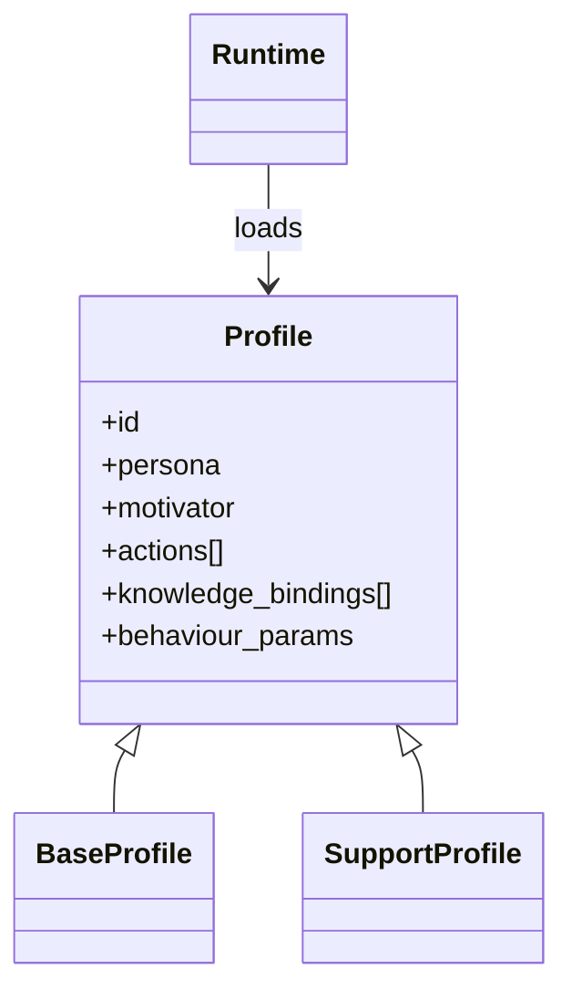

# Agent Persona Profile

**Also known as:** Agent Profile Object, Persona Configuration, Nexus-Style Profile

**Category:** Routing & Composition  
**Status in practice:** emerging

## Intent

Treat agent identity as a structured profile object — persona, primary motivator, allowed actions, knowledge bindings — rather than a free-form role sentence in the system prompt.

## Context

A platform hosts many agent variants — customer-support persona, research-assistant persona, coding-partner persona — that share a runtime but differ in role, tone, motivator, allowed tools, and knowledge bindings. Each variant is currently defined by a free-form system prompt the team edits in markdown.

## Problem

Free-form persona prompts collapse into a few failure shapes. Versioning is by git diff over prose, which is brittle. Two variants that should share a base persona accidentally diverge as engineers edit each in isolation. Knowledge bindings (which RAG corpus, which tools, which memory partition) live half in code, half in prose, with no single review surface. Swapping personas at runtime requires re-injecting the whole prompt rather than swapping a typed reference.

## Forces

- Personas need to be versionable as structured artifacts, not prose diffs.
- Shared persona components (motivator, tone) want to be inherited rather than copy-pasted.
- Knowledge bindings (tools, RAG, memory) should be part of the persona, not adjacent code.
- Runtime swap of persona must be cheap and unambiguous.

## Applicability

**Use when**

- Multiple persona variants share a runtime but differ in role, tools, or knowledge.
- Personas need to be versioned and inherited rather than copy-pasted.
- Runtime persona swap is a product requirement.

**Do not use when**

- Single persona, never changes, no inheritance need — prose prompt is fine.
- Persona behaviour cannot be reduced to a schema without losing what matters.
- Team will not maintain profile artifacts — they will drift from the running prompt.

## Therefore

Therefore: model agent identity as a structured profile object — persona, motivator, action set, knowledge bindings — that the runtime loads as configuration, so persona is versioned, inheritable, and swappable.

## Solution

Define a Profile schema with fields: persona (role description), primary motivator (what drives this agent), action set (allowed tools), knowledge bindings (RAG sources, memory partitions, vector stores), behaviour parameters (tone, verbosity, model choice). Store profiles as configuration files. The runtime composes the active system prompt from the profile; runtime swap is by profile id. Inheritance: a base profile defines defaults; specialised profiles override fields. Distinct from [[role-prompting]] (one prose sentence) and from [[personality-variant-overlay]] (multiple voices over a single base).

## Example scenario

A SaaS product offers three agent personas: a support-rep persona (warm, escalates to humans easily, billing-tools), a sales-rep persona (curious, asks fit questions, CRM-tools), and an internal-staff persona (terse, has admin-tools). All three inherit from a base profile defining tone defaults; each overrides motivator and action set. Switching a tenant from support-only to support+sales is a profile-id change.

## Diagram

## Consequences

**Benefits**

- Personas become versionable, inheritable, swappable artifacts.
- Knowledge bindings live in the same object as persona — one place to review.
- Per-tenant or per-feature persona switching is a config change.

**Liabilities**

- Schema rigidity can fight a persona that genuinely needs unique fields.
- Inheritance graphs grow tangled if not curated.
- Profile fields can drift away from what the prompt actually demonstrates at runtime.

## What this pattern constrains

Agent identity must not be defined only by free-form prose in the system prompt; it is captured as a structured profile object the runtime loads as configuration.

## Known uses

- **Nexus (Lanham, AI Agents in Action) — profile/persona platform** — *Available* — <https://github.com/cxbxmxcx/Nexus>
- **OpenAI Custom GPTs configuration objects** — *Available*
- **Claude Skills package format** — *Available*

## Related patterns

- *alternative-to* → [camel-role-playing](camel-role-playing.md) — Role-prompting is the unstructured form; this is the structured form.
- *complements* → [personality-variant-overlay](personality-variant-overlay.md)
- *complements* → [agent-skills](agent-skills.md)
- *complements* → [inner-committee](inner-committee.md)

## References

- (book) *AI Agents in Action*, Micheal Lanham, 2025, <https://www.manning.com/books/ai-agents-in-action>
- (repo) *cxbxmxcx/Nexus*, <https://github.com/cxbxmxcx/Nexus>

**Tags:** configuration, persona, platform
