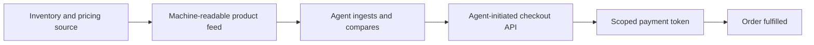

# Agent-Readable Commerce Surface

**Also known as:** Agentic Checkout Surface, Machine-Readable Storefront

**Category:** Tool Use & Environment  
**Status in practice:** emerging

## Intent

Expose a service to agent buyers through a machine-readable product feed and an agent-initiated checkout API rather than a human click funnel, so an agent can discover, compare, and buy against a goal.

## Context

Shoppers increasingly delegate buying to agents: an agent is told to find and order something and fulfils the whole lifecycle of discovery, comparison, checkout, and payment from a goal rather than a sequence of clicks. A storefront built for humans presents this through rendered pages, search UX, and a checkout flow that assumes a person navigating a browser.

## Problem

An agent does not browse a rendered page; it calls APIs, ingests structured feeds, and reasons across results. A catalog exposed only as human-facing HTML, with price and stock buried in scripts and a checkout that needs a person to click through, is effectively invisible to an agent, and a product the agent cannot parse is a product it never surfaces to its user. Yet maintaining a separate agent channel risks drifting out of sync with the human storefront's prices and inventory.

## Forces

- A human storefront optimises for rendered pages and search-engine visibility; an agent consumer needs structured, queryable data and a programmatic checkout.
- A goal-driven agent compares across options and transacts in one flow, so a multi-step click funnel either blocks it or forces brittle page-scraping.
- A dedicated agent surface must stay consistent with the human storefront's live price and stock, or the agent transacts on stale data.

## Therefore

Therefore: publish a machine-readable catalog with real-time price and inventory and expose an agent-initiated checkout API that accepts a delegated, scoped payment, keeping the agent surface sourced from the same inventory and pricing as the human storefront.

## Solution

Treat the agent as a first-class consumer of the service. Publish a structured product feed — titles, descriptions, images, price, stock, shipping, and policies — that an agent can ingest and reason over, kept current against the same inventory the human storefront uses. Accept agent-initiated checkout sessions through an API: the agent constructs a cart by calling the endpoint, and the buyer's authorisation arrives as a scoped payment token limited to one merchant, one amount, and a short expiry rather than raw card details. Adopting a shared protocol such as ACP or UCP lets many agents discover and transact against the surface without a bespoke integration per agent.

## Structure

```
Inventory/pricing source -> machine-readable product feed -> agent ingests and reasons -> agent-initiated checkout API(cart) -> scoped payment token -> order fulfilled.
```

## Diagram



*The merchant exposes a structured feed and a checkout API; the agent discovers, compares, and buys with a scoped payment token.*

## Example scenario

An online retailer publishes a structured product feed with live prices and stock and stands up an agent checkout endpoint. When a shopper's agent is asked to find a specific espresso machine under a budget, it ingests the feed, compares options across merchants, and places the order through the API with a one-merchant payment token — a sale the retailer's human-only checkout would never have captured.

## Consequences

**Benefits**

- Products become discoverable to agent buyers instead of invisible, opening a channel the human click funnel cannot serve.
- A shared protocol lets any conforming agent transact without a per-agent integration.
- The scoped payment token keeps the merchant from handling raw card details while still completing an agent-driven sale.

**Liabilities**

- A second surface must be kept in sync with the human storefront, or agents buy on stale price and stock.
- Exposing structured feeds and a checkout API widens the attack surface to scripted abuse and scraping at machine speed.
- Committing to an emerging commerce protocol couples the merchant to its evolution and to the agent platforms that speak it.

## Failure modes

- Stale feed — the agent surface lags the human storefront, so the agent orders at a price or stock level that no longer holds.
- Invisible catalog — products exist only as rendered HTML and never surface in an agent's results.
- Unbounded automation — the checkout API lacks rate and scope limits and is driven by scripts faster than a human channel ever would be.

## What this pattern constrains

An agent buyer cannot rely on scraping rendered pages; the merchant must publish structured, current product data and only accept agent checkout through a scoped, authenticated API, never exposing raw card details to the agent.

## Applicability

**Use when**

- A meaningful share of buyers delegate discovery and purchase to agents rather than browsing in person.
- The catalog can be published as structured data and kept in sync with live price and stock.
- A standard agentic-commerce protocol exists that the target agents already speak.

**Do not use when**

- Sales depend on human browsing, merchandising, and persuasion that an agent channel cannot carry.
- Inventory and pricing cannot be kept current enough for an agent to transact on safely.
- Regulatory or trust constraints require a human in the checkout loop for every purchase.

## Components

- Product feed — structured catalog with title, description, price, stock, shipping, and policy fields
- Inventory/pricing source — the single source the feed and checkout read from to stay current
- Agent checkout API — accepts agent-initiated cart and order sessions
- Scoped payment acceptor — takes a one-merchant, capped, short-lived token instead of raw card details
- Protocol adapter — conforms the surface to a shared standard (ACP, UCP) so many agents can transact

## Tools

- Structured feed format (product schema / JSON) — machine-readable catalog an agent can ingest
- Agentic commerce protocol (ACP, UCP) — standard discovery and checkout contract
- Scoped payment token issuance — delegated, bounded payment instead of a card hand-off

## Evaluation metrics

- Catalog coverage in agent results — share of products an agent can parse and surface
- Feed freshness — lag between storefront price/stock and the agent feed
- Agent-channel conversion versus the human storefront
- Abuse rate on the checkout API — scripted or out-of-scope sessions blocked

## Known uses

- **[Agentic Commerce Protocol (ACP)](https://www.agenticcommerce.dev/)** _available_ — OpenAI and Stripe protocol behind Instant Checkout in ChatGPT; merchants expose product feeds and an agentic checkout API any compatible agent can call.
- **[Universal Commerce Protocol (UCP)](https://commercetools.com/blog/google-ucp-merchant-guide-to-agentic-commerce)** _available_ — Google coalition protocol for agent-readable catalogs and checkout, surfacing through Search AI Mode and Gemini.
- **[Shopify agentic commerce (Shopify Catalog)](https://www.shopify.com/blog/how-agentic-commerce-works)** _available_ — Shopify Catalog structures and syndicates product information across connected agent platforms in real time so shopping agents can transact.

## Related patterns

- _complements_ **Verifiable Purchase Mandate** — The commerce surface accepts the charge; the purchase mandate is the signed user authorization the surface verifies before fulfilling.
- _complements_ **Tool Discovery** — Tool discovery lets an agent find callable tools; the commerce surface is the provider-side mirror — designing the service so agent buyers can find and call it.
- _complements_ **Agent Capability Manifest** — Both publish a machine-readable description at a known location for agents to consume; the manifest advertises an agent's skills, the commerce surface advertises a merchant's catalog and checkout.

## References

- [Agentic Commerce Protocol — OpenAI Commerce Documentation](https://developers.openai.com/commerce/) — OpenAI, 2026
- [Google UCP: Merchant Guide to Agentic Commerce](https://commercetools.com/blog/google-ucp-merchant-guide-to-agentic-commerce) — commercetools, 2026
- [Agentic commerce for merchants: how to make your checkout AI-agent-ready](https://gr4vy.com/posts/agentic-commerce-for-merchants-how-to-make-your-checkout-ai-agent-ready/) — GR4VY, 2026
