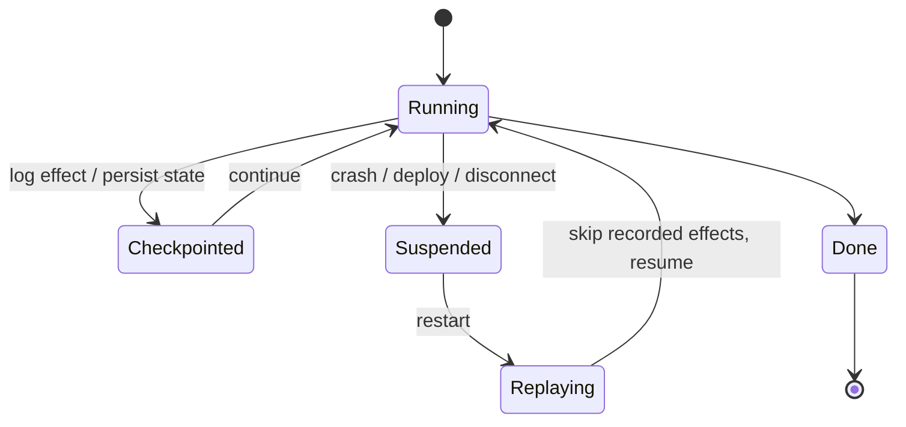

# Agent Resumption

**Also known as:** Durable Execution, Pause-and-Resume, Long-Running Agent State

**Category:** Governance & Observability  
**Status in practice:** mature

## Intent

Persist agent execution state so a long-running run survives restarts, deploys, or user disconnects.

## Context

Production agents that run for minutes to hours; users need the work to survive disconnects and ops events.

## Problem

Agents that lose state on restart lose hours of work; users distrust long-running agents.

## Forces

- Checkpoint frequency vs cost.
- What to persist; what to recompute.
- Resumability requires deterministic enough replay or full state capture.

## Therefore

Therefore: either replay a deterministic log of recorded effects or restore a periodic snapshot of agent state, and pass idempotency keys to every side-effect target, so that a restart resumes mid-flight without duplicating work.

## Solution

Two production approaches. (a) Deterministic replay of recorded effects (Temporal/Inngest pattern): state = inputs + log of side-effects; on resume, the engine re-executes the workflow code, skipping side-effects that already have logged results. (b) Checkpoint snapshots of agent state (LangGraph Cloud pattern): periodically serialise plan, working memory, partial outputs, pending tool calls; restore on restart. Both approaches require deterministic idempotency keys passed to side-effect targets so a replayed-but-unlogged call is deduplicated downstream. Without this, crash-between-effect-and-log produces duplicates.

## Example scenario

A research agent is forty minutes into a slow scrape-and-summarise run when the operator deploys a hotfix and the worker container restarts. Without persisted state, the run vanishes and the user re-issues the request. The team adds Agent Resumption: every step's plan, tool result, and intermediate state is checkpointed to durable storage, keyed by run id. After the restart, the worker reloads the checkpoint and continues from the next step instead of from scratch.

## Diagram

## Consequences

**Benefits**

- Reliability for long-running agents.
- Operations confidence: deploys do not lose user work.

**Liabilities**

- Checkpoint storage cost.
- Resumed runs may see drifted external state.
- Deterministic-replay requires the workflow code to be deterministic; non-deterministic code in the agent path corrupts on resume.
- Tools that don't accept an idempotency key cannot be safely resumed.

## What this pattern constrains

Agent state must be serialisable; non-serialisable in-memory references are forbidden in long-running paths.

## Applicability

**Use when**

- Agent runs are long enough that restarts, deploys, or disconnects would lose meaningful work.
- Side effects can be logged or snapshotted without breaking semantics on replay.
- Users or operators need to trust that an in-flight run will survive infrastructure events.

**Do not use when**

- Runs complete in seconds and can simply be retried from scratch.
- Side effects cannot be made idempotent and replay would double-charge or double-act.
- State is small and ephemeral by design (e.g. throwaway exploratory agents).

## Known uses

- **Devin sessions** — *Available*
- **Manus tasks** — *Available*
- **OpenAI Agents SDK durable execution** — *Available*
- **Temporal-backed agents** — *Available*
- **Inngest agents** — *Available*
- **LangGraph Cloud checkpointing** — *Available*

## Related patterns

- *complements* → [scheduled-agent](scheduled-agent.md)
- *complements* → [event-driven-agent](event-driven-agent.md)
- *uses* → [short-term-memory](short-term-memory.md)
- *complements* → [todo-list-driven-agent](todo-list-driven-agent.md)

## References

- (doc) *Temporal: Durable execution*, <https://docs.temporal.io>
- (doc) *Inngest: AgentKit durable agents*, <https://www.inngest.com/docs>

**Tags:** durability, long-running, state
