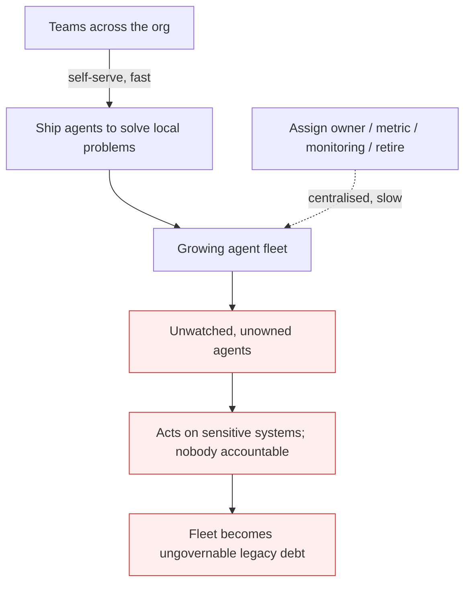

# Agent Sprawl

**Also known as:** Ungoverned Agent Fleet, Agent Fleet Sprawl

**Category:** Anti-Patterns  
**Status in practice:** deprecated

## Intent

Anti-pattern: every team ships its own agents while ownership, success metrics, monitoring, and a decommissioning path stay an afterthought, so the fleet outgrows governance and most agents end up unwatched, unowned, and impossible to retire.

## Context

An organisation moves from a pilot agent or two to dozens. Building one is now easy enough that individual teams do it themselves: marketing stands up a content-drafting agent, sales wires one up for lead scoring, support adds a triage bot. Each is deployed to solve an immediate local problem, on whatever stack that team already uses, and there is no central record of what exists, who owns it, what it touches, or how it will eventually be turned off.

## Problem

Building agents is fast and decentralised; governing them — assigning an owner, defining what success looks like, monitoring behaviour, and retiring them when they stop earning their keep — stays slow and centralised, and the gap compounds. Agents accumulate faster than anyone catalogues them, so no one can say how many are in production or what systems they reach. Most run unwatched: there is no owner to notice when one degrades, no success metric to judge it against, and no decommissioning path, so a half-finished agent keeps making autonomous decisions on sensitive systems long after the team that shipped it has moved on. The fleet becomes legacy debt that nobody fully understands and nobody is accountable for, and a single misbehaving agent can act for weeks before anyone notices.

## Forces

- Building an agent is now cheap and any team can do it, so creation is decentralised and effectively unbounded.
- Ownership, success metrics, monitoring, and decommissioning are governance work that stays centralised and human-speed.
- Each agent individually solves a real business problem, which makes the local decision to ship it look obviously correct.
- The faster agents are shipped than they are owned or retired, the larger the share of the fleet that runs unwatched.

## Applicability

**Use when**

- Multiple teams deploy their own production agents with no central inventory of what exists or who owns each one.
- Agents reach production without a named owner, a success metric, or a defined way to pause or retire them.
- An audit cannot say how many agents are running, what systems they touch, or which are still earning their keep.

**Do not use when**

- Every production agent has a named owner, a success metric, monitoring, and a decommissioning trigger, reconciled against a central inventory.
- The deployment is a single agent or a small, centrally governed set.
- Agent creation and agent governance run through the same gated, owned process.

## Therefore

Therefore: make every agent that reaches production carry an owner, a success metric, monitoring, and a decommissioning trigger from day one, reconciled against a central inventory, so the fleet stays governed at the rate teams create it — business case and ownership before tooling, not after.

## Solution

Govern the agent fleet at the rate it grows. Make it a deployment gate that every production agent declares an owner, the business outcome it is accountable for, and the conditions under which it is paused or retired, and register it in a central inventory that can be reconciled against what is actually running. The order matters: the business case and an accountable owner come first and the technical platform second, because a governance tool layered onto an already-sprawling fleet only inventories the mess. Mitigation patterns: tool-agent-registry for a reconciled inventory of agents and their owners, and kill-switch for the pause-and-decommission path each agent must carry. This is the organisational, fleet-scale lifecycle failure that those per-agent controls do not by themselves prevent.

## Diagram

## Example scenario

Over a year a mid-sized company goes from one pilot agent to roughly seventy, each stood up by a different team to solve a local problem — content drafting, lead scoring, ticket triage, invoice matching. None was registered centrally, given a success metric, or assigned an owner beyond the engineer who built it. A security review finds that more than half run unmonitored, several still call production systems with the credentials of people who have since left, and no one can say which are still useful. The platform team responds by making an owner, a success metric, monitoring, and a decommissioning trigger mandatory at deployment, and by reconciling a central agent registry against what is actually running — putting governance back in step with how fast teams create agents.

## Consequences

**Liabilities**

- Most of the fleet runs unwatched, so a degrading or misbehaving agent can act on sensitive systems for weeks before anyone notices.
- No one can enumerate which agents exist, who owns them, or what they touch, so risk and cost stay unaccountable.
- Agents shipped without a success metric or owner become legacy debt that nobody can confidently retire.

## Failure modes

- Silent degradation — an unwatched agent drifts or breaks and keeps acting on sensitive systems unnoticed
- Accountability vacuum — ownership of a given agent is unknown, so no one fixes, funds, or retires it
- Retire paralysis — nobody is confident enough about what an agent does to switch it off, so it lingers as legacy debt

## What this pattern constrains

No useful constraint; the missing constraint is fleet-scale governance that keeps pace with creation — every production agent bound to an owner, a success metric, monitoring, and a decommissioning trigger, reconciled against a central inventory.

## Components

- Decentralised creation — individual teams stand up agents on their own stacks to solve immediate problems
- Governance backlog — centralised, human-speed assignment of ownership, metrics, monitoring, and retirement that falls behind
- Orphaned agent — a production agent with no owner, no success metric, and no decommissioning path
- Inventory gap — the missing central record reconciling what was shipped against what is actually running

## Tools

- Agent registry — central inventory reconciling shipped agents against what is running, with an owner per entry
- Deployment governance gate — blocks an agent from production until it declares owner, success metric, and retirement trigger
- Fleet monitoring — watches every production agent for degradation and flags unowned or idle ones for retirement

## Evaluation metrics

- Inventory coverage — share of running agents present in a central registry with a named owner
- Unmonitored-agent count — production agents with no monitoring or success metric
- Creation-vs-decommission rate — agents shipped versus agents retired per period
- Orphaned-agent count — agents whose owning team or business case can no longer be identified

## Known uses

- **[t3n — agent sprawl as enterprise legacy debt](https://t3n.de/news/agent-sprawl-ki-altlasten-unternehmen-1741167/)** — *Available* — Reports that more than half of active enterprise AI agents run unmonitored, deployed department-by-department without ownership, success metrics, or a shutdown process, and argues governance must align business case, ownership, and implementation in that order.
- **[t3n — five architecture mistakes that sink agents](https://t3n.de/news/ki-agenten-scheitern-an-architekturfehlern-1730278/)** — *Available* — Describes teams rolling out agent prototypes built with coding assistants without review, ownership, or operational governance, which compounds into an ungoverned fleet.

## Related patterns

- *complements* → [agent-identity-sprawl](agent-identity-sprawl.md)
- *complements* → [shadow-ai](shadow-ai.md)
- *complements* → [perma-beta](perma-beta.md)
- *alternative-to* → [tool-agent-registry](tool-agent-registry.md)
- *alternative-to* → [kill-switch](kill-switch.md)

## References

- (blog) t3n, *Mehr als die Hälfte aller KI-Agenten läuft unüberwacht – und wird zur tickenden Zeitbombe*, <https://t3n.de/news/agent-sprawl-ki-altlasten-unternehmen-1741167/>
- (blog) t3n, *KI-Agenten scheitern nicht am Modell – sondern an diesen fünf Architekturfehlern*, <https://t3n.de/news/ki-agenten-scheitern-an-architekturfehlern-1730278/>

**Tags:** anti-pattern, governance, fleet-governance, operations, organizational
