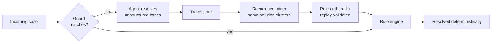

# Agent-to-Rule Distillation

**Also known as:** Recurring-Solution Crystallization, Dynamic-to-Deterministic Promotion, Rule Harvesting from Agent Traces

**Category:** Routing & Composition  
**Status in practice:** emerging

## Intent

Watch production traces for problems the agent solves the same way repeatedly, and promote each recurring solution into a deterministic rule outside the agent, so the stochastic surface shrinks as the system matures.

## Context

An agent embedded in a business process handles the unstructured cases deterministic logic could not be written for upfront. Over months of operation its traces accumulate, and a share of the supposedly unstructured cases turns out to be structured after all: the same problem class arrives again and again, and the agent resolves it along the same path every time. Each of those resolutions pays full model cost and carries stochastic risk for an answer the organisation already knows.

## Problem

Keeping a solved-often case inside the agent means re-deriving a known answer forever — at LLM latency and price, with a nonzero chance of fumbling it, and behind reasoning an auditor cannot replay. Writing the rule upfront was impossible because nobody knew the case existed until the agent surfaced it. The knowledge the agent earned in production stays locked in trace logs instead of hardening the process, and the system's cost and risk profile never improves with experience.

## Forces

- A rule evaluation costs a fraction of an LLM call, and a recurring case pays the model's price on every occurrence.
- Auditors and regulators accept deterministic rules far more readily than stochastic reasoning, yet rules cannot be authored upfront for cases nobody has seen.
- The agent's flexibility is what discovers the solution in the first place, so removing the agent entirely would also remove the discovery mechanism.

## Therefore

Therefore: keep the agent as the discovery mechanism for unstructured cases, mine its traces for recurring solution shapes, and migrate each stabilised shape into a deterministic rule that the process evaluates without invoking the model.

## Solution

Instrument the agent so every case leaves a comparable trace: problem class, resolution path, outcome. Mine the traces for clusters where the same class was resolved along the same path repeatedly — on the order of ten identical resolutions is a workable trigger. For each stable cluster, author the deterministic equivalent (a DMN decision table, a BPMN branch, or plain code), validate it by replaying the historical traces it was mined from, and cut over so the rule short-circuits the agent for matching inputs. Keep the agent as fallback for anything the rule's guard rejects, and link each promoted rule to its source traces so its provenance stays reviewable. Repeated over time this inverts the system's economics: reported production programmes attribute cost reductions up to seventy percent to exactly this transition from dynamic reasoning to rule logic, and the agent's capacity concentrates on genuinely novel cases.

## Structure

```
Agent resolves unstructured cases -> traces logged -> recurrence miner finds same-solution clusters -> rule authored and replay-validated -> rule engine short-circuits matching cases -> unmatched cases fall through to the agent -> loop.
```

## Diagram



*The agent discovers solutions; recurring ones are mined from traces and promoted into rules that short-circuit the model.*

## Example scenario

An operations agent handles inbound IT tickets. After a few months, traces show it has resolved 'password reset for contractor account' identically dozens of times: verify identity, check the contract is active, reset, notify. The team promotes that path into a deterministic workflow branch validated against the historical tickets; the agent now only sees requests the branch's guard rejects. Cost per ticket drops sharply and the audit team signs off on the deterministic path without reviewing model reasoning.

## Consequences

**Benefits**

- Per-case cost and latency collapse for promoted paths, and the saving compounds as more clusters stabilise.
- Promoted logic is deterministic, replayable, and auditable — the compliance surface grows while the stochastic surface shrinks.
- The organisation actually learns from the agent: production experience hardens into process assets instead of staying in logs.

**Liabilities**

- Every promoted rule is a maintenance obligation; the rule inventory grows as long as the loop runs.
- A mined rule encodes yesterday's distribution and will not adapt when the world changes, where the agent might have.
- The dual-path system (rule plus agent fallback) complicates debugging and demands trace infrastructure and governance to run safely.

## Failure modes

- Premature crystallization — a handful of coincidental repetitions is promoted and the rule is wrong on the distribution's tail.
- Rule rot — the world shifts, the rule keeps firing with stale logic, and nobody notices because the agent no longer sees those cases.
- Guard leakage — the rule matches inputs outside the mined cluster and applies a memorised answer to a novel problem.
- Ossification — so much is promoted that the system loses the adaptability that justified deploying an agent at all.
- Provenance loss — rules outlive the traces that justified them, and later reviewers cannot tell why a rule exists or when it should die.

## What this pattern constrains

A promoted case must no longer be answered by the model: the rule short-circuits the agent, the agent path survives only as fallback for inputs the rule's guard rejects, and no rule ships without replay validation against the traces it was mined from.

## Applicability

**Use when**

- Production traces show the agent resolving the same problem class along the same path repeatedly.
- Cost, latency, or auditability pressure makes paying model price for known answers unacceptable.
- A deterministic home for promoted logic exists — a process engine, rule engine, or plain code path with a fallback route to the agent.

**Do not use when**

- The domain shifts fast enough that mined rules would rot before they pay back their maintenance cost.
- Case volume is too low for recurrence to be distinguishable from coincidence.
- Traces are not comparable or complete enough to validate a candidate rule by replay.

## Components

- Trace store — comparable records of problem class, resolution path, and outcome per case
- Recurrence miner — detects clusters where the same class was resolved along the same path
- Rule author and replay validator — turns a stable cluster into a rule and proves it against history
- Rule engine / process spine — the deterministic home that evaluates promoted logic without the model
- Guard and fallback router — sends matching cases to the rule and everything else to the agent
- Provenance link — connects each promoted rule to the traces that justified it

## Tools

- Camunda BPMN/DMN — process and decision spine that receives promoted rules
- LangSmith / Langfuse / OpenTelemetry — trace substrate the recurrence mining runs on
- Agent Workflow Memory — research method inducing reusable workflows from agent trajectories
- Shadow replay harness — validates a mined rule against historical cases before cut-over

## Evaluation metrics

- Deterministic-path share — fraction of traffic short-circuiting the agent, which should rise over time
- Cost per case trend — the economic payoff of each promotion
- Rule regression rate — promoted-rule outputs diverging from ground truth or the agent's answer on replay
- Fallback rate — guard rejections flowing back to the agent, signalling guard fit
- Rule age and review cadence — how stale the promoted inventory is allowed to get

## Known uses

- **[Camunda agentic orchestration customer programmes](https://www.it-daily.net/it-management/ki/ki-agenten-in-der-produktion-2026-vom-prototyp-zum-prozessstandard)** _available_ — Camunda's CTO describes the mechanism across 50+ customer projects in banking, telecommunications, insurance, and healthcare: recurring agent solutions are recognised and converted into deterministic BPMN/DMN rules, with cost reductions up to 70 percent attributed to the transition.
- **[Agent Workflow Memory (research)](https://arxiv.org/abs/2409.07429)** _pure-future_ — Induces reusable workflows from an agent's own past trajectories and reuses them on new tasks — the in-agent analog of the same recurrence-mining move, demonstrated on WebArena and Mind2Web.

## Related patterns

- _complements_ **BPMN/DMN Deterministic Shell Around Agent** — The shell is the destination structure — a deterministic spine with agent nodes for unstructured problems; distillation is the lifecycle loop that grows the spine by migrating stabilised agent solutions into it.
- _alternative-to_ **Skill Library** — Both capture recurring solutions; the skill library stores them as code the agent itself invokes, distillation moves them outside the agent into governed rules the process evaluates without the model.
- _alternative-to_ **Procedural Memory** — Procedural memory keeps learned how-to inside the agent's memory; distillation externalises the learned path so the model is no longer consulted at all for that case.
- _complements_ **Hybrid Symbolic-Neural Routing** — The hybrid router is the runtime seat of the pattern: promoted rules populate the symbolic path that short-circuits the neural one for matching inputs.
- _uses_ **Shadow Canary** — Replay and shadow validation of a mined rule against historical traces before cut-over is a canary run of the deterministic candidate.

## References

- [KI-Agenten in der Produktion 2026: Vom Prototyp zum Prozessstandard](https://www.it-daily.net/it-management/ki/ki-agenten-in-der-produktion-2026-vom-prototyp-zum-prozessstandard) — Daniel Meyer, 2026
- [Agent Workflow Memory](https://arxiv.org/abs/2409.07429) — Zora Zhiruo Wang, Jiayuan Mao, Daniel Fried, Graham Neubig, 2024
- [Code execution with MCP: Building more efficient agents](https://www.anthropic.com/engineering/code-execution-with-mcp) — Anthropic, 2025
