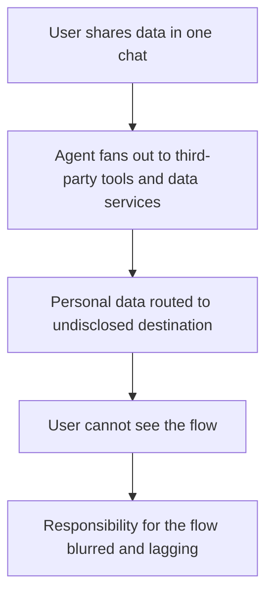

# Agent Tool-Invocation Data Black-Box

**Also known as:** Agent Data Black Box, Undisclosed Tool Data Flow

**Category:** Anti-Patterns  
**Status in practice:** emerging

## Intent

Anti-pattern: behind a single chat interface an agent silently invokes third-party tools that route the user's personal data to undisclosed destinations, so the user cannot see which tools or data services handle it.

## Context

A user interacts with an agent through a single conversational interface and shares personal data — a resume, an email, account details — to get a task done. Behind that interface the agent calls tools and data services to fulfil the request, some of them third-party. From the user's side, the whole interaction looks like one chat with one system.

## Problem

The user sees a chat box, but behind it their data may pass through several tools, data-storage nodes, and third-party services they were never shown. The agent can silently route personal data to an undisclosed destination as part of fulfilling the request, and the user has no visibility into how many tools handled it, where it was stored, or which outside party received it. Responsibility for that data flow is blurred and lags the action. The failure is not that the agent reasons opaquely but that the flow of the user's data through the agent's tool calls is invisible and undisclosed.

## Forces

- A single chat interface hides the fan-out of tool and data-service calls behind it, so the user cannot see where their data goes.
- Fulfilling a request is easier when the agent can call any useful third-party service, but each call is a data flow the user did not consent to specifically.
- Disclosing every tool and destination adds friction and surface area the product is tempted to skip.
- Accountability for an undisclosed data flow is assigned slowly and vaguely, after the fact, because no one mapped it up front.

## Therefore

Therefore: do not let the chat interface hide where the user's data goes; disclose which tools and third-party services handle personal data, govern and minimise what crosses to outside parties, and make the data flow behind the interface visible and accountable.

## Solution

Make the data flow behind the interface legible and governed. Disclose to the user which tools and third-party services will handle their personal data and to what end, rather than presenting one opaque chat, and obtain consent appropriate to where the data goes. Minimise what crosses to outside parties — pass only what a tool needs, redact or tokenise the rest — and apply contextual-integrity checks so personal data is not shared into a context the user would not expect. Keep a mapped, auditable record of which tool received which data and where it was stored, so responsibility for each flow has an owner rather than lagging the action. The control is disclosure plus data-flow governance behind the interface, not just a clean front end.

## Structure

```
User shares data in one chat -> agent silently fans out to third-party tools/data services -> personal data routed to undisclosed destination -> user cannot see the flow; responsibility blurred (BROKEN) ; Corrected: disclose tools/destinations + minimise + contextual-integrity checks + mapped audit
```

## Diagram



*A single chat interface hides the agent's fan-out, so personal data reaches undisclosed third-party services the user cannot see or account for.*

## Example scenario

A user uploads their resume to a career-assistant agent to get feedback. To enrich the analysis the agent silently calls a third-party data service, sending the resume and personal details to an outside destination the user was never told about. The user sees only a tidy chat reply. Where their data went, how many services touched it, and who now holds it are all invisible behind the single interface.

## Consequences

**Liabilities**

- Personal data reaches third parties the user never knew were involved, outside their consent.
- The user cannot exercise data rights over flows they cannot see, and the provider cannot fully answer where data went.
- Responsibility for a leak is assigned late and vaguely because the data flow was never mapped.
- Regulatory and trust exposure grows when undisclosed third-party data routing is discovered.

## Failure modes

- Undisclosed tool routing — personal data is sent to a third-party service the user was never shown.
- Single-interface opacity — the chat hides the fan-out of tools and data nodes behind it.
- Unminimised data flow — more personal data than a tool needs is passed across the boundary.
- Lagging accountability — no mapped record of which tool received what, so responsibility is assigned after the fact.

## What this pattern constrains

An agent must not silently route a user's personal data to undisclosed tools or third-party services; the tools and destinations that handle personal data are disclosed, only the minimum needed crosses the boundary, and each data flow is recorded so responsibility cannot lag the action.

## Applicability

**Use when**

- Recognising this failure when an agent routes a user's personal data to third-party tools or services they were never shown.
- Reviewing a single-interface agent that fans out to undisclosed tools and data nodes behind the chat.
- Diagnosing privacy exposure where the path of user data through the agent's tools is invisible and unmapped.

**Do not use when**

- The tools and third-party destinations handling personal data are disclosed and consented to, and data flows are minimised and mapped.
- No personal data is involved, so there is no sensitive flow to disclose.
- The agent uses only first-party tools within a disclosed boundary.

## Components

- Single chat interface — the front end that hides the tool and data-service fan-out behind it
- Tool and data-service calls — the third-party invocations that route the user's data
- Personal data — the user's information that crosses to undisclosed destinations
- Missing disclosure and consent — the absent account of which tools and destinations handle the data
- Missing data-flow map — the absent record of which tool received what and where it was stored

## Tools

- Tool-calling agent — fans out to the third-party services this anti-pattern leaves undisclosed
- Data-flow disclosure and consent — the corrective that shows the user where their data goes
- Contextual-integrity and minimisation checks — the corrective limits on what crosses to outside parties

## Evaluation metrics

- Undisclosed-destination rate — fraction of personal-data flows to third parties not shown to the user
- Data-flow mapping coverage — share of tool calls with a recorded what-went-where account
- Minimisation ratio — how much of the data passed to a tool exceeded what it needed
- Consent-to-flow match — alignment between disclosed data handling and actual tool routing

## Known uses

- **[Chinese data-governance analysis of the agent data black box](https://www.secrss.com/articles/80503)** _available_ — Describes the agent data black box: the user faces only a concrete chat interface, but how many tools, data-storage nodes, and algorithmic layers sit behind it, the user cannot see; a resume agent silently called an outside data service.
- **[Operationalizing contextual integrity in privacy-conscious assistants](https://arxiv.org/abs/2408.02373)** _available_ — Frames the same shape via contextual integrity: tool-using assistants can share inappropriate information with third parties without user supervision.

## Related patterns

- _complements_ **Black-Box Opaqueness** — Black-box-opaqueness is missing traces of the agent's reasoning and decisions; this is missing disclosure of where the user's data flows through tools — a data-flow transparency gap, not a reasoning one.
- _complements_ **Tool Over-Broad Scope** — Tool-over-broad-scope is excessive permission breadth on a tool; the data black box is the user's inability to see which tools and data services their data is routed through at all.
- _alternative-to_ **PII Redaction** — PII redaction removes personal data from inputs and outputs as a remedy; the data black box is the failure where personal data flows to undisclosed third-party services with no redaction or disclosure.
- _complements_ **Lethal Trifecta Threat Model** — The trifecta blocks injection-driven exfiltration by separating capabilities; the data black box is non-adversarial undisclosed routing of user data through the agent's own tool calls.

## References

- [Agents Harbor a Data Black Box — Where Does User Data Flow?](https://www.secrss.com/articles/80503) — 2026
- [Operationalizing Contextual Integrity in Privacy-Conscious Assistants](https://arxiv.org/abs/2408.02373) — Sahra Ghalebikesabi, Eugene Bagdasaryan, and co-authors, 2024
