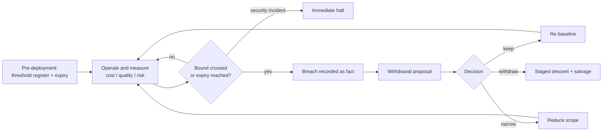

# Agent Withdrawal Criteria

**Also known as:** 撤退基準, Pre-Agreed De-Adoption Thresholds, Agent Exit Criteria, Expiry-Date Design

**Category:** Governance & Observability  
**Status in practice:** emerging

## Intent

Agree before production on the quantitative thresholds — cost versus a human baseline, correction rate, security incidents — whose breach triggers a documented withdrawal proposal, making de-adoption a designed decision instead of a defeat.

## Context

An agent runs in production doing work people used to do. Its economics and quality drift over time: a provider change degrades accuracy, scope creep multiplies cost, correction work quietly shifts back to humans. The team that built it evaluates it, and every incremental fix feels cheaper than admitting the deployment is not paying off.

## Problem

Nobody plans the exit. Withdrawal reads as defeat, so teams escalate commitment instead: one more prompt fix, one more guardrail, while the agent costs more than the humans it replaced and correction rates climb. Because degradation is gradual, each week's numbers are individually defensible, and criteria negotiated in the middle of a failure are political — the people who would decide have already sunk their credibility into the deployment. The result is a fleet of half-working agents nobody dares to kill and no record of when the case for them stopped holding.

## Forces

- Escalation of commitment is well documented for software projects: sunk cost and personal attachment keep failing efforts alive long past the evidence.
- Degradation is gradual and multi-axis — cost, quality, risk — so without pre-agreed bounds no single data point ever forces the question.
- Criteria agreed before go-live are cheap and neutral; the same criteria proposed during a failure are contested by everyone invested in the deployment.

## Therefore

Therefore: fix the withdrawal thresholds before the agent ships — cost relative to the human baseline, human-correction rate, and incident classes — record every breach as a fact, and let a breach force a documented keep, narrow, or withdraw decision.

## Solution

Define the exit before the entry. Agree measurable bounds on three axes: economics (cost per case above a multiple of the human-equivalent baseline, such as 1.5x), quality (human-correction rate above a bound, such as half of outputs needing rework), and risk (incident classes that halt the agent immediately). Give every deployment an expiry date — a review point at which continued operation must be re-justified rather than assumed. Instrument the measurements from day one so the thresholds are evaluated by pipeline, not by advocacy; when a bound is crossed, record the fact and present it as the basis for a withdrawal proposal. The decision itself stays human and has three designed outcomes: keep with a re-baselined threshold, narrow the agent to the scope where it performs, or withdraw — executed as a staged descent of autonomy and scope, with salvage of what the deployment learned, rather than an overnight unplug.

## Structure

```
Before go-live: threshold register (cost, quality, risk) + expiry date -> operate and measure -> breach recorded as fact -> withdrawal proposal -> decision: keep (re-baseline) | narrow scope | withdraw (staged descent + salvage).
```

## Diagram



*Thresholds agreed before go-live turn degradation into recorded breaches that force a keep, narrow, or withdraw decision.*

## Example scenario

A team ships a knowledge-base QA agent with agreed thresholds: cost per resolved query under 1.5 times the help desk baseline, correction rate under 50 percent, immediate halt on any data-leak incident, review after six months. A model provider change pushes the correction rate over the bound for two consecutive weeks; the on-call records the breach and files the withdrawal proposal. The review narrows the agent to the two document domains where corrections were rare — the descent path the criteria had designed in advance.

## Consequences

**Benefits**

- De-adoption becomes a governed decision with a paper trail instead of a slow, unacknowledged failure.
- Pre-agreement removes the politics: the thresholds were set when nobody's credibility was at stake.
- The expiry date kills zombie deployments by default — continued operation must be argued for, not merely not argued against.

**Liabilities**

- Thresholds demand real measurement infrastructure — cost per case, correction telemetry, a maintained human baseline — before the first case runs.
- Badly chosen bounds bite: too tight withdraws an agent during normal variance, too loose never fires.
- A hard public exit bar can make teams gun-shy about deploying agents whose early numbers will look bad before they improve.

## Failure modes

- Threshold gaming — cost and correction metrics get redefined until the numbers stay just under the bar.
- Rescue spiral — a breach triggers one more fix instead of the documented decision the criteria demanded.
- Zombie agent — withdrawal is decided but never executed, and the agent lingers half-maintained in the workflow.
- Baseline rot — the human-equivalent cost baseline is never re-measured, so the economic comparison quietly stops meaning anything.

## What this pattern constrains

Thresholds must be agreed before go-live and cannot be renegotiated mid-breach: a crossed bound is recorded and forces a documented keep, narrow, or withdraw decision, a defined security incident halts the agent immediately, and no deployment runs without an expiry date for its next review.

## Applicability

**Use when**

- An agent replaces or augments measurable human work, so a cost and quality baseline exists to compare against.
- The deployment is long-lived enough for drift, scope creep, and provider changes to erode its original case.
- The organisation has a governance forum that can own a keep, narrow, or withdraw decision when a breach is recorded.

**Do not use when**

- The deployment is a time-boxed experiment whose end date already is the withdrawal decision.
- No human baseline exists and none can be constructed, leaving the economic threshold unmeasurable.
- Thresholds would be set by the same people who can redefine the metrics — gaming is then cheaper than compliance.

## Components

- Threshold register — the pre-agreed cost, quality, and risk bounds plus an expiry date per deployment
- Measurement pipeline — cost per case, human-correction telemetry, and incident classification feeding the register
- Human baseline — the maintained cost and quality of the work the agent replaced
- Breach recorder — an append-only log of crossed bounds that anchors the withdrawal proposal
- Decision forum — the body that owns keep, narrow, or withdraw and its paper trail
- Descent ladder — the staged reduction of autonomy and scope that executes a withdrawal

## Tools

- Cost observability stack — per-case cost attribution against the human baseline
- Correction telemetry — measures how much agent output humans rework
- Incident management system — classifies and routes the risk-threshold halts
- Governance review calendar — enforces the expiry dates so reviews actually happen

## Evaluation metrics

- Time from breach to decision — how long a recorded threshold crossing waits for its keep/narrow/withdraw verdict
- Coverage — share of deployed agents with a registered threshold set and expiry date
- Zombie count — deployments past a breach or expiry with no recorded decision
- Salvage rate — share of withdrawn deployments whose learnings (rules, evals, data) were retained

## Known uses

- **[Knowledge-base QA agent production operation (practitioner report)](https://zenn.dev/miyan/articles/ai-agent-production-ops-reality-2026)** _available_ — First-hand production account proposing three withdrawal thresholds — cost above 1.5x human-equivalent work, human-correction rate above 50 percent, immediate halt on any security incident — plus expiry-date design (消費期限設計), while noting no industry standard for withdrawal decisions exists yet.
- **[Gartner agentic project forecast](https://www.gartner.com/en/newsroom/press-releases/2025-06-25-gartner-predicts-over-40-percent-of-agentic-ai-projects-will-be-canceled-by-end-of-2027)** _available_ — Gartner predicts over 40 percent of agentic projects will be cancelled by end of 2027 on cost and unclear value — the population this pattern gives an orderly exit instead of an unmanaged one.

## Related patterns

- _complements_ **Kill Switch** — The kill switch is the mechanism the risk threshold invokes for immediate halt; withdrawal criteria are the standing policy for when the deployment as a whole should end.
- _conflicts-with_ **Perma-Beta** — An expiry date and pre-agreed exit thresholds make the indefinite-beta dodge impossible: a breach or a lapsed review forces a recorded decision.
- _uses_ **Cost Observability** — The economic threshold is only evaluable if cost per case is measured continuously and compared against a maintained human baseline.

## References

- [AIエージェント本番運用 — 3つの壊れ方と撤退基準](https://zenn.dev/miyan/articles/ai-agent-production-ops-reality-2026) — 2026
- [Pulling the Plug: Software Project Management and the Problem of Project Escalation](https://www.jstor.org/stable/249627) — Mark Keil, 1995
- [Gartner Predicts Over 40% of Agentic AI Projects Will Be Canceled by End of 2027](https://www.gartner.com/en/newsroom/press-releases/2025-06-25-gartner-predicts-over-40-percent-of-agentic-ai-projects-will-be-canceled-by-end-of-2027) — Gartner, 2025
