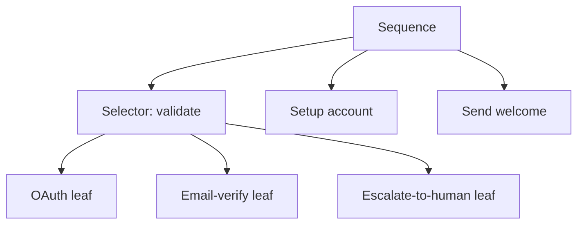

# Agentic Behavior Tree

**Also known as:** ABT, Behavior Tree for LLM Agents

**Category:** Planning & Control Flow  
**Status in practice:** experimental

## Intent

Borrow the behavior-tree formalism: leaves are LLM calls or tools that return success/failure; a tree of selectors and sequences orchestrates control flow.

## Context

An agent needs structured orchestration with clear fallback semantics — try one approach; if it fails, try the next; if all fail, escalate. Pure prompt chains and free-form ReAct loops have no first-class concept of 'failure of a sub-task triggers the sibling branch'. Behavior trees, widely used in game design and robotics, are the canonical formalism for this shape.

## Problem

Free-form ReAct gives the LLM total freedom over control flow, which is brittle on tasks where the design intent is exactly a structured sequence of try-then-fallback. Prompt chains hard-code one path with no fallback. Custom orchestrators reinvent BT semantics ad-hoc per project. Without a first-class BT layer, the team rebuilds the same selector/sequence/decorator vocabulary every time, with diverging implementations and no shared mental model.

## Forces

- Selector (try children until one succeeds) and Sequence (run all children, fail on first failure) are the core BT primitives.
- Leaves can be LLM calls, tool invocations, or even sub-agents.
- Success/failure must propagate cleanly upward.
- Retries, timeouts, and decorators (e.g. invert, always-succeed) are standard BT extensions.

## Applicability

**Use when**

- Control flow has structured retries, fallbacks, and escalations.
- Reviewing the agent's structure is a first-class need.
- Multiple leaf implementations (LLM, tool, sub-agent) need uniform success/failure semantics.

**Do not use when**

- The agent's control flow is genuinely open-ended exploration — ReAct fits better.
- Task is one-shot; tree authoring overhead is not justified.
- Team has no BT vocabulary and the tree becomes a custom DAG no one can read.

## Therefore

Therefore: orchestrate the agent as a behavior tree whose leaves are LLM calls or tool invocations and whose interior nodes are selectors and sequences, so control flow is explicit, retry/fallback is first-class, and the structure is reviewable.

## Solution

Build the agent as a tree. Interior nodes are Selectors (try children left-to-right, succeed on first success) and Sequences (run children left-to-right, fail on first failure), plus standard decorators (Retry, Timeout, Invert). Leaves call the LLM or a tool and return SUCCESS or FAILURE. The tree executes top-down per tick; status propagates up. The tree itself is a versioned artifact reviewers can read. Distinct from [[plan-and-execute]] (one-shot plan + sequential run): a behavior tree is the structure of the controller across runs.

## Example scenario

A customer-onboarding agent's behavior tree at the top level is a Sequence: validate identity → set up account → send welcome. The validate-identity child is a Selector: try OAuth → fall back to email-verify → fall back to escalate-to-human. Each leaf is an LLM call or tool. If OAuth fails, the agent moves to email-verify without the LLM having to reason about fallback structure.

## Diagram

## Consequences

**Benefits**

- Retry, fallback, and escalation are first-class structural choices.
- Reviewable as a tree, not a prompt.
- Composes naturally with sub-agents at leaves.

**Liabilities**

- Tree authoring is up-front design work; ad-hoc cases want to bypass the tree.
- Mixing LLM leaves with deterministic ones complicates timing and cost reasoning.
- Authors may overuse decorators to paper over leaf flakiness.

## What this pattern constrains

Control flow with structured fallback must not be left entirely to LLM reasoning; selector/sequence/decorator semantics are explicit in the tree.

## Known uses

- **AI Agents in Action (Lanham) — Agentic Behavior Trees** — *Available* — <https://livebook.manning.com/book/ai-agents-in-action/chapter-6>
- **Game/robotics BT libraries adapted to LLM agents (py_trees + LLM leaves)** — *Available*

## Related patterns

- *alternative-to* → [plan-and-execute](plan-and-execute.md)
- *alternative-to* → [react](react.md)
- *complements* → [behavior-tree-back-chaining](behavior-tree-back-chaining.md) — Back-chaining is one way to construct an ABT.
- *uses* → [fallback-chain](fallback-chain.md)
- *composes-with* → [agent-as-tool-embedding](agent-as-tool-embedding.md)
- *complements* → [circuit-breaker](circuit-breaker.md)
- *complements* → [degenerate-output-detection](degenerate-output-detection.md)

## References

- (book) *AI Agents in Action*, Micheal Lanham, 2025, <https://www.manning.com/books/ai-agents-in-action>
- (blog) *Introduction to Autonomous Assistants with Behaviour Trees*, Micheal Lanham, <https://medium.com/@Micheal-Lanham/introduction-to-autonomous-assistants-with-behaviour-trees-b79ec24fc346>

**Tags:** planning, behavior-tree, control
