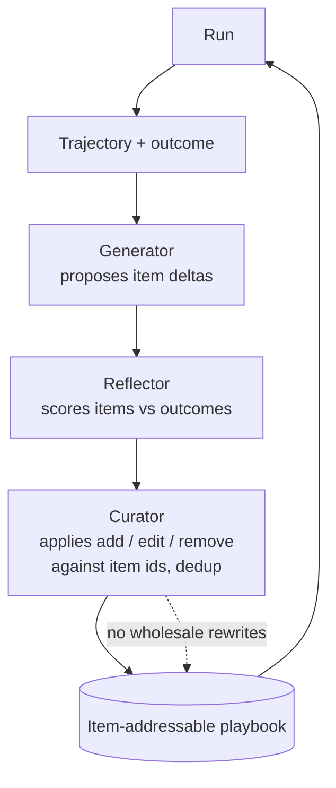

# Agentic Context Engineering Playbook

**Also known as:** ACE, Delta-Patched Playbook, Generator-Reflector-Curator Triad, Item-Addressable Self-Improvement

**Category:** Verification & Reflection
**Status in practice:** emerging

## Intent

Treat the agent's system prompt and long-lived memory as a structured, item-addressable playbook that evolves through small delta updates from a Generator/Reflector/Curator loop, so accumulated tactics resist the context collapse that monolithic rewrites cause.

## Context

Agents whose behaviour is shaped by a system prompt or persistent memory that accumulates tactics, heuristics, and worked examples over many runs. Teams that have tried free-form self-reflection or whole-prompt rewrites find that each rewrite tends to wipe out useful items or merge them into vague abstractions.

## Problem

Free-form self-reflection produces a single blob of lessons that gets harder to reuse with each pass. Whole-prompt rewrites lose item-level structure — yesterday's specific tactic gets paraphrased into a generality and then dropped on the next pass. There is no addressable unit a reflection step can target, so the playbook either bloats or collapses. Without item-level addressing, three things blur together: generating the lesson, evaluating it, and deciding what to keep.

## Forces

- Playbooks must accumulate specific tactics, not just abstract principles, to remain useful.
- Monolithic rewrites lose item-level structure and tend toward generic phrasing each pass (context collapse).
- Some items are wrong, redundant, or stale and must be removable without disturbing the rest.
- Generation, evaluation, and curation are different jobs; collapsing them into one prompt produces vague output.
- The playbook must remain readable and auditable by humans, not become an opaque blob.

## Therefore

Therefore: structure the playbook as addressable items, run three separate roles — Generator proposes new items from recent trajectories, Reflector judges existing and proposed items against outcomes, Curator merges deltas (add, edit, remove, dedup) — and only ever apply small item-level patches, so accumulated tactics survive across runs.

## Solution

The playbook is stored as an ordered list of items with stable identifiers; each item carries a short tactic, optional worked example, and provenance. A run produces a trajectory and outcome. The Generator reads the trajectory and proposes new candidate items as deltas. The Reflector reviews proposed and existing items against the outcome and recent history, scoring which to keep, edit, or drop. The Curator applies the resulting delta set — strictly add/edit/remove operations against item ids — with dedup against existing items. Whole-playbook rewrites are forbidden. The three roles are separate prompts (and may be separate model calls) so that generation cannot pre-empt evaluation, and evaluation cannot quietly drop items the Curator did not authorise.

## Structure

```
Trajectory + outcome -> Generator (proposes item deltas) -> Reflector (scores items vs outcomes) -> Curator (applies add/edit/remove patches against item ids, with dedup) -> updated item-addressable playbook. No role rewrites the playbook wholesale; the Curator is the only writer.
```

## Diagram



*Three role-separated stages turn each run into small delta updates against an item-addressable playbook.*

## Example scenario

A coding agent accumulates a playbook of testing tactics over months of runs. The team switches from whole-prompt rewrites to a three-role loop. After each task, the Generator proposes new items like 'before running pytest in this repo, install dev extras'; the Reflector compares the proposal against the run outcome and against existing items; the Curator adds it as item 47, edits item 12 (which was a vaguer version of the same tactic), and removes item 33 (which the Reflector flagged as wrong in two recent runs). The playbook keeps growing in specificity instead of decaying into generalities.

## Consequences

**Benefits**

- Specific tactics survive across many runs instead of being paraphrased away.
- Item-level provenance makes the playbook auditable and rollback-able.
- Separating Generator, Reflector, and Curator prevents the single-prompt collapse of generation into evaluation.
- Small deltas are cheap; full rewrites are expensive — cost per improvement step drops.

**Liabilities**

- Three-role loop is more machinery than a single reflection pass.
- Item identifiers must be stable, which adds a small storage and bookkeeping concern.
- The Curator's dedup logic can be wrong and silently drop items it should have kept; needs its own audit.
- Playbook can still grow unbounded without a separate retention policy.

## What this pattern constrains

The Generator must only emit candidate item deltas, never rewrite the playbook; the Reflector must only score items, never edit them; the Curator must apply only add/edit/remove operations against existing item ids and must never replace the playbook wholesale; whole-prompt regeneration of the playbook is forbidden.

## Applicability

**Use when**

- The agent has a long-lived prompt or memory that accumulates tactics across many runs.
- Whole-prompt rewrites have measurably degraded specificity (context collapse).
- Outcomes are observable per run and can score items.

**Do not use when**

- The agent is stateless or sessions are short and uncorrelated.
- There is no outcome signal — the Reflector has nothing to score against.
- The team cannot afford the three-role overhead and a single reflection step is good enough.

## Known uses

- **[Agentic Context Engineering (ACE) — Zhang et al., ICLR 2026](https://arxiv.org/abs/2510.04618)** — *Available* — Generator/Reflector/Curator triad with delta-patched item-addressable playbook.

## Related patterns

- *specialises* → [reflexion](reflexion.md) — Reflexion produces free-form verbal lessons; ACE structures them as addressable items with a three-role loop.
- *alternative-to* → [self-refine](self-refine.md) — Self-refine rewrites in one pass; ACE forbids whole-prompt rewrites and only applies deltas.
- *complements* → [prompt-versioning](prompt-versioning.md) — Item-level deltas slot naturally into a prompt-versioning registry.
- *complements* → [cluster-capped-insight-store](cluster-capped-insight-store.md) — Cluster-capping bounds the playbook's size; ACE governs how items enter and leave it.
- *alternative-to* → [dspy-signatures](dspy-signatures.md) — DSPy compiles prompts from data; ACE evolves a human-readable playbook in place.

## References

- (paper) Zhang et al., *Agentic Context Engineering: Evolving Contexts for Self-Improving Language Models*, 2025, <https://arxiv.org/abs/2510.04618>
- (blog) *VentureBeat coverage of Agentic Context Engineering*, 2025, <https://venturebeat.com/ai/>

**Tags:** self-improvement, memory, reflection, prompt-engineering, context-collapse
