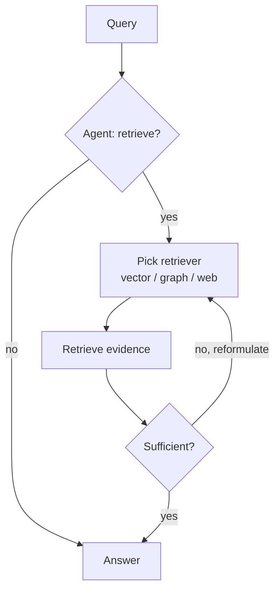

# Agentic RAG

**Also known as:** Iterative RAG

**Category:** Retrieval & RAG  
**Status in practice:** mature

## Intent

Replace static retrieve-then-generate with autonomous agents that plan, choose sources, retrieve iteratively, reflect, and re-query.

## Context

A team is building a retrieval-augmented system to answer user questions over a corpus, but the questions are not all of one kind. Some are multi-hop, where the answer depends on facts from two or three different documents combined. Some are ambiguous, where the question itself does not pin down what is being asked. And the corpus or the user's information need is evolving over time. A single retrieve-once, generate-once pipeline cannot serve all of these reliably.

## Problem

Naive retrieval-augmented generation runs one retrieval per question and feeds the top chunks straight into the generator. It cannot decide whether retrieval is even needed for a given question, cannot choose between several available sources, cannot tell when it has gathered enough evidence to stop, and has no path to recover when the retrieval comes back with poor or irrelevant chunks. Easy questions get pointless retrieval calls, multi-hop questions get partial answers, and bad retrievals quietly corrupt the output.

## Forces

- Agentic loops cost more than single-shot retrieval.
- Source selection requires capability descriptions.
- Loop bounds must prevent runaway retrieval.

## Therefore

Therefore: expose retrieval as a tool the agent chooses, reformulates, and bounds, so that retrieval becomes a planning decision rather than a fixed pipeline step.

## Solution

Treat retrieval as a tool. The agent decides whether to retrieve, formulates and reformulates the query, picks among multiple retrievers (vector, graph, keyword, web), evaluates retrieved evidence, and re-queries on insufficient results. Composes naturally with reflection, planning, and tool-use patterns.

## Diagram



## Example scenario

A consulting agent is asked, 'Compare our 2023 and 2024 revenue by region.' Naive RAG would do one search and pass whatever it found to the model. Agentic RAG instead runs in a loop: it queries the 2023 figures, decides it also needs 2024 figures, queries those, notices the EMEA numbers are missing, queries again with a more specific phrase, then produces the comparison from a complete set.

## Consequences

**Benefits**

- Handles multi-hop and adaptive queries.
- Source diversity (multi-store retrieval) becomes feasible.

**Liabilities**

- Cost and latency rise with loop iterations.
- Loop quality depends on agent self-evaluation.

## What this pattern constrains

Retrieval is one tool among many; the agent decides invocation, but each retrieval is bounded by the step budget.

## Applicability

**Use when**

- A single retrieve-then-generate pass is insufficient for the task's information needs.
- Multiple retrievers (vector, graph, keyword, web) exist and the right one varies per query.
- The agent benefits from reflecting on retrieved evidence and re-querying when results are poor.

**Do not use when**

- Static one-shot RAG already meets quality targets at lower cost and latency.
- Latency budgets cannot afford iterative retrieval rounds.
- There is only one retriever and no meaningful query reformulation possible.

## Known uses

- **Self-RAG, CRAG implementations** — *Available*
- **LangGraph Agentic RAG tutorials** — *Available*
- **Perplexity** — *Available*
- **ChatGPT Search** — *Available*
- **Glean** — *Available*
- **Notion AI** — *Available*
- **[Sparrot](https://marco-nissen.com/sparrot/)** — *Available* — The agent retrieves over its own Markdown corpus (and external sources) inside a reasoning loop rather than via a one-shot fetch-then-answer step.

## Related patterns

- *generalises* → [naive-rag](naive-rag.md)
- *uses* → [react](react.md)
- *uses* → [reflection](reflection.md)
- *uses* → [tool-use](tool-use.md) — Retrieval is exposed as a tool the agent decides to invoke.
- *composes-with* → [cross-encoder-reranking](cross-encoder-reranking.md) — Reranking is a near-universal RAG companion.
- *generalises* → [self-rag](self-rag.md)
- *generalises* → [crag](crag.md)

## Code examples

Source of truth: [`examples-src/retrieval.json`](../examples-src/retrieval.json) (entry `agentic-rag`). The Pages site renders these as a tabbed code panel; below they appear sequentially because GitHub-flavoured Markdown has no tab primitive.

All examples below ship with `verified: false` and link the upstream source URL — a verifier re-runs each one against its `source_url` at the pinned `sdk_version` before flipping the flag.

### Pseudo-code

```text
function answer(question):
    messages = [system_prompt, user(question)]
    for step in 1..MAX_STEPS:
        reply = llm.generate(
            messages=messages,
            tools=[retrieve_vector, retrieve_graph, retrieve_web],
        )
        messages.append(reply)

        if not reply.tool_calls:
            return reply.content              # agent answered

        for call in reply.tool_calls:
            evidence = dispatch(call.name, call.args)
            messages.append(tool_result(call.id, evidence))
        # next iteration: agent sees evidence and either answers,
        # reformulates the query, or picks a different retriever.

    return abort("step budget exhausted")     # bounded by MAX_STEPS
```

### LangChain (Python) — `langchain>=1.0`

Source: <https://docs.langchain.com/oss/python/langchain/rag>

```python
from langchain.agents import create_agent
from langchain.chat_models import init_chat_model
from langchain.tools import tool

vector_store = ...  # built once at startup

@tool(response_format="content_and_artifact")
def retrieve_context(query: str):
    """Retrieve information to help answer a query."""
    docs = vector_store.similarity_search(query, k=2)
    serialized = "\n\n".join(
        f"Source: {d.metadata}\nContent: {d.page_content}" for d in docs
    )
    return serialized, docs

model = init_chat_model("gpt-4o-mini")
agent = create_agent(
    model,
    tools=[retrieve_context],
    system_prompt=(
        "You have access to a tool that retrieves context. Use it when "
        "answering needs grounding; if retrieval returns nothing useful, "
        "say you don't know."
    ),
)

for event in agent.stream(
    {"messages": [{"role": "user", "content": "What is task decomposition?"}]},
    stream_mode="values",
):
    event["messages"][-1].pretty_print()
```

### LlamaIndex (Python) — `llama-index>=0.12`

Source: <https://developers.llamaindex.ai/python/examples/agent/agent_workflow_basic/>

```python
import asyncio
from llama_index.core.agent.workflow import FunctionAgent
from llama_index.llms.openai import OpenAI

index = ...  # built once at startup

async def search_corpus(query: str) -> str:
    """Search the indexed corpus for passages relevant to the query.

    The agent calls this only when it judges retrieval is needed; the
    docstring is what the LLM reads to decide.
    """
    nodes = await index.as_retriever().aretrieve(query)
    return "\n\n".join(n.get_content() for n in nodes)

agent = FunctionAgent(
    tools=[search_corpus],
    llm=OpenAI(model="gpt-4o-mini"),
    system_prompt=(
        "You are a helpful assistant. Use search_corpus when the user's "
        "question needs information you do not already have."
    ),
)

async def main():
    response = await agent.run(user_msg="What is task decomposition?")
    print(str(response))

asyncio.run(main())
```

### Haystack (Python) — `haystack-ai>=2.0`

Source: <https://docs.haystack.deepset.ai/docs/agent>

```python
from typing import Annotated
from haystack.components.agents import Agent
from haystack.components.generators.chat import OpenAIChatGenerator
from haystack.dataclasses import ChatMessage
from haystack.tools import tool

retrieval_pipeline = ...  # built once at startup

@tool
def retrieve_documents(query: Annotated[str, "Search query"]) -> str:
    """Retrieve documents relevant to the query.

    The Agent calls this only when the user's message needs grounding
    in the indexed corpus.
    """
    result = retrieval_pipeline.run({"query": query})
    return "\n\n".join(d.content for d in result["documents"])

agent = Agent(
    chat_generator=OpenAIChatGenerator(model="gpt-4o-mini"),
    tools=[retrieve_documents],
    system_prompt=(
        "You are a helpful assistant. Use retrieve_documents when the "
        "user's message needs information from the indexed corpus."
    ),
)

response = agent.run(
    messages=[ChatMessage.from_user("What is task decomposition?")]
)
print(response["last_message"].text)
```

## References

- (paper) Singh, Ehtesham, Kumar, Khoei, *Agentic Retrieval-Augmented Generation: A Survey on Agentic RAG*, 2025, <https://arxiv.org/abs/2501.09136>

**Tags:** rag, agentic, iterative
