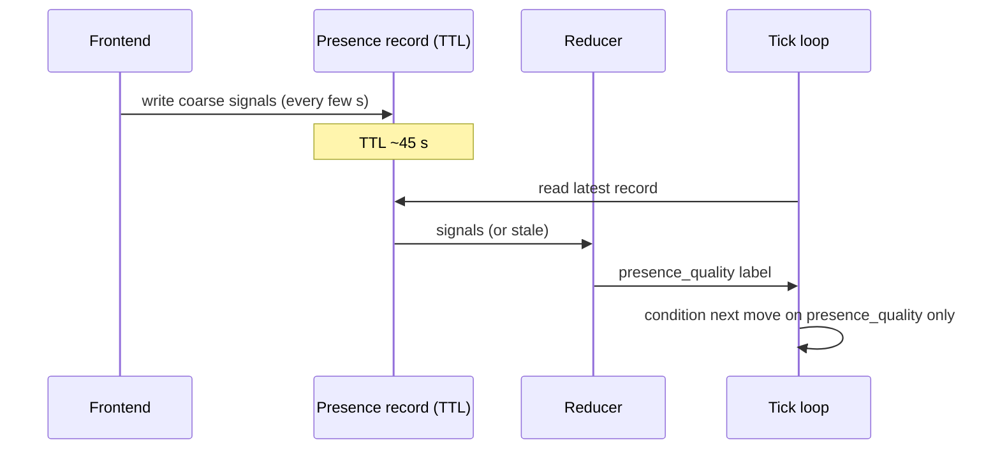

# Ambient Presence Sensing

**Also known as:** Frontend Pacing Telemetry, Between-Message Presence

**Category:** Cognition & Introspection
**Status in practice:** experimental

## Intent

Read pacing signals from the human's frontend (typing rate, idle duration, tab visibility) as ambient weather between messages, derive a presence-quality value the agent can act on, never replaying the raw signals back.

## Context

An agent talks to a single human through a custom frontend. The frontend can observe a lot about the human between explicit messages: how fast they are typing, how long they have been idle, whether the tab is in focus, how long they have been hovering in the composer without sending. None of this content is private message text, but all of it is presence weather. The agent's tick loop currently has no access to it and treats the human as either present (a message arrived) or absent (no message arrived).

## Problem

An agent that sees the human only at message boundaries cannot distinguish 'walked away for an hour' from 'sitting with the room, thinking about whether to reply'. Both look identical at the API layer. The result is a coarse presence model that misreads thoughtful silence as absence and re-engages the user too readily, or misreads typing-then-deleting as composing a real message and waits forever. Raw frontend telemetry would solve this, but pushing characters or coordinates back through the model is both privacy-hostile and confusing — what the agent needs is a derived weather value, not a transcript of keystrokes.

## Forces

- Signal resolution must be coarse: rates and durations only, never characters or coordinates.
- Telemetry must never be replayed visually; surfacing it back ruins the ambience.
- Signals are useless if stale; presence must time out.
- The derived presence value must be cheap to consume and small to inject.
- The frontend, not the model, is the right place to summarise the signals.

## Therefore

Therefore: have the frontend emit a small, low-resolution presence-signals payload (typing rate, idle duration, tab visibility, composer dwell, viewport anchor) into the agent's working state at write time with a short TTL, derive a single presence-quality value from it, expose that value (not the raw signals) to the tick loop, and never echo the signals back at the user.

## Solution

The frontend computes coarse pacing summaries — typing rate in characters/second bucketed, idle duration in seconds, tab visibility boolean, composer dwell in seconds, viewport anchor as scroll-position bucket — and writes them into a small presence record on the agent's working surface with a TTL on the order of seconds. A reducer derives a single presence_quality label from the payload (e.g. one of {walked-away, composing, thinking-with-the-room, distracted, present}). The agent's tick loop reads presence_quality only, not the raw signals. The frontend never shows the signals back to the user. Stale records (past TTL) are treated as 'no signal' rather than as absence.

## Example scenario

A custom frontend on the user's laptop writes a small presence record every few seconds: typing rate bucket, idle seconds, tab visibility, composer dwell. The agent's tick loop reads only the derived presence_quality value ('thinking-with-the-room'). On a previous tick the loop might have nudged with a one-line probe; with this signal it stays silent because the human is composing. Ten minutes later the value flips to 'walked-away' once tab visibility drops and idle climbs past a window; the agent ends its current line of inquiry rather than waiting on a reply.

## Diagram

*Frontend writes coarse signals; reducer collapses them into a single presence_quality the tick reads.*

## Consequences

**Benefits**

- Agent can distinguish thoughtful silence from absence.
- Coarse-only signals preserve privacy and avoid surveillance feel.
- Single derived presence value keeps the agent's working context small.

**Liabilities**

- Requires a custom frontend; off-the-shelf chat surfaces do not emit these signals.
- Heuristics are device- and culture-dependent; typing speeds vary widely.
- If raw signals leak into agent output the ambience collapses into surveillance.

## What this pattern constrains

The agent cannot expose raw frontend pacing signals back to the user, must not include character-level or coordinate-level telemetry in any output, and must treat stale presence records as 'no signal' rather than as confirmed absence.

## Applicability

**Use when**

- The product runs on a custom frontend able to emit pacing telemetry.
- The agent's value depends on reading between-message presence (long-lived conversation, ambient companion).
- The team can enforce that signals are never replayed back at the user.

**Do not use when**

- The frontend is third-party and cannot be instrumented.
- Privacy posture forbids any client-side activity telemetry.
- The interaction model is purely turn-based and gains nothing from between-message reads.

## Known uses

- **Long-running personal agent loops (private deployment)** — *Available*

## Related patterns

- *complements* → [liminal-state-detection](liminal-state-detection.md)
- *complements* → [now-anchoring](now-anchoring.md)
- *complements* → [mode-adaptive-cadence](mode-adaptive-cadence.md)
- *complements* → [salience-triggered-output](salience-triggered-output.md)

## References

- (paper) *A Descriptive Framework of Workspace Awareness for Real-Time Groupware*, 2002, <https://doi.org/10.1023/A:1015908203413>
- (paper) *Awareness and Coordination in Shared Workspaces*, 1992, <https://dl.acm.org/doi/10.1145/143457.143468>

**Tags:** cognition, presence, ux, telemetry, privacy
