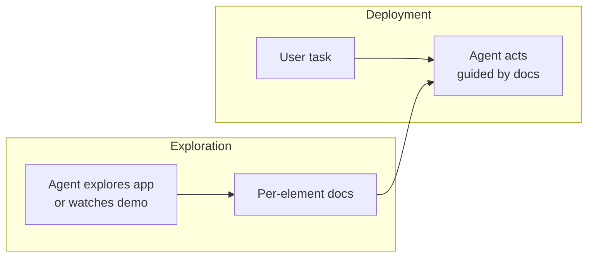

# App Exploration Phase

**Also known as:** Pre-Deployment Exploration, App Onboarding Crawl, UI Element Documentation

**Category:** Tool Use & Environment  
**Status in practice:** experimental

## Intent

Before deploying an agent against an opaque app, have it explore (or watch a human demonstrate) the app, generating a per-element documentation knowledge base; at deployment, retrieve element docs to ground actions.

## Context

The agent must operate an app whose UI is not self-describing (no accessibility metadata, no API). Element semantics ("this is the cart icon", "this opens search filters") have to be learned somehow.

## Problem

Without prior knowledge of element semantics, the agent guesses at every screen — slow, error-prone, and wasteful per-deployment-task.

## Forces

- Exploration costs time and money up front;
- Demonstrations require a human, but a single demo amortises across many deployments.
- App UIs change; the documentation goes stale and needs refresh.
- Documentation that is too verbose drowns the agent in irrelevant context at deployment.

## Solution

Split the agent's lifecycle into two phases. (1) Exploration — agent autonomously interacts with the app or watches a human demo, and writes per-element documentation: what the element is, what it does, when to use it. Store as a structured knowledge base. (2) Deployment — for each task, retrieve relevant element docs (e.g. via vector search), inject into context, then act. Refresh docs when the UI changes.

## Example scenario

A logistics company points its agent at an internal warehouse app it has never seen before. On every task the agent stumbles: it misreads which button submits, hallucinates field names, and clicks 'Cancel' thinking it confirms. The team runs an exploration phase first: a human demonstrates a few flows while the agent records each element's role and the surrounding context, building a per-element knowledge base. At deployment, the agent retrieves the relevant element docs before each click and stops guessing.

## Structure

```
Phase 1: Agent (or Human) -> interact_with_app -> per-element docs -> KB. Phase 2: Task -> retrieve(KB) -> grounded actions on app.
```

## Diagram



## Consequences

**Benefits**

- Deployment-time actions are grounded in learned semantics, not guesses.
- Single exploration amortises across many user tasks.
- Human-demo mode lowers the bar to onboard a new app.

**Liabilities**

- Exploration is expensive and offline; production tasks must wait or use an older KB.
- KB drift when the app changes; staleness detection is non-trivial.
- Element documentation quality bounds deployment-phase quality.

## What this pattern constrains

At deployment, the agent may not act on an element whose documentation is missing; missing-doc events trigger re-exploration rather than improvisation.

## Applicability

**Use when**

- The agent must operate against an opaque app with no API documentation for its UI elements.
- The agent will be deployed against the same app many times, amortising up-front exploration cost.
- Per-element semantics (what each control does and when to use it) are stable enough to document once.

**Do not use when**

- The app changes faster than exploration documentation can be refreshed.
- Each task uses a different app, so exploration cost cannot be amortised.
- Element-level semantics are obvious from labels alone and exploration adds no signal.

## Known uses

- **[AppAgent (Tencent)](https://github.com/TencentQQGYLab/AppAgent)** — *Available*. Two-phase architecture; exploration writes element documentation consumed at deployment.

## Related patterns

- *specialises* → [tool-discovery](tool-discovery.md) — Tool discovery for opaque GUIs.
- *complements* → [skill-library](skill-library.md)
- *uses* → [naive-rag](naive-rag.md) — Element docs are retrieved at deployment.
- *complements* → [mobile-ui-agent](mobile-ui-agent.md)

## References

- (paper) Zhang et al., *AppAgent: Multimodal Agents as Smartphone Users*, 2023, <https://arxiv.org/abs/2312.13771>

**Tags:** tool-use, gui-agent, china-origin, exploration
