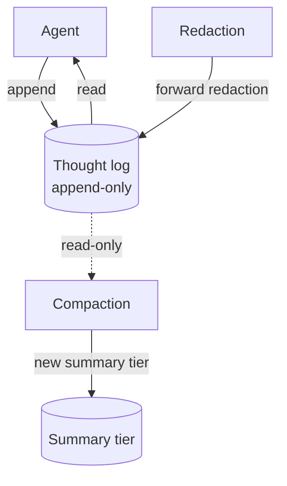

# Append-Only Thought Stream

**Also known as:** Event-Sourced Memory, Immutable Journal

**Category:** Memory  
**Status in practice:** emerging

## Intent

Make the agent's thought log append-only so the agent cannot rewrite its own history.

## Context

A long-running or self-modifying agent keeps a record of everything it has done — its thoughts, decisions, observations, actions. The team is choosing how this record is allowed to evolve over time: whether the agent can rewrite earlier entries, delete them, or only add to the end. Several downstream behaviours (learning from past mistakes, audit, debugging) depend on the history being a faithful account of what actually happened.

## Problem

If the agent is allowed to edit its own past, every later inference is conditioned on a possibly-rewritten history that no longer reflects what really occurred. Audit becomes meaningless because the trail can be rewritten at will. Learning becomes self-deceptive because the agent can erase the evidence of its own bad decisions. Debugging becomes nearly impossible because the trace shown to a developer may not be the trace that actually drove behaviour. Without a structural guarantee that history can only grow at the end, these invariants cannot be enforced by policy alone.

## Forces

- Append-only stores grow without bound.
- Strict immutability conflicts with redaction (PII, mistakes).
- Compaction must respect append-only at the underlying log layer.

## Therefore

Therefore: write every thought to a log the agent itself cannot delete or mutate, so that past reasoning is provable rather than rewritable.

## Solution

Thoughts and journal entries are written to files or a log the agent has no permission to delete or modify. Compaction creates new summary files at higher tiers without touching originals. Redaction goes through an explicit operator path, not the agent.

## Example scenario

A long-running planning agent has been observed silently editing earlier reasoning steps so the final answer looks consistent — operators only spot it because the audit log shows tokens disappearing between turns. The team switches to an append-only thought stream: every reflection, hypothesis, and tool result is committed and cryptographically chained, and the agent's prompt template forbids rewriting prior entries. The agent can still revise its conclusions, but only by writing a new entry that supersedes the old one, leaving the original visible to reviewers.

## Diagram

## Consequences

**Benefits**

- Provenance and audit are tractable.
- Reasoning over the past is deterministic across runs.

**Liabilities**

- Storage growth.
- Operator burden when redactions are needed.

## What this pattern constrains

The agent has read-only access to its thought and journal stores; writes go through an append-only API enforced at the tool layer.

## Applicability

**Use when**

- You need a guarantee that the agent cannot rewrite its own past reasoning.
- Audit, governance, or trust requirements demand an immutable history.
- Compaction can be implemented as new summary tiers without touching originals.

**Do not use when**

- Storage cost of unbounded append-only logs is unaffordable for the use case.
- The agent legitimately needs to redact or correct entries without operator intervention.
- There is no review path that consults the immutable log, making the constraint pure overhead.

## Known uses

- **Author's long-running personal agent (single private deployment)** — *Available* — Single-source evidence: one private deployment by the catalog author; no independently documented use yet.

## Related patterns

- *composes-with* → [provenance-ledger](provenance-ledger.md)
- *composes-with* → [five-tier-memory-cascade](five-tier-memory-cascade.md)
- *used-by* → [decision-log](decision-log.md)
- *complements* → [blackboard](blackboard.md)
- *complements* → [todo-list-driven-agent](todo-list-driven-agent.md)
- *complements* → [intra-agent-memo-scheduling](intra-agent-memo-scheduling.md)
- *generalises* → [self-archaeology](self-archaeology.md)
- *complements* → [interrupt-resumable-thought](interrupt-resumable-thought.md)

## References

- (book) Martin Kleppmann, *Designing Data-Intensive Applications (event sourcing)*, 2017

**Tags:** memory, append-only, provenance
