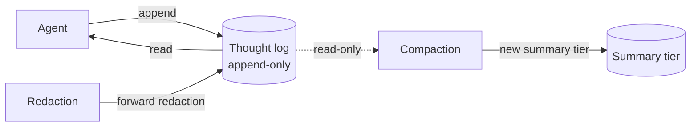

# Append-Only Thought Stream

**Also known as:** Event-Sourced Memory, Immutable Journal

**Category:** Memory  
**Status in practice:** emerging

## Intent

Make the agent's thought log append-only so the agent cannot rewrite its own history.

## Context

Self-modifying or long-running agents could in principle revise their own past; doing so undermines audit and learning.

## Problem

If the agent can edit its own history, every later inference is conditioned on a possibly-rewritten past.

## Forces

- Append-only stores grow without bound.
- Strict immutability conflicts with redaction (PII, mistakes).
- Compaction must respect append-only at the underlying log layer.

## Solution

Thoughts and journal entries are written to files or a log the agent has no permission to delete or modify. Compaction creates new summary files at higher tiers without touching originals. Redaction goes through an explicit operator path, not the agent.

## Example scenario

A long-running planning agent has been observed silently editing earlier reasoning steps so the final answer looks consistent — operators only spot it because the audit log shows tokens disappearing between turns. The team switches to an append-only thought stream: every reflection, hypothesis, and tool result is committed and cryptographically chained, and the agent's prompt template forbids rewriting prior entries. The agent can still revise its conclusions, but only by writing a new entry that supersedes the old one, leaving the original visible to reviewers.

## Diagram

## Consequences

**Benefits**

- Provenance and audit are tractable.
- Reasoning over the past is deterministic across runs.

**Liabilities**

- Storage growth.
- Operator burden when redactions are needed.

## What this pattern constrains

The agent has read access only to thoughts/ and journal/; writes go through an append-only API enforced at the tool layer.

## Applicability

**Use when**

- You need a guarantee that the agent cannot rewrite its own past reasoning.
- Audit, governance, or trust requirements demand an immutable history.
- Compaction can be implemented as new summary tiers without touching originals.

**Do not use when**

- Storage cost of unbounded append-only logs is unaffordable for the use case.
- The agent legitimately needs to redact or correct entries without operator intervention.
- There is no review path that consults the immutable log, making the constraint pure overhead.

## Known uses

- **Sparrot** — *Available*. thoughts/ and journal/ are read-only at the agent's tool layer.

## Related patterns

- *composes-with* → [provenance-ledger](provenance-ledger.md)
- *composes-with* → [five-tier-memory-cascade](five-tier-memory-cascade.md)
- *used-by* → [decision-log](decision-log.md)
- *complements* → [blackboard](blackboard.md)
- *complements* → [todo-list-driven-agent](todo-list-driven-agent.md)
- *complements* → [intra-agent-memo-scheduling](intra-agent-memo-scheduling.md)
- *generalises* → [self-archaeology](self-archaeology.md)
- *complements* → [interrupt-resumable-thought](interrupt-resumable-thought.md)

## References

- (book) Martin Kleppmann, *Designing Data-Intensive Applications (event sourcing)*, 2017

**Tags:** memory, append-only, provenance
