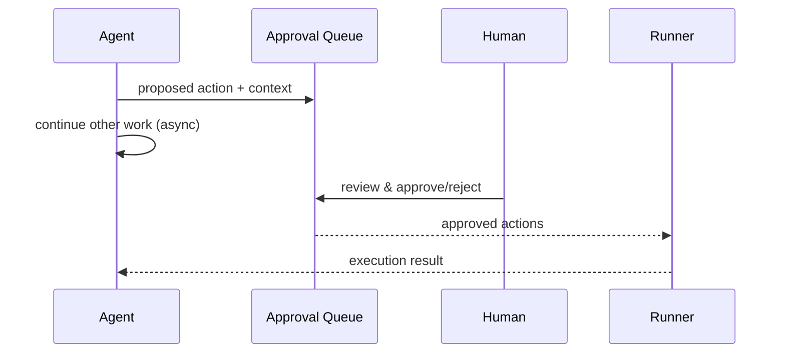

# Approval Queue

**Also known as:** Async Approval, Supervisor Inbox, Approval Inbox

**Category:** Safety & Control  
**Status in practice:** mature

## Intent

Queue agent-proposed actions for asynchronous human review while the agent continues other work.

## Context

Long-running agent products where some actions need human approval but blocking the agent's whole loop on every approval is impractical.

## Problem

Synchronous human-in-the-loop blocks the agent; ungated execution risks unsafe actions.

## Forces

- Async approval adds wall-clock delay before action lands.
- Approval inbox can become unmanageable at scale.
- Race conditions if the world changes while approval is pending.

## Solution

Agent emits proposed action to an approval queue with context. A human (or supervisor agent) reviews the queue and approves or rejects. Approved actions are executed by the agent or by a runner. The agent can continue parallel work while waiting; some workflows pause specific branches.

## Diagram

## Example scenario

An email-drafting agent prepares replies to 80 inbox messages overnight. Rather than send them automatically (risky) or block waiting on each one (slow), the agent writes them to an approval queue. In the morning the user reviews 80 draft replies and clicks 'send' or 'reject' on each. The agent kept moving through the inbox while waiting for the human.

## Consequences

**Benefits**

- Human oversight without blocking throughput.
- Approval inbox is auditable.

**Liabilities**

- Inbox fatigue at scale.
- World drift between proposal and approval.

## What this pattern constrains

Actions in the approval queue may not execute until the approval status is set to approved.

## Applicability

**Use when**

- Some agent actions require human review but blocking the agent until review completes is unacceptable.
- Reviewers (humans or supervisor agents) can process queued actions asynchronously.
- The agent has parallel work it can pursue while specific branches await approval.

**Do not use when**

- Every action needs synchronous approval and there is no parallel work to do.
- The action's approval window is so short that asynchronous review adds no benefit.
- No reviewer capacity exists to drain the queue at the rate the agent fills it.

## Known uses

- **Lindy approval inbox** — *Available*
- **Sierra supervisor escalations** — *Available*
- **GitHub Copilot Workspace plan review** — *Available*

## Related patterns

- *specialises* → [human-in-the-loop](human-in-the-loop.md)
- *complements* → [compensating-action](compensating-action.md)
- *complements* → [conversation-handoff](conversation-handoff.md)

**Tags:** safety, approval, async
