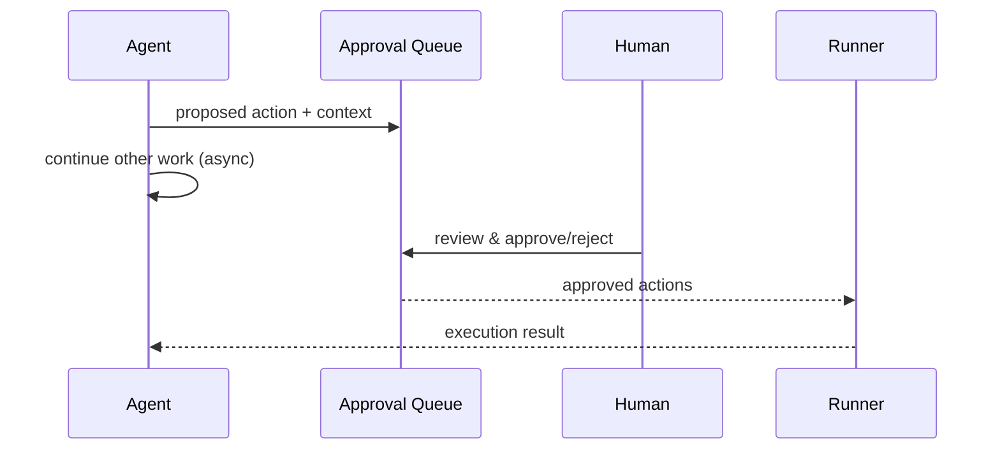

# Approval Queue

**Also known as:** Async Approval, Supervisor Inbox, Approval Inbox

**Category:** Safety & Control  
**Status in practice:** mature

## Intent

Queue agent-proposed actions for asynchronous human review while the agent continues other work.

## Context

A team is operating a long-running agent product that performs many actions per session — sending emails, posting messages, opening tickets, scheduling meetings — where a non-trivial fraction of those actions need a human to look at them before they ship. Stopping the entire agent loop after every proposed action while a human gets around to clicking approve would reduce throughput to a trickle and waste the parallelism the agent could otherwise exploit.

## Problem

If the agent calls the human and blocks until they respond on every gated action, the system is only as fast as the slowest reviewer and the agent sits idle between clicks. If the team removes the gate to keep the agent moving, unsafe or wrong actions ship before anyone has a chance to look at them. A naive design forces a choice between slow-and-safe and fast-and-dangerous, with no middle path that preserves human authority without holding the whole loop hostage to it.

## Forces

- Async approval adds wall-clock delay before action lands.
- Approval inbox can become unmanageable at scale.
- Race conditions if the world changes while approval is pending.

## Therefore

Therefore: route gated actions to an asynchronous review inbox while the agent keeps working on independent branches, so that human oversight is preserved without blocking throughput.

## Solution

Agent emits proposed action to an approval queue with context. A human (or supervisor agent) reviews the queue and approves or rejects. Approved actions are executed by the agent or by a runner. The agent can continue parallel work while waiting; some workflows pause specific branches.

## Diagram

## Example scenario

An email-drafting agent prepares replies to 80 inbox messages overnight. Rather than send them automatically (risky) or block waiting on each one (slow), the agent writes them to an approval queue. In the morning the user reviews 80 draft replies and clicks 'send' or 'reject' on each. The agent kept moving through the inbox while waiting for the human.

## Consequences

**Benefits**

- Human oversight without blocking throughput.
- Approval inbox is auditable.

**Liabilities**

- Inbox fatigue at scale.
- World drift between proposal and approval.

## What this pattern constrains

Actions in the approval queue may not execute until the approval status is set to approved.

## Applicability

**Use when**

- Some agent actions require human review but blocking the agent until review completes is unacceptable.
- Reviewers (humans or supervisor agents) can process queued actions asynchronously.
- The agent has parallel work it can pursue while specific branches await approval.

**Do not use when**

- Every action needs synchronous approval and there is no parallel work to do.
- The action's approval window is so short that asynchronous review adds no benefit.
- No reviewer capacity exists to drain the queue at the rate the agent fills it.

## Known uses

- **Lindy approval inbox** — *Available*
- **Sierra supervisor escalations** — *Available*
- **GitHub Copilot Workspace plan review** — *Available*
- **[Sparrot](https://marco-nissen.com/sparrot/)** — *Available* — High-blast-radius actions (file edits outside the agent's own surfaces, dangerous tools) queue for two-phase human approval via an inbox folder; the human partner reads and replies asynchronously.

## Related patterns

- *specialises* → [human-in-the-loop](human-in-the-loop.md)
- *complements* → [compensating-action](compensating-action.md)
- *complements* → [conversation-handoff](conversation-handoff.md)

**Tags:** safety, approval, async
