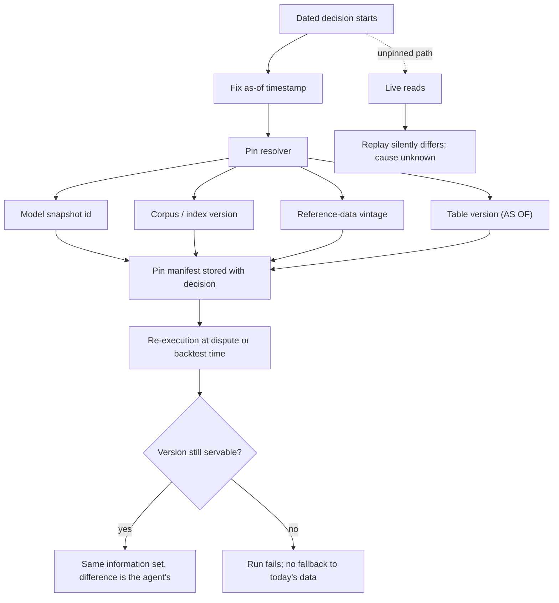

# As-Of Information-Set Pinning

**Also known as:** Snapshot-Pinned Analysis, Point-in-Time Information Set, As-Of Pinning

**Category:** Governance & Observability  
**Status in practice:** emerging

## Intent

Bind every input a dated decision may read, including the model snapshot, retrieval corpus, reference data and table version, to the information set that existed at its as-of timestamp, and record the pin.

## Context

An agent makes decisions that are dated: a credit file is underwritten on a given day, a trade is placed against the prices quoted that morning, a sanctions screen is run against the list published that week. Every source the agent reads keeps moving after the decision is made. Fundamentals are restated, sanctions entries are added and revoked, bureau files are re-scored, a document index is re-crawled, and the served model is replaced by a newer snapshot whose training data already covers the period being reasoned about. Meanwhile the decision itself is expected to stand still: an examiner, a disputing customer or a backtest will come back to it months later and ask how it was reached.

## Problem

Re-running the decision later produces a different answer, and nothing in the record says whether the agent changed its mind or the world underneath it changed. Because each read resolved to whatever the source held at the moment of the re-run, the original inputs are unrecoverable, so a dispute cannot be settled and an audit cannot distinguish a defensible call from a mistake. The same gap corrupts measurement in the other direction: an agent evaluated on historical periods reads restated figures and reasons with weights trained on text published after the decision date, so it scores itself on facts it could not have had and the backtest overstates what the deployed system would have done.

## Forces

- Live operation wants the freshest value of every source, while a dated decision wants the value that stood at its as-of timestamp, and one read path cannot satisfy both.
- Upstream sources mutate silently and in place: restated fundamentals, revised sanctions entries and re-scored bureau files replace the earlier value rather than adding a version beside it.
- Lookahead leaks through the weights as well as the data, because a model trained on unrestricted corpora embeds information published after the period it is asked to reason about, and a chronologically consistent alternative gives up accuracy to stay inside a training cutoff.
- Pinning is only as durable as retention: a version identifier recorded in a decision outlives the snapshot it names once the source's retention interval expires, leaving a pin that resolves to nothing.
- A recorded pin that the read path does not enforce is decoration, since a fallback to the current value produces a plausible answer and no error.

## Therefore

Therefore: fix one as-of timestamp per decision, resolve every read through it into an immutable version identifier, store those identifiers with the decision, and re-execute against them instead of against today's sources.

## Solution

Fix a single as-of timestamp when the decision starts and route every read through a resolver that turns a source plus that timestamp into an immutable version identifier: a dated model snapshot rather than a moving alias, a corpus or index version rather than a name, a vintage of reference and market data rather than a current quote, and a table version or AS OF timestamp on a store that keeps past states addressable. The resolved identifiers are written into the decision record as a pin manifest, so the decision carries the description of its own inputs rather than a pointer to whatever those inputs later became. Re-execution at dispute, examination or backtest time replays the manifest: the same snapshot, the same corpus, the same table versions, so a difference in outcome is attributable to the agent and not to the world. Retention on every pinned source is set to at least the window in which the decision can be questioned, and a read that cannot be served at the recorded version fails the run rather than falling back to the current value, which turns a silently mutating dependency into a visible error.

## Structure

```
as-of timestamp -> pin resolver -> {model snapshot id, corpus version, reference-data vintage, table version} -> pin manifest stored with the decision. Re-execution reads the manifest, not the live sources; an unresolvable version fails rather than falling back.
```

## Diagram



*Every read for a dated decision resolves through the as-of timestamp into an immutable version, and the resulting manifest is what a later replay reads instead of the live sources.*

## Example scenario

A lender's agent declines a loan application in March. In September the applicant disputes the decision, the agent re-runs the case, and this time it approves: the credit bureau has re-scored the file and the served model has been upgraded since March. Nobody can tell whether the March decision was wrong or the inputs simply moved. Had the March run pinned its bureau vintage, policy document version and dated model snapshot, the re-run would reproduce the original decision and the examiner could see exactly what it was based on.

## Consequences

**Benefits**

- A decision can be re-derived months later from the inputs that actually produced it, so a dispute or an examination compares like with like.
- A difference between the original outcome and a replay is attributable to the agent, because the information set is held constant across both runs.
- Backtests stop scoring the agent on restated figures and post-dated text, so measured performance is closer to what the deployed system would have achieved.
- Silently mutating dependencies surface as unresolvable-version failures instead of as quiet answer drift.

**Liabilities**

- Every pinned source needs retention long enough to cover the dispute window, and storing addressable history for market data, indexes and model snapshots costs money that grows with the window.
- A pinned model snapshot ages: it misses later fixes and capability gains, and pinning to a training cutoff trades accuracy for temporal validity.
- Sources outside the operator's control often expose no as-of read at all, so the information set has to be copied and versioned locally before it can be pinned.
- The pin is a second thing that can be wrong; a manifest recorded from a resolver that quietly fell back to the live value is worse than no manifest, because it looks like evidence.

## Failure modes

- The pin manifest records a model alias rather than a dated snapshot, so a vendor rotation silently changes the weights behind an apparently pinned decision.
- Retention on a pinned table expires before the dispute window closes, and the recorded version identifier no longer resolves to any data.
- The resolver falls back to the current value when a source cannot serve the as-of version, and the replay reports a clean reproduction that never happened.
- Only the data is pinned while the retrieval index is re-crawled in place, so the same query returns documents that did not exist at the as-of timestamp.
- A backtest pins prices but not the model, and the agent reasons about a period its training data already describes.

## What this pattern constrains

A dated decision must not read any source at its live current value: every read resolves only through the pin manifest for that decision's as-of timestamp, no source may be pinned for less than the window in which the decision can be questioned, and a source that cannot serve the recorded version fails the run rather than falling back to today's data.

## Applicability

**Use when**

- A decision is dated and can be questioned later by an examiner, a customer dispute or a regulator.
- Upstream sources are restated, revised or re-crawled in place rather than versioned beside their earlier values.
- An agent is scored on historical periods, where reading current values or a model trained past the decision date inflates measured performance.
- Two runs of the same case must be comparable, so the input set has to be held constant across them.

**Do not use when**

- The task is about the present state of the world, where reading a frozen view would give a stale and wrong answer.
- No source can be versioned or copied locally, so a recorded pin would never resolve and would only give false assurance.
- The dispute window is shorter than the cost of retaining addressable history, and a plain input log is sufficient evidence.
- The decision has no legal, financial or measurement consequence that would ever require re-derivation.

## Components

- As-of clock — fixes one decision timestamp that every read in the run resolves against
- Pin resolver — maps a source plus the as-of timestamp to an immutable version identifier, and fails rather than returning the live value
- Versioned source store — serves a past state by version identifier or AS OF timestamp instead of overwriting it
- Pin manifest — the record of model snapshot, corpus version, reference-data vintage and table versions stored alongside the decision
- Dated model snapshot — weights identified by an explicit release date whose training cutoff precedes the as-of timestamp
- Retention policy — keeps every pinned version servable for at least the window in which the decision can be questioned
- Re-execution harness — replays a decision against its recorded manifest and diffs the outcome against the original

## Tools

- Delta Lake or Apache Iceberg — table formats that address a past snapshot by version or timestamp
- Snowflake Time Travel — AT and BEFORE reads bounded by a configured retention period
- MLflow dataset tracking — records the dataset and table versions a run consumed
- Point-in-time model checkpoints such as ChronoBERT and ChronoGPT — weights with an enforced training cutoff for historical evaluation
- Content-addressed index snapshots — identify a retrieval corpus by digest so a re-crawl cannot change what a pinned query returns

## Evaluation metrics

- Pin coverage — share of inputs to a dated decision resolved through a recorded version rather than a live read
- Re-derivation rate — share of audited decisions whose replay against the manifest reproduces the original outcome
- Pin expiry rate — share of recorded pins whose sources are no longer servable, which shows whether retention matches the dispute window
- Lookahead gap — difference between a backtest scored on the pinned information set and the same backtest scored on current data
- Unresolvable-read rate — how often a source cannot serve its as-of version, exposing dependencies that mutate in place

## Known uses

- **[Delta Lake time travel](https://docs.delta.io/latest/delta-batch.html)** _available_ — Supports SQL TIMESTAMP AS OF and VERSION AS OF reads against a configurable per-table data retention interval, and the paper names reproducing an old version of a table for machine-learning training as a motivating workload.
- **[Apache Iceberg snapshot queries](https://iceberg.apache.org/docs/latest/spark-queries/)** _available_ — Table snapshots are addressable by snapshot id or as-of timestamp, so an analytical run can name the exact table state it read.
- **[Snowflake Time Travel](https://docs.snowflake.com/en/user-guide/data-time-travel)** _available_ — AT and BEFORE clauses read a table as of a timestamp or statement within a configured retention period, which also bounds how long a recorded pin stays resolvable.
- **[MLflow dataset tracking](https://mlflow.org/docs/latest/ml/dataset/)** _available_ — Records the dataset and table versions a run read, which is the pin-manifest half of the pattern for training and evaluation runs; the Delta Lake paper cites this integration as automatic recording of the table versions read during a training workload.
- **[ChronoBERT and ChronoGPT point-in-time model family](https://huggingface.co/manelalab/chrono-bert-v1-19991231)** _available_ — Dated checkpoints trained only on text available up to each calendar date, released so that a study can pin the model snapshot as well as the data and avoid lookahead through the weights.
- **[Dated model snapshot identifiers in vendor APIs](https://docs.claude.com/en/docs/about-claude/models/overview)** _available_ — Model identifiers that carry an explicit snapshot date let a caller pin the exact weights instead of an alias that moves to a newer release.

## Related patterns

- _complements_ **Determinism-Tiered Replay Gate** — That gate classifies an agent by re-running identical inputs and presupposes the input set is already fixed and retrievable; this pattern is what makes it fixed and retrievable.
- _complements_ **Replay / Time-Travel** — Replay re-runs a stored trace from a chosen step but still resolves live tools against today's data; pinning is what makes those reads return the original information set.
- _complements_ **Lineage Tracking** — Lineage records which sources produced an output after the fact; this pattern constrains which versions may be read in the first place and keeps them servable for the dispute window.
- _complements_ **Journaled LLM Call** — Journaling replays one recorded model output for crash recovery and says nothing about the corpus or reference data the call read; pinning fixes that surrounding input set.
- _complements_ **Durable Workflow Snapshot** — Persists workflow execution state so a run can resume; this pins the external information set the run reads, which the execution snapshot does not contain.
- _complements_ **Serving-Stack Attestation** — A pinned model snapshot identifier is a claim about which weights answered; attestation is how that claim is checked against the live endpoint.
- _complements_ **Eval Harness** — A held-out backtest is only valid if the graded inputs are pinned to what existed at each decision date, otherwise the harness measures hindsight.
- _complements_ **Memo-As-Source Confusion** — There a stale summary is wrongly trusted instead of the current artifact; here a stale-by-design view is the correct read because the decision is dated, so the two patterns divide on whether the question is about now or about a past moment.
- _complements_ **Now-Anchoring** — Injects the current wall clock so replies are time-aware; a dated decision needs both that clock and its as-of timestamp, and must not read one for the other.

## References

- [Chronologically Consistent Large Language Models](https://arxiv.org/abs/2502.21206) — 2025
- [Scaling Point-in-Time Language Models](https://arxiv.org/abs/2607.11889) — 2026
- [Delta Lake: High-Performance ACID Table Storage over Cloud Object Stores](https://www.vldb.org/pvldb/vol13/p3411-armbrust.pdf) — Michael Armbrust, Tathagata Das, Liwen Sun, Burak Yavuz, et al., 2020
- [Beyond Agent Architecture: Execution Assumptions and Reproducibility in LLM-Based Trading Systems](https://arxiv.org/abs/2606.08285) — 2026
- [Delta Lake — Query an older snapshot of a table (time travel)](https://docs.delta.io/latest/delta-batch.html)
- [Snowflake — Understanding and Using Time Travel](https://docs.snowflake.com/en/user-guide/data-time-travel)
