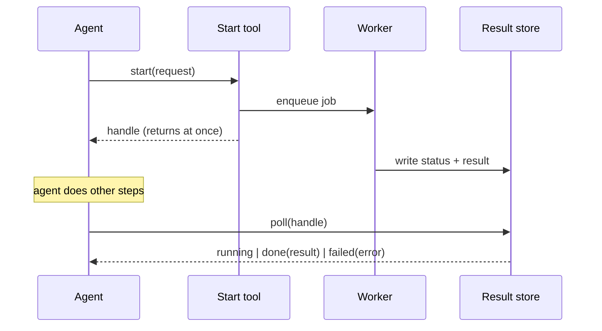

# Async Tool Handle

**Also known as:** Async HandleId Pattern, Job-Handle Tool, Deferred Tool Result

**Category:** Tool Use & Environment  
**Status in practice:** emerging

## Intent

Have a slow tool return a job handle immediately and expose a separate poll tool for the result, so the agent loop never blocks past a tool-call timeout.

## Context

An agent reaches a tool that wraps slow work: a video render, a long database query, a third-party API that takes a minute to answer, or a batch job. The transport that carries the tool call enforces a short response deadline. Model Context Protocol clients, for instance, commonly abort a tool call after a few seconds and surface a timeout error to the agent.

## Problem

A tool that waits for its slow work to finish before returning will breach the transport deadline, and the agent receives a timeout instead of a result. From the model's side the call simply failed, so it retries, fires the slow job again, or abandons the task. Meanwhile the agent loop is frozen on a single call and cannot make progress on anything else. Holding a synchronous connection open for the whole duration is fragile and wastes the turn.

## Forces

- The transport caps how long one tool call may take, but the underlying work legitimately takes far longer than that cap.
- Returning fast keeps the loop responsive, yet the result still has to reach the agent once the work completes.
- Polling too eagerly burns turns and tokens on empty status checks; polling too lazily leaves the result stale.
- The handle must outlive the call that created it, so the slow work needs somewhere durable to run and store its outcome.

## Therefore

Therefore: split the slow tool into a start tool that enqueues the work and returns a handle at once, and a poll tool that the agent calls with that handle to fetch status or the finished result.

## Solution

Model the slow operation as two tools instead of one. The start tool validates the request, hands the work to a background worker or queue, and returns a job handle immediately, well inside the transport deadline. The background worker runs the job to completion and writes its status and result into a store keyed by the handle. A separate poll tool takes the handle and returns one of running, done with the result, or failed with an error. The agent calls the start tool, keeps working on other steps, and calls the poll tool when it needs the answer, treating a running reply as a signal to wait or do something else. Because the handle is durable, the result survives even if the agent run pauses or restarts between starting the job and collecting it.

## Structure

```
Agent --start(req)--> Start tool --enqueue--> Worker --writes--> Result store ; Agent --poll(handle)--> Poll tool --reads--> Result store --> {running | done(result) | failed(error)}
```

## Diagram



*Start returns a handle immediately; a worker fills the result store; the agent polls the handle for status or result.*

## Example scenario

An agent is asked to generate a marketing video. The render takes ninety seconds, but the tool transport aborts any call after seven. So the render tool returns a job id straight away, the agent moves on to drafting the caption, and a minute later it calls the poll tool with that job id, gets back the finished video, and attaches it. The slow render never blocked the loop and never tripped the timeout.

## Consequences

**Benefits**

- Every tool call returns inside the transport deadline, so a slow operation no longer freezes the agent loop or trips the timeout.
- The agent can interleave other steps while the job runs instead of stalling on one call.
- A durable handle lets the result be collected after a pause, restart, or handoff to another worker.

**Liabilities**

- Two tools and a result store add moving parts versus a single blocking call.
- A handle whose job is never polled leaks an entry in the result store unless it is expired.
- Polling cadence has to be tuned: too frequent wastes turns, too rare leaves the result stale.

## Failure modes

- Lost handle — the agent drops or mistypes the handle and can never retrieve a job that did finish.
- Poll storm — the agent polls in a tight loop with no backoff, spending the whole turn budget on running replies.
- Orphaned job — the worker dies after the handle is returned, so the poll tool reports running forever.
- Premature collection — the agent treats a running reply as terminal and proceeds on a missing result.

## What this pattern constrains

A slow tool must not block until its work finishes; the start tool may only return a handle, and the result is read solely through a separate poll call against that handle.

## Applicability

**Use when**

- A tool wraps work that can take longer than the transport's tool-call deadline.
- The agent can usefully do other steps while the slow job runs, or the run may pause and resume before the result is needed.
- The slow work can run in a background worker and write its outcome to a store keyed by a handle.

**Do not use when**

- The tool reliably returns well within the transport deadline, so a plain synchronous call is simpler.
- The agent has nothing to do until the result arrives and cannot pause, so polling only adds latency and turns.
- Streaming partial output through a single call already fits the transport, making a separate poll tool unnecessary.

## Components

- Start tool — validates the request, enqueues the slow work, and returns a job handle inside the transport deadline
- Job handle — an opaque, durable id that keys the job's status and eventual result
- Background worker — runs the slow job to completion independently of the agent loop
- Result store — keyed by handle, holds running/done/failed status and the finished result
- Poll tool — takes a handle and returns current status or the result once the job is done

## Tools

- Tool-calling LLM — issues the start call, interleaves other steps, then polls the handle
- Job queue or task runner — carries the slow work off the request path
- Key-value or job store — persists handle to status/result so it survives the originating call

## Evaluation metrics

- Tool-call timeout rate — fraction of calls that breach the transport deadline, expected near zero
- Polls per completed job — how much turn budget the polling cadence spends per result
- Time to result collection — lag between job completion and the agent reading it
- Orphaned-handle rate — fraction of started jobs whose result is never polled or never lands

## Known uses

- **[AWS-espanol: Patron HandleId Asincrono (MCP timeout fix)](https://dev.to/aws-espanol/por-que-fallan-los-agentes-de-ia-3-modos-de-fallo-que-cuestan-tokens-y-tiempo-20b)** _available_ — Field write-up of MCP tools that time out after ~7s; the prescribed fix returns a job handleId immediately and exposes a check-result tool for the agent to poll.
- **[AWS-espanol: Async HandleId among 8 production agent patterns](https://dev.to/aws-espanol/como-guiar-asistentes-de-ia-para-construir-agentes-listos-para-produccion-8-patrones-esenciales-1ifd)** _available_ — Listed as one of eight production-readiness patterns: 'Async handleId retorna un ID de trabajo inmediatamente, permitiendo que el agente continue con otras tareas' while a separate tool checks for the result.
- **Restate** _available_

## Related patterns

- _alternative-to_ **Blocking Sync Calls in Agent Loop** — The blocking call is the anti-pattern this avoids: instead of holding a synchronous connection open through the slow work, the start tool returns a handle and the agent polls.
- _complements_ **Agent Resumption** — A durable handle plus result store is exactly what lets a resumed run reconnect to a job started before the restart.
- _complements_ **Interruptible Agent Execution** — Both keep the loop responsive during long work; interruption gives the user a halt control, the handle keeps each tool call short so the loop can be interrupted at a clean boundary.
- _complements_ **Actor-Model Agents** — The background worker behind the handle is naturally an actor with its own mailbox; the start tool sends it a message and the poll tool reads its outcome.

## References

- [Por Que Fallan los Agentes de IA: 3 Modos de Fallo Que Cuestan Tokens y Tiempo](https://dev.to/aws-espanol/por-que-fallan-los-agentes-de-ia-3-modos-de-fallo-que-cuestan-tokens-y-tiempo-20b) — AWS en Espanol, 2025
- [Como Guiar Asistentes de IA para Construir Agentes Listos para Produccion: 8 Patrones Esenciales](https://dev.to/aws-espanol/como-guiar-asistentes-de-ia-para-construir-agentes-listos-para-produccion-8-patrones-esenciales-1ifd) — AWS en Espanol, 2025
- [MCP Tasks: Asynchronous task execution for long-running MCP operations](https://modelcontextprotocol.io/extensions/tasks/overview) — Model Context Protocol, 2025
- [Asynchronous LLM Function Calling](https://arxiv.org/abs/2412.07017) — In Gim, Seung-seob Lee, Lin Zhong, 2024
- [AsyncTool: Evaluating the Asynchronous Function Calling Capability under Multi-Task Scenarios](https://arxiv.org/abs/2605.27995) — Kou Shi, Ziao Zhang, Shiting Huang, Avery Nie, Zhen Fang, Qiuchen Wang, Lin Chen, Huaian Chen, Zehui Chen, Feng Zhao, 2026
- [MCP Async Tasks: Building long-running workflows for AI Agents](https://workos.com/blog/mcp-async-tasks-ai-agent-workflows) — WorkOS, 2025
- [Of course you can build dynamic AI agents with Temporal](https://temporal.io/blog/of-course-you-can-build-dynamic-ai-agents-with-temporal) — Temporal Technologies, 2025
