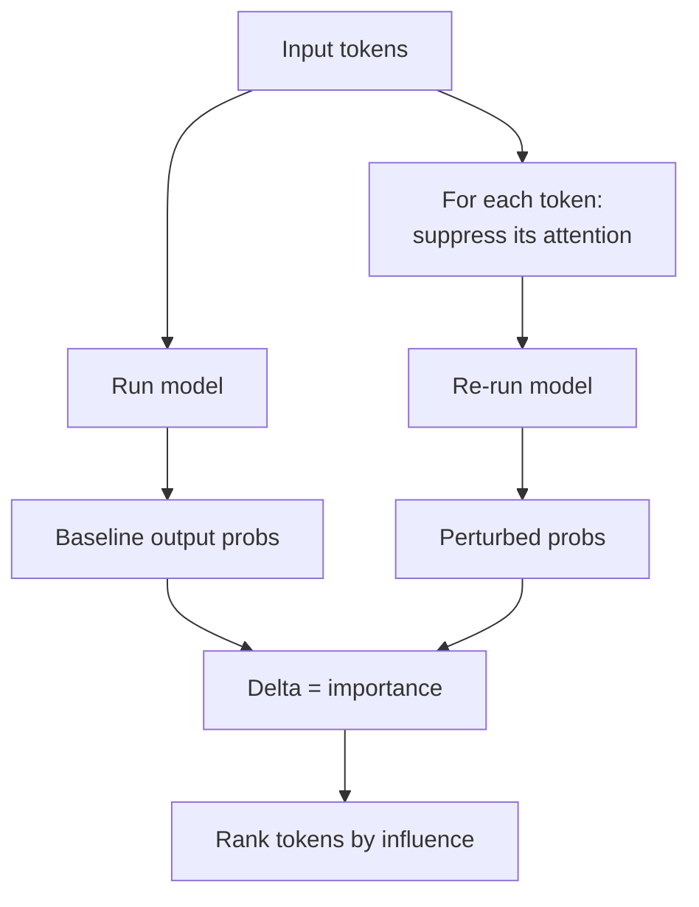

# Attention-Manipulation Explainability

**Also known as:** AtMan, Attention Perturbation Attribution, Token-Influence Map

**Category:** Governance & Observability  
**Status in practice:** experimental

## Intent

Surface which input tokens caused a given output by perturbing attention across all transformer layers and measuring the resulting change in output probability, producing a per-token relevance map alongside the model's response.

## Context

A team operates a transformer-based language model in a setting where someone — an auditor, a regulator, a clinician, a loan applicant — can demand a real explanation for any given output. The team controls inference enough to inspect the model's internal attention weights, either because the weights are open or because the provider exposes a way to perturb attention. A generated paragraph of self-justification will not satisfy the people asking, because what they want is evidence about which parts of the input actually drove the answer.

## Problem

Asking the model in plain language to explain why it answered the way it did produces fluent, convincing prose that may have nothing to do with the computation that produced the answer. The model can confabulate a reason that sounds reasonable but does not reflect which input tokens actually shifted the output. The team is forced to choose between a polished but unfaithful self-explanation and saying nothing at all, neither of which is acceptable when an auditor wants input-grounded evidence.

## Forces

- Auditors want input-grounded explanations, not generated rationales.
- Per-token attribution must be cheap enough to run in production, not only offline.
- Faithfulness of the explanation matters more than its readability.
- Vendor-side method may be incompatible with hosted black-box APIs.

## Therefore

Therefore: perturb the model's attention token by token and measure how each suppression shifts output probability, so that the explanation comes from the model's actual computation instead of a generated rationalisation.

## Solution

Run a structured perturbation pass over the model's attention: for each input token (or chunk), suppress its attention contribution and measure the change in the output token probabilities. Tokens whose suppression most reduces the output probability are the most relevant. Surface this as a heat-map alongside the answer. Keep the attribution method on the inference side; avoid asking the model to self-explain in prose.

## Example scenario

A medical-summarisation agent recommends a contraindicated drug and the clinician asks why. Asking the model to justify itself produces a polished but invented rationale that doesn't actually match the input that swayed it. The team layers Attention-Manipulation Explainability: they perturb attention to each input token across all transformer layers and measure how the output probability shifts, producing a per-token relevance map served alongside the response. Now the clinician can see that the recommendation hinged on a single ambiguous lab value, not on the patient history the prose claimed.

## Structure

```
Input -> Model -> Output. Parallel: Input -> perturb(token_i) -> ΔP(output) -> relevance_map.
```

## Diagram



## Consequences

**Benefits**

- Faithful (mechanistic) attribution rather than confabulated rationale.
- Compatible with audit and right-to-explanation requirements.
- User-visible heat-maps build calibrated trust.

**Liabilities**

- Requires white-box access to attention; not available for hosted black-box APIs.
- Compute overhead per request (one forward pass per token group).
- Token-level attribution can mislead when reasoning spans many tokens.

## What this pattern constrains

The agent may not present generated text as the explanation of its own output when an attribution-based explanation is feasible; self-explanations have to be marked as such.

## Applicability

**Use when**

- You need a faithful per-token relevance map of which inputs caused a given output.
- You control inference (open weights or a provider that exposes attention perturbation).
- Free-text self-explanations are insufficient because the model confabulates its reasons.

**Do not use when**

- You only have a black-box API with no access to attention internals.
- The latency cost of a structured perturbation pass per output is unacceptable.
- A heat-map UI is not actionable for the user and explanations need to be in natural language anyway.

## Known uses

- **[Aleph Alpha AtMan](https://aleph-alpha.com/)** — *Available*. Original attention-perturbation explainability method shipped in PhariaAI.

## Related patterns

- *complements* → [decision-log](decision-log.md)
- *complements* → [confidence-reporting](confidence-reporting.md)
- *complements* → [lineage-tracking](lineage-tracking.md)
- *alternative-to* → [citation-streaming](citation-streaming.md) — Citations attribute to retrieved docs; AtMan attributes to input tokens.
- *complements* → [model-card](model-card.md)

## References

- (paper) *AtMan: Understanding Transformer Predictions Through Memory Efficient Attention Manipulation*, 2023, <https://arxiv.org/abs/2301.08110>

**Tags:** governance, explainability, germany-origin, aleph-alpha
