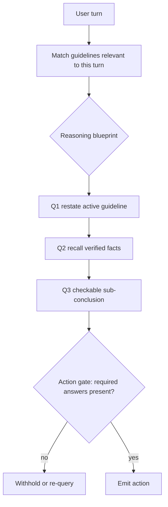

# Attentive Reasoning Queries

**Also known as:** ARQs, Reasoning Blueprint, Structured Reasoning Queries

**Category:** Reasoning  
**Status in practice:** emerging

## Intent

Replace free-form chain-of-thought with a domain-tailored sequence of structured queries that re-anchor the model's attention to the critical instructions and prior decisions at the exact generation steps where adherence tends to slip.

## Context

A team runs a customer-facing agent that must follow a large body of use-case-specific instructions — eligibility rules, escalation policies, things it must never say — across long multi-turn conversations. The agent reasons before each reply, usually with chain-of-thought. As the conversation grows and the instructions accumulate, the model starts to drift: it forgets a guideline it applied correctly three turns ago, or it asserts a fact under conversational pressure, even though the rule that should have stopped it was in its context the whole time.

## Problem

Free-form chain-of-thought lets the model decide what to reason about, and on long instruction-heavy conversations that freedom is the failure: the steps that matter most — re-checking a guideline, confirming a value the user gave earlier, refusing to assert an unverified fact — are exactly the steps the model is most likely to skip when the context is crowded. Because the reasoning is unstructured prose, there is also no fixed place to check that a given instruction was actually considered; an auditor cannot tell from the trace whether the model weighed the escalation rule or simply never looked at it. The instruction sits in the context window but never becomes a token the model is forced to attend to at the decision point.

## Forces

- The model attends unevenly across a long context, so instructions far from the generation point lose salience.
- Free-form reasoning is flexible but unconstrained, which leaves the critical step optional.
- Hand-authoring a reasoning script per use case is upfront work that generic chain-of-thought avoids.
- A structured trace is machine-checkable, but over-scripting reasoning can suppress the model's own problem-solving.

## Applicability

**Use when**

- The agent must follow many use-case-specific instructions across long multi-turn conversations where free-form reasoning drifts.
- Specific failure points are identifiable — a guideline that gets dropped, a fact that gets hallucinated — and can be targeted with a query.
- The reasoning trace needs to be machine-checkable so a downstream guard can gate the action.
- The domain is stable enough that authoring and maintaining a reasoning blueprint pays off.

**Do not use when**

- The task is one-shot or short, where instruction drift across turns is not the problem.
- The problem space is open-ended and a fixed query sequence would constrain reasoning the model needs to do freely.
- No one can enumerate the decision points that matter, so there is nothing specific to anchor.
- Generic chain-of-thought already meets the reliability bar and the blueprint maintenance cost is not justified.

## Therefore

Therefore: author a domain-specific blueprint of targeted queries that the model must answer in sequence before it acts, reinstating each critical instruction and prior decision at the step where it is needed, so adherence is forced rather than left to the model's discretion.

## Solution

For each decision point, author a blueprint — a fixed sequence of queries, typically emitted and answered as JSON fields — that walks the model through the reasoning the use case requires. Early queries reinstate the instructions and facts that matter here, such as restating the active guideline or recalling a value the customer gave; intermediate queries have the model commit to checkable sub-conclusions, such as whether the case meets the eligibility rule or whether the user has been verified; the final query produces the action conditioned on those answers. The queries fire at the points where the model historically slips, re-anchoring attention to the relevant instruction just before generation. Because every step is a named field, the trace is machine-checkable: a downstream guard can confirm the eligibility query was answered before the approval was emitted. Author blueprints per use case and keep them as narrow as the failure modes demand.

## Variants

- **JSON reasoning blueprint** — The query sequence is emitted as a JSON object with one field per reasoning step, so each answer is parseable and individually checkable. Use when downstream guards or tools need to read individual reasoning answers.
- **Failure-targeted queries** — Only the steps with a history of slipping get a query; the rest of the reasoning stays free-form, keeping the blueprint minimal. Use when most of the task is reliable and only a few instructions get dropped.
- **Guideline re-application queries** — Each active guideline gets a query that restates it and asks whether it applies to the current turn, fighting the tendency to forget rules mid-conversation. Use when the agent carries many conditional guidelines and forgets to re-check them as context grows.

## Diagram

## Example scenario

A bank's support agent must verify a customer's identity before discussing account details and must escalate any mention of fraud, across conversations that run dozens of turns. With plain chain-of-thought it occasionally discusses balances before verification or misses a fraud cue buried in a long message, because those checks compete with everything else in its free-form reasoning. The team adds an attentive-reasoning-queries blueprint: before each reply the model answers a fixed sequence — is the customer verified? did this turn mention fraud? which guideline applies here? — as JSON fields, and a guard refuses any account-detail action whose verification field is false. The drift stops, and every reply now carries a checkable record of which rules the model considered.

## Consequences

**Benefits**

- Critical instructions are re-anchored at the decision point, so guideline re-application and instruction-following hold up over long conversations.
- Each reasoning step is a named field, so the trace is machine-checkable and a guard can gate the action on specific answers.
- Targeting queries at known failure points can cost fewer tokens than free-form reasoning over the whole context.
- Hallucination drops when an explicit query forces the model to confirm a fact before asserting it.

**Liabilities**

- Each use case needs a hand-authored blueprint, and that design work does not transfer across domains.
- An over-prescribed blueprint can box the model in, suppressing reasoning the designer did not anticipate.
- Blueprints drift from the instructions they encode as policies change, and a stale query re-anchors the wrong rule.
- The approach assumes the designer can enumerate the decision points where adherence slips; novel failure modes are uncovered until a query is added for them.

## What this pattern constrains

The model may not emit the final action until it has answered the blueprint's queries in order; it cannot substitute its own free-form reasoning path for the prescribed one, and a step the blueprint demands cannot be silently skipped.

## Known uses

- **[Parlant (emcie-co/parlant)](https://github.com/emcie-co/parlant)** — *Available* — Open-source framework for reliable customer-facing agents where ARQs originated; the engine matches the guidelines relevant to each turn and walks the model through structured reasoning queries before it generates a response.

## Related patterns

- *alternative-to* → [chain-of-thought](chain-of-thought.md)
- *composes-with* → [structured-output](structured-output.md)
- *alternative-to* → [tree-of-thoughts](tree-of-thoughts.md)
- *composes-with* → [react](react.md)

## References

- (paper) Karov, Zohar, Marcovitz, *Attentive Reasoning Queries: A Systematic Method for Optimizing Instruction-Following in Large Language Models*, 2025, <https://arxiv.org/abs/2503.03669>
- (repo) *Parlant — framework for reliable customer-facing agents*, <https://github.com/emcie-co/parlant>

**Tags:** reasoning, instruction-following, structured-reasoning, arqs, guardrails
