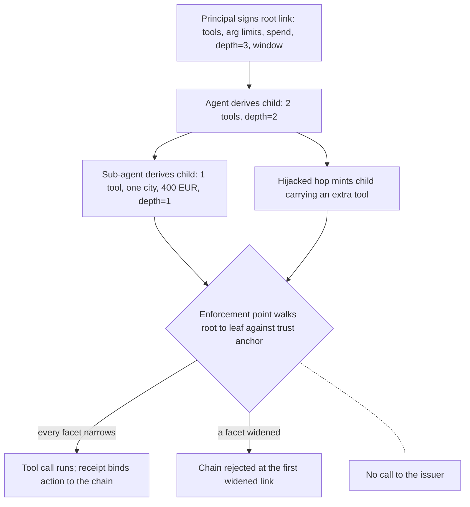

# Attenuating Delegation Chain

**Also known as:** Attenuated Capability Chain, Cannot-Widen Delegation, Attenuating Authorization Token, Invocation-Bound Capability Token

**Category:** Safety & Control  
**Status in practice:** emerging

## Intent

Carry authority down a multi-hop agent delegation as a signed, append-only chain in which each child link is no wider than its parent on every facet, so a verifier can reject widening offline.

## Context

A person gives an agent a task, and the agent completes it by spawning sub-agents and calling tools over protocols such as the Model Context Protocol and Agent-to-Agent messaging. Authority has to travel with the work, because the sub-agent that queries a database or moves money needs something the resource server will accept. In most deployments what travels is a bearer credential minted for the top of the chain, or nothing at all: a scan of roughly two thousand public Model Context Protocol servers found that every one of them lacked authentication. The enforcement point at the third hop therefore has no record of what the person actually granted at the first.

## Problem

A bearer credential states what its holder may do, not what its holder was delegated. Once it is handed down, every hop holds the authority the first hop held, so an agent that has been prompt-injected somewhere in the middle of the call tree can spend the whole grant; in one measurement a compromised sub-agent under bearer delegation could reach all 8,100 actions available in the environment. Narrowing the credential at each hop through the authorization server helps, but it puts a round trip on the critical path of every delegation and still leaves the resource server trusting a scope claim it has no way to check. Nothing in the credential ties a child to its parent, so no enforcement point can answer whether the authority in front of it is narrower than what the person signed.

## Forces

- Delegation has to be cheap at the point of use, since an orchestrator that must call an authorization server before every sub-agent hop pays a round trip per hop, yet the enforcement point still has to be able to check the grant it is handed.
- The narrower a child credential, the less a hijacked sub-agent can reach; but over-narrowing breaks legitimate work the parent could not foresee when it minted the child, and narrowing cannot be undone from inside the chain.
- Scope alone does not bound a delegation tree, because an agent can stay inside its allowed tool list and still recurse without limit or spend without limit, so remaining depth and budget need facets of their own.
- An append-only chain is self-describing and verifiable without the issuer, but it grows with every hop and outlives the issuer's ability to withdraw it, so revocation and rotation have to be handled outside it.
- Enforcement cost has to vanish next to model inference; a measured chain check runs at about 2.6 microseconds per decision, negligible against a model call, but only while verification stays local.

## Therefore

Therefore: mint authority as a signed, append-only chain whose every link is checked against its parent facet by facet, and let any enforcement point holding the root trust anchor reject a widened link without contacting the issuer.

## Solution

Represent the grant as a credential chain rooted in a link the principal signed. The root states the authority actually delegated across a fixed facet set: which tools may be invoked, which argument values are legal, how much may be spent, how many further hops remain, and how long the grant stays valid. When a holder delegates, it derives a child link offline by restricting one or more facets and signing the result. It cannot add a tool the parent did not carry, raise a spend ceiling, or extend a validity window, and the depth facet forces the child to record at least one hop fewer than its parent. An enforcement point that holds the root trust anchor walks the chain from root to leaf, checks each signature, and checks each facet for monotone narrowing; the first widened link fails the entire chain. Because the check is local it needs no call to the authorization server, and because the chain is append-only it doubles as the provenance record for the action it authorised. Revocation, key rotation, and short root lifetimes remain the issuer's responsibility, since a link already handed out cannot be withdrawn by the chain itself.

## Structure

```
Principal signs root link {tools, arg-constraints, spend, depth, window} -> agent derives child by restricting facets and signing -> sub-agent derives grandchild (depth-1) -> enforcement point walks root..leaf against the trust anchor, checking signature + per-facet narrowing -> first widened link rejects the chain; executed action emits a receipt bound to the chain.
```

## Diagram



*Each hop derives a strictly narrower signed link; the enforcement point verifies signatures and per-facet narrowing locally, and the first widened link fails the whole chain.*

## Example scenario

A travel agent books a trip and hands a hotel sub-agent a delegation link that allows only the booking tool, only for one named city, only up to 400 euros, valid for one hour, with one hop left. The sub-agent reads a poisoned page and tries to mint a child link that also carries the refund tool. The hotel's booking service walks the chain, finds a tool the parent never held, and rejects the call before it runs. The refusal needs no call back to the travel agent's authorization server.

## Consequences

**Benefits**

- A hijacked sub-agent stays confined to its own task rather than to the whole grant: measured reachability fell from all 8,100 environment actions under bearer delegation to a mean of 1.5, across 2,000 randomised scenarios.
- Verification is local, so an enforcement point that has never spoken to the issuer can still decide, and the authorization server leaves the per-hop critical path.
- Delegation-depth violations and audit evasion through an emptied context become detectable; an adversarial evaluation over 600 attack attempts reported full rejection, with those two categories caught only by the chained model and missed by unsigned and plain-token deployments.
- The chain is its own audit trail, so an executed action can be traced link by link back to the principal who signed the root.

**Liabilities**

- The chain grows with every hop and every link has to be carried and verified, so deep trees pay in credential size and in the bookkeeping that keeps links from being replayed.
- Narrowing is irreversible, so a parent that under-provisions a child forces the work back up the tree, while a parent that over-provisions has handed out authority it cannot take back through the chain.
- Offline verification is exactly what makes revocation hard: a leaked mid-chain link stays acceptable until its validity window closes or an out-of-band deny list reaches every enforcement point.
- The facet set is a standardisation problem — the two 2026 IETF submissions in this space name overlapping but different facets — so a chain minted for one verifier can carry facets another ignores, weakening the check without any visible failure.

## Failure modes

- The verifier checks signatures but not facets, so a correctly signed child that quietly added a tool passes.
- A risk-bearing constraint such as an argument restriction or a spend ceiling has no vocabulary in the chain, so it is stated in prose or nowhere, and the guarantee holds only over the facets that were encoded.
- The remaining-depth facet is omitted, so a recursive delegation loop keeps minting valid children until some unrelated budget runs out.
- The root is minted with the principal's full standing authority instead of the task's, so every correctly narrowed child is still far wider than the work required.
- Chain verification is skipped on a fast path under load, leaving a signed chain that nothing reads and a guarantee that exists only on paper.

## What this pattern constrains

A child link must not authorize any tool, argument value, spend ceiling, depth or validity window that its parent did not already carry, and the depth facet must decrease at every hop; a verifier must reject the whole chain at the first widened link, and no hop may act on authority it cannot present as a signed chain back to the principal's root.

## Applicability

**Use when**

- Work is delegated across more than one hop, so a sub-agent or a tool goes on to call a further sub-agent or tool.
- The enforcement point is operated by someone other than the issuer and cannot be expected to call back to an authorization server on every action.
- Some hops touch money, irreversible actions, or data the principal would not grant in bulk, so authority has to be demonstrably bounded rather than merely intended to be.
- The threat model assumes any agent in the tree may be prompt-injected and must still be unable to exceed what was delegated.

**Do not use when**

- Delegation is single-hop, with one principal, one agent and one resource, where a scoped short-lived token from the issuer already carries the whole story.
- Immediate revocation matters more than local verification, since a chain that verifies without the issuer also verifies after the issuer has revoked it.
- The constraints that carry the risk cannot be expressed in the chain's facet vocabulary, in which case a policy engine at the enforcement point is the honest place for the check.
- No enforcement point will actually walk the chain, because an unverified chain adds size and latency and contains nothing.

## Components

- Root link — the authority the principal signed, stated across a fixed facet set rather than as an opaque scope string
- Facet set — tools, argument constraints, spend ceiling, remaining depth and validity window; the axes the narrowing invariant is checked on
- Attenuation step — derives a child link offline by restricting facets and signing it, never by adding
- Delegation chain — the append-only sequence of signed links from the root to the acting agent
- Chain verifier — walks the chain at the enforcement point, checking each signature and each facet for monotone narrowing
- Trust anchor — the root issuer key an enforcement point holds so verification needs no network call
- Action receipt — the signed record binding an executed action to the chain link that authorised it

## Tools

- Biscuit or macaroon libraries — credential formats whose blocks can only add restrictions, giving offline attenuation and local verification
- Ed25519 signing libraries — per-link signatures cheap enough to verify on the action path
- OAuth Rich Authorization Requests (RFC 9396) — a claim format for tool-level capability details that a chain profile can carry
- Model Context Protocol and Agent-to-Agent transports — the hop boundaries at which a chain link is presented and checked
- Policy enforcement point libraries — where chain verification runs before a tool call is allowed to execute

## Evaluation metrics

- Reachable-action count for a compromised sub-agent — how much of the environment a hijacked hop can still touch
- Widening-rejection rate — share of deliberately widened links a verifier refuses
- Verification latency per decision — whether the check stays negligible against model inference
- Facet coverage — fraction of risk-bearing constraints encoded in the chain rather than left in prose
- Chain depth distribution — how deep real delegation trees run and how often the depth facet is what stops them
- Unverified-hop rate — actions executed at enforcement points that never walked the chain

## Known uses

- **[Agent Passport System (APS), draft-pidlisnyi-aps-03](https://datatracker.ietf.org/doc/html/draft-pidlisnyi-aps-03)** _planned_ — IETF individual submission of 18 July 2026 defining Ed25519 agent passports and delegation chains that cannot widen across scope, spend, depth, time, reputation, values or reversibility; the depth rule requires that a child's remaining hops be no greater than the parent's minus one.
- **[Attenuating Authorization Tokens (AAT), draft-niyikiza-oauth-attenuating-agent-tokens-01](https://datatracker.ietf.org/doc/html/draft-niyikiza-oauth-attenuating-agent-tokens-01)** _planned_ — IETF individual submission of 15 June 2026 defining a signed credential for task-scoped delegation that encodes invocable tools and argument constraints; a holder derives a narrower token offline, and the chain verifies against the root trust anchor without network contact with the issuer.
- **[Agent Identity Protocol, Invocation-Bound Capability Tokens](https://arxiv.org/abs/2603.24775)** _pure-future_ — Research prototype fusing identity, attenuated authorization and provenance binding into a single append-only token chain across Model Context Protocol and Agent-to-Agent hops; evaluated adversarially over 600 attack attempts.
- **[Biscuit authorization tokens](https://www.biscuitsec.org/)** _available_ — Shipping token format whose blocks may only add restrictions, so any holder can attenuate a token offline and any verifier can check the result against the issuer's public key.
- **[Macaroons](https://research.google/pubs/macaroons-cookies-with-contextual-caveats-for-decentralized-authorization-in-the-cloud/)** _available_ — The pre-agent precedent: bearer credentials with contextual caveats that any holder may narrow without contacting the issuer, and that a verifier checks locally.

## Related patterns

- _specialises_ **Delegated Agent Authorization** — That pattern gives an agent a scoped, short-lived, revocable credential from an issuer and states that scope should only narrow downstream; this one makes the narrowing a verifiable relation between parent and child links, checkable at the enforcement point without the issuer, and extends it to facets an access scope has no vocabulary for such as remaining depth and spend.
- _alternative-to_ **Agent Privilege Escalation** — The constructive counterpart of that anti-pattern: where effective permissions there are the union of everything in the call path, here they are the intersection enforced by the chain.
- _alternative-to_ **Tool Over-Broad Scope** — A per-hop tool facet that can only shrink is how a downstream agent stops inheriting the whole loadout the top of the chain was given.
- _complements_ **Ephemeral Agent Identity** — That pattern bounds how long an agent's credential lives; this one bounds how wide a child's authority may be relative to its parent. Short-lived roots are also the practical answer to a chain that cannot be revoked from inside.
- _complements_ **Deontic Token Delegation** — Obligations and prohibitions travel with the work there; here it is the permitted authority that travels, under a monotone-narrowing invariant a verifier can check mechanically.
- _alternative-to_ **Progressive Delegation** — That pattern widens an agent's autonomy across runs as a human observes measured performance; this one forbids widening within a single call tree. They operate on different axes and are usually combined.
- _complements_ **Policy-Gated Agent Action (KRITIS)** — The gate decides whether an action is permitted by policy; the chain decides whether the caller holds the authority to ask. Facets the chain cannot express belong in the policy engine.
- _complements_ **Provenance Ledger** — The append-only chain plus the signed receipt for each executed action is what the ledger records, so authorization evidence and audit evidence stay the same object.
- _complements_ **Signed Agent Card** — The card binds an identity to a key; the chain binds authority to that identity and to every hop it passed through.

## References

- [Agent Passport System (APS): Verifiable Agent Identity, Faceted Authority, and Signed Action Receipts](https://datatracker.ietf.org/doc/html/draft-pidlisnyi-aps-03) — Tymofii Pidlisnyi, 2026
- [Attenuating Authorization Tokens for Agentic Delegation Chains](https://datatracker.ietf.org/doc/html/draft-niyikiza-oauth-attenuating-agent-tokens-01) — N. A. Niyikiza, 2026
- [AIP: Agent Identity Protocol for Verifiable Delegation Across MCP and A2A](https://arxiv.org/abs/2603.24775) — Sunil Prakash, 2026
- [Delegation Without Trust: An Empirical Gap Analysis of Identity, Authorization, and Runtime Governance in Multi-Agent LLM Systems](https://arxiv.org/abs/2609.00267) — Panduranga Sai Varma Dantuluri, Jyotirmoy Sundi, 2026
- [Before the Tool Call: Deterministic Pre-Action Authorization for Autonomous AI Agents](https://arxiv.org/abs/2603.20953) — Uchi Uchibeke, 2026
- [Macaroons: Cookies with Contextual Caveats for Decentralized Authorization in the Cloud](https://research.google/pubs/macaroons-cookies-with-contextual-caveats-for-decentralized-authorization-in-the-cloud/) — Arnar Birgisson, Joe Gibbs Politz, Ulfar Erlingsson, Ankur Taly, Michael Vrable, Mark Lentczner, 2014
- [RFC 8693: OAuth 2.0 Token Exchange](https://www.rfc-editor.org/rfc/rfc8693.html) — 2020
- [Biscuit: an authorization token with offline attenuation](https://www.biscuitsec.org/)
