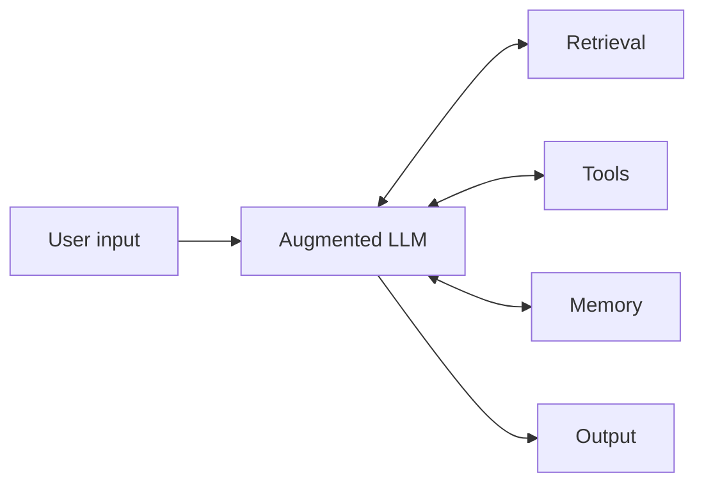

# Augmented LLM

**Also known as:** Augmented Model, LLM + Tools + Memory, Foundational Agent Block

**Category:** Tool Use & Environment  
**Status in practice:** mature

## Intent

Build the foundational agent block as an LLM augmented with retrieval, tools, and memory that the model actively chooses to use, rather than a bare-model call.

## Context

Any agentic system. The augmented LLM is the unit of composition that every higher-level workflow or agent pattern is built from.

## Problem

A bare LLM call cannot fetch fresh facts, take actions in external systems, or remember across turns. Wiring those capabilities differently for each pattern leads to incompatible building blocks.

## Forces

- Each augmentation (retrieval, tools, memory) is independently useful but composes badly if not tailored to the specific use case.
- The model must decide when to retrieve, when to call a tool, and what to remember — pushing this decision out of the prompt into surrounding code defeats the augmentation.
- Adding all three augmentations naively bloats every prompt; capabilities should be exposed only where they pay off.

## Applicability

**Use when**

- You are building any agent system and need a consistent building block.
- The model should decide when to retrieve, call tools, or use memory — not surrounding code.
- Higher-level workflows (chaining, routing, orchestration) need a uniform unit to compose.

**Do not use when**

- A bare model call (no tools, no retrieval, no memory) is genuinely sufficient — keep it simple.
- Each augmentation is owned by a different team and cannot be co-evolved as one block.

## Therefore

Therefore: treat the augmented LLM (model + retrieval + tools + memory) as the indivisible building block, and let the model itself decide when to invoke each augmentation, so that every higher-level pattern can compose this unit without re-implementing the basics.

## Solution

Wire the model with three capabilities and expose each via a model-driven interface: (1) retrieval queries the model can issue against external corpora; (2) tool calls the model can emit and whose results stream back; (3) memory the model can read from and write to across turns. The model — not the surrounding code — decides which augmentation to invoke at each step. Other workflow patterns (prompt-chaining, routing, orchestrator-workers, etc.) compose instances of this block, not bare model calls.

## Example scenario

A support agent is built as one augmented LLM: it can call a tool to look up the customer's order, retrieve a knowledge-base article via vector search, and read/write a session memory of the conversation so far. Every higher-level workflow (routing tickets, escalating to a human, parallel ranking of suggested replies) composes instances of this block rather than rewiring the model with capabilities each time.

## Diagram

*The augmented LLM as the indivisible foundational building block.*

## Consequences

**Benefits**

- One indivisible building block; every higher-level workflow composes it without re-implementing basics.
- Capabilities are model-driven, so the model adapts which augmentation to use per request.
- Provider-agnostic — the augmentation surface (retrieval, tools, memory) is independent of which model serves the block.

**Liabilities**

- Easy to underspecify when each augmentation should fire; without guidance the model may retrieve when it should call a tool, or skip memory writes.
- Cost compounds when every block calls all three augmentations on every request.
- Debugging touches three subsystems at once; observability must cover all augmentation paths.

## What this pattern constrains

Higher-level patterns must compose this block, not raw model calls; capability use is decided by the model, not hardcoded in surrounding code.

## Known uses

- **Anthropic Claude with tool use and retrieval** — *Available*. Anthropic positions the augmented LLM as the foundational block for all agentic systems. https://www.anthropic.com/research/building-effective-agents
- **OpenAI Assistants API** — *Available*. Combines model + tools (function calls, code interpreter, file search) + threads (memory) as a single primitive. https://platform.openai.com/docs/assistants/overview

## Related patterns

- *uses* → [tool-use](tool-use.md)
- *uses* → [naive-rag](naive-rag.md)
- *uses* → [short-term-memory](short-term-memory.md)
- *used-by* → [prompt-chaining](prompt-chaining.md)
- *used-by* → [routing](routing.md)
- *used-by* → [orchestrator-workers](orchestrator-workers.md)
- *specialises* → [react](react.md)

## References

- (blog) Anthropic, *Building Effective Agents* (2024) — https://www.anthropic.com/research/building-effective-agents

**Tags:** foundational, tool-use, retrieval, memory, anthropic
