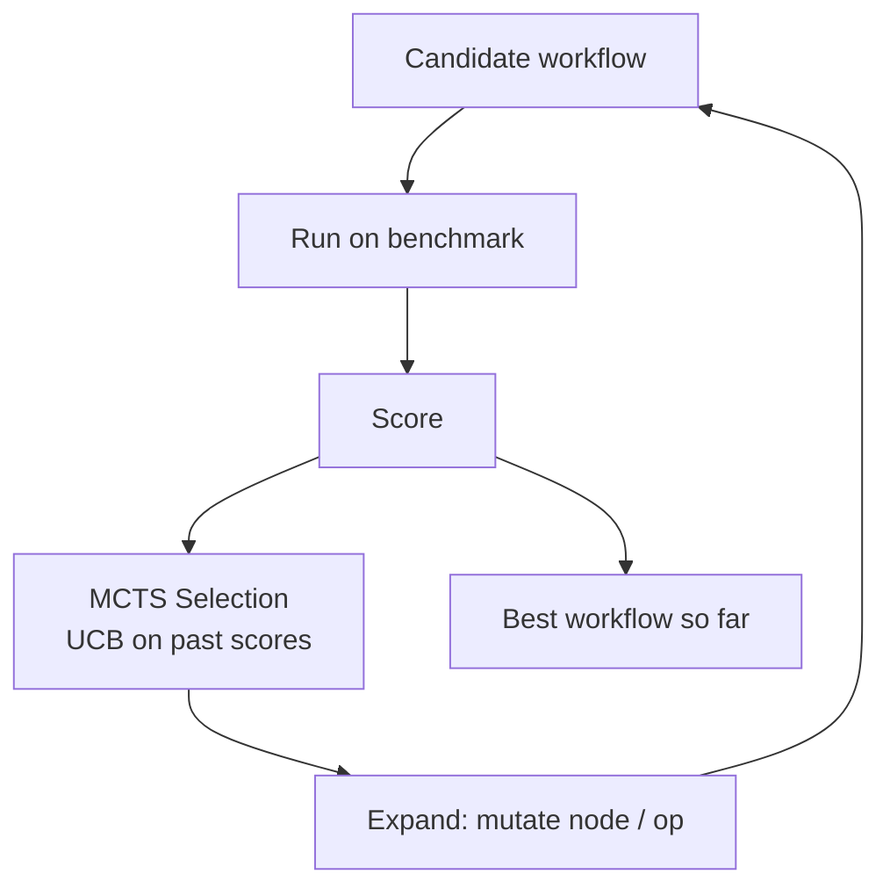

# Automatic Workflow Search

**Also known as:** AFlow, Workflow Synthesis, MCTS over Agent Graphs

**Category:** Routing & Composition  
**Status in practice:** experimental

## Intent

Treat the agent's workflow itself (a graph of LLM-invoking nodes connected by edges) as an artefact to search; use Monte Carlo Tree Search guided by an eval benchmark to discover the best workflow, then deploy it.

## Context

A team is building an agent for a repeatable task domain such as competitive coding, mathematical problem solving, or question answering, where each output can be scored automatically against a benchmark of known answers. They are choosing how to compose the agent out of named building blocks like a router, a planner, an ensembler, a reviewer, and a revise step, but no one on the team knows in advance which arrangement of these blocks will perform best on the target task.

## Problem

When the workflow shape is chosen by a human designer, the choice is biased toward whatever patterns the designer has seen before, and exploring even a handful of alternatives by hand is slow and expensive. Each candidate workflow has to be implemented, run end-to-end against the benchmark, and compared, so the search space the team actually covers is a tiny fraction of the realistic compositions. The result is workflows that work but are almost certainly not the best the model and tools could deliver.

## Forces

- There is a combinatorial space of workflows.
- Each workflow run costs money to evaluate.
- Search needs a signal (benchmark scores) plus an explore/exploit policy.
- Workflows have to be representable as code or as a graph for search to work.

## Therefore

Therefore: treat the workflow itself as a searchable artefact and let MCTS guided by benchmark scores explore its shape, so that the deployed composition is discovered by measurement rather than by designer hunch.

## Solution

Represent each candidate workflow as code or a graph of nodes (router, planner, ensemble, review, revise, executor). Use MCTS — selection by UCB-style scoring on past benchmark performance, expansion by code mutations or graph edits, simulation by running the workflow on the eval set, backpropagation of scores. After a search budget, deploy the best-scoring workflow. Use a library of operators (Ensemble, Review, Revise) to constrain the search space.

## Example scenario

A research lab has built six different agent workflows for a maths-olympiad benchmark — chain-of-thought, debate, planner-executor, and so on — and none consistently wins. Hand-tuning the next variant is slow and biased toward what the team already knows. They treat each workflow as a graph of LLM-invoking nodes and let an MCTS search explore variations, scoring each candidate against the benchmark. After a few thousand evaluations the search returns a workflow shape no one on the team had drafted, and it ships.

## Structure

```
Search: workflow_graph -> mutate -> run on eval set -> score -> MCTS update -> repeat -> best_workflow -> deploy.
```

## Diagram



## Consequences

**Benefits**

- Discovers non-obvious workflow compositions a human designer would not try.
- Cheaper smaller models reach larger-model performance on some benchmarks.
- The search artefact is a reusable, inspectable workflow.

**Liabilities**

- Eval set quality bounds discovered workflow quality.
- Compute-intensive: many workflow evaluations per search.
- Risk of overfitting to the eval set; held-out eval needed.

## What this pattern constrains

No workflow may be deployed that was not measured against the held-out eval set; ad-hoc human edits to a discovered workflow re-enter the search.

## Applicability

**Use when**

- You have a stable eval benchmark that can score full workflows end-to-end.
- Designer bias toward familiar patterns is leaving real workflow improvements on the table.
- Compute budget for many workflow trials is available and amortised across many future runs.

**Do not use when**

- No reliable eval exists to guide the search.
- Workflow domain is small enough to enumerate by hand more cheaply than running MCTS.
- The deployment target changes faster than search can converge on a stable workflow.

## Known uses

- **[AFlow (DeepWisdom + HKUST(GZ))](https://github.com/FoundationAgents/AFlow)** — *Available*. MCTS over code-represented workflows; outperforms hand-designed baselines by 5.7% average.

## Related patterns

- *uses* → [eval-harness](eval-harness.md)
- *complements* → [eval-as-contract](eval-as-contract.md)
- *complements* → [lats](lats.md) — LATS searches reasoning trees; AFlow searches workflow graphs.
- *alternative-to* → [spec-first-agent](spec-first-agent.md)
- *complements* → [best-of-n](best-of-n.md)

## References

- (paper) Zhang et al., *AFlow: Automating Agentic Workflow Generation*, 2024, <https://arxiv.org/abs/2410.10762>

**Tags:** workflow, search, china-origin, aflow, mcts
