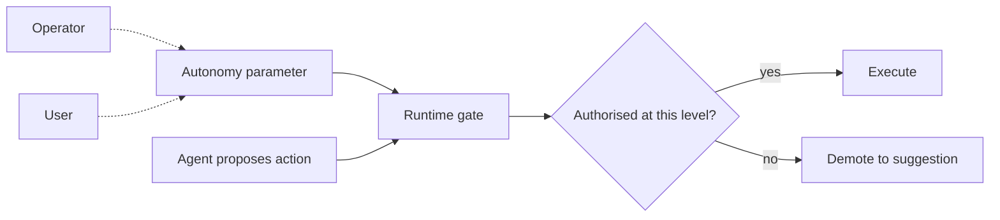

# Autonomy Slider

**Also known as:** Autonomy Dial, Continuous Autonomy Control

**Category:** Safety & Control  
**Status in practice:** emerging

## Intent

Expose agent autonomy as a continuous adjustable parameter so the same codebase can span scripted assistant to fully autonomous worker without re-architecting.

## Context

A product team owns one agent codebase but several deployment contexts: a free tier that should not act unsupervised, a paid tier where the user has opted into automation, an internal beta where engineers want full autonomy to stress-test. Hard-coding the autonomy level per build forks the codebase or branches the prompt.

## Problem

Binary 'workflow vs agent' framings collapse the design space to two points. Most real deployments want a position between — autonomous on some axes (information gathering), supervised on others (irreversible action). Without a control surface for autonomy, each new context forces an ad-hoc fork in code or in prompt, and the team loses the ability to dial the same agent across users, contexts, or risk profiles.

## Forces

- Different users and contexts justify different default autonomy.
- Autonomy is multidimensional — read vs write, internal vs external, reversible vs not.
- The control must be runtime-mutable so it can dial without redeploy.
- Operators need to inspect and audit the current setting.

## Applicability

**Use when**

- One agent codebase needs to serve materially different autonomy contexts.
- Operators need to dial autonomy down quickly without redeploy.
- Users should be able to opt into higher autonomy explicitly.

**Do not use when**

- The product has a single autonomy level for everyone forever.
- A discrete tier vocabulary (Crawl/Walk/Run) is what stakeholders ask for.
- Multidimensional autonomy cannot honestly compress to a single slider without misleading users.

## Therefore

Therefore: model autonomy as a runtime-mutable parameter that the agent and runtime consult on each action, so one codebase covers the full workflow-to-autonomous span by configuration rather than code.

## Solution

Define an autonomy parameter (scalar or vector) the runtime consults before each action. At one end the agent only emits suggestions a human acts on; at the other it acts directly and reports. Intermediate values gate by action type, confidence, or user opt-in. Persist the setting per-tenant or per-user. Surface the current value in the UI so users and operators see at a glance how autonomous the agent currently is.

## Example scenario

A coding-assistant product ships with an autonomy slider: at 0, the agent only suggests; at 1, it edits files; at 2, it runs tests; at 3, it commits and pushes. New users default to 1; power users opt into 3 per repository. A bug-bash mode drops the entire fleet to 1 within a release while the team investigates a regression.

## Diagram

## Consequences

**Benefits**

- One codebase serves many autonomy contexts.
- Per-tenant or per-user tuning without redeploy.
- Operators can dial autonomy down quickly in response to incidents.

**Liabilities**

- A continuous knob invites micro-tuning that has no clear meaning.
- Multidimensional autonomy is hard to render as a single slider; teams collapse to a slider that loses information.
- Users may not know what setting they are on if the UI hides it.

## What this pattern constrains

The agent must not act at an autonomy level the runtime parameter does not currently authorise; autonomy is decided by the parameter, not by the agent's own reasoning.

## Known uses

- **Building Applications with AI Agents (Albada, O'Reilly 2025) — Autonomy Slider UX pattern** — *Available* — <https://www.oreilly.com/library/view/building-applications-with/9781098176495/ch03.html>
- **Cursor / Claude Code agent-mode toggles** — *Available*

## Related patterns

- *alternative-to* → [crawl-walk-run-automation-gating](crawl-walk-run-automation-gating.md) — Three discrete tiers; this is the continuous version.
- *complements* → [cost-aware-action-delegation](cost-aware-action-delegation.md)
- *complements* → [progressive-delegation](progressive-delegation.md)
- *complements* → [approval-queue](approval-queue.md)
- *complements* → [human-in-the-loop](human-in-the-loop.md)
- *complements* → [kill-switch](kill-switch.md)

## References

- (book) *Building Applications with AI Agents*, Michael Albada, 2025, <https://www.oreilly.com/library/view/building-applications-with/9781098176495/>

**Tags:** safety, autonomy, ux
