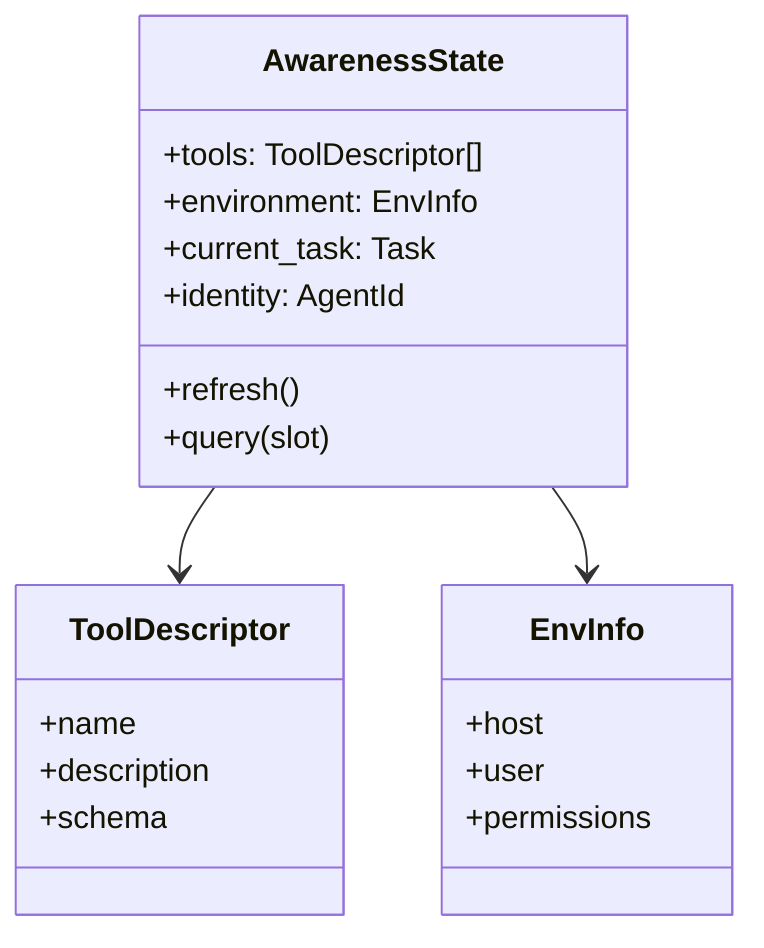

# Awareness

**Also known as:** Situational Awareness, Capability Self-Knowledge

**Category:** Cognition & Introspection
**Status in practice:** emerging

## Intent

Maintain the agent's explicit knowledge of its own tools, capabilities, environment, and current context as queryable state.

## Context

A team is building an agent that operates across multiple sessions and whose set of available tools, permissions, and roles changes at runtime. The agent needs to reason about what it can actually do right now — which tools are wired in, which are disabled, who the current user is, which permissions apply — rather than relying on whatever the original system prompt happened to mention. Without an explicit place where this information lives, capability is buried implicitly in prompt text and stale the moment anything changes.

## Problem

An agent that has no reliable picture of its own current capabilities fails in two predictable directions. It promises to invoke tools it does not actually have, fabricating plausible function calls that error out at dispatch. Or it forgets that it does have a particular tool and falls back on weaker workarounds when the right capability was available all along. Both failure modes are invisible to the model because nothing in its context tells it what is really wired up at this moment.

## Forces

- Awareness state grows with capability.
- Stale awareness misleads.
- Self-description is itself a prompt-engineering effort.

## Therefore

Therefore: keep the agent's tools, environment, task, and identity as queryable state injected into each turn, so that the agent reasons from what it actually has rather than from what it imagines.

## Solution

Persist explicit state about: available tools (with descriptions), the environment (what host, what user, what permissions), the current task, and the agent's own identity. Refresh on capability changes. Inject relevant slices of awareness into each turn's context.

## Example scenario

A field-service agent occasionally promises to 'check the parts inventory' even though that tool was disabled in the latest deploy, then apologises when the call fails. The root cause is that the agent has no reliable picture of what it actually has. The team adds an Awareness module that exposes tool names, descriptions, and current health as queryable state the agent reads each turn. Now when the inventory tool is offline, the agent sees that fact in its own context and offers an alternative instead of fabricating one.

## Diagram

## Consequences

**Benefits**

- Reduces hallucinated tool calls.
- Grounds the agent in its own context.

**Liabilities**

- Awareness state is a maintenance burden.
- Excess awareness wastes context tokens.

## What this pattern constrains

Tool calls and self-references must match the awareness state; mismatches are flagged.

## Applicability

**Use when**

- The agent regularly hallucinates tools it does not have or forgets tools it does.
- Tool palette, environment, or permissions change at runtime and the agent must reflect the current state.
- Downstream behaviour depends on the agent reasoning explicitly about what it can and cannot do.

**Do not use when**

- Tools and environment are static and the system prompt already lists them adequately.
- Awareness state would consume more tokens per turn than the failures it prevents.
- There is no refresh path on capability changes and stale awareness would mislead worse than absence.

## Known uses

- **Avramovic Awareness pattern** — *Available*

## Related patterns

- *complements* → [tool-use](tool-use.md)
- *specialises* → [model-card](model-card.md)
- *complements* → [tool-discovery](tool-discovery.md)
- *complements* → [preoccupation-tracking](preoccupation-tracking.md)
- *complements* → [emotional-state-persistence](emotional-state-persistence.md)
- *complements* → [world-model-separation](world-model-separation.md)

## References

- (repo) *zeljkoavramovic/agentic-design-patterns*, <https://github.com/zeljkoavramovic.github.io/agentic-design-patterns/>

**Tags:** awareness, state, self-model
