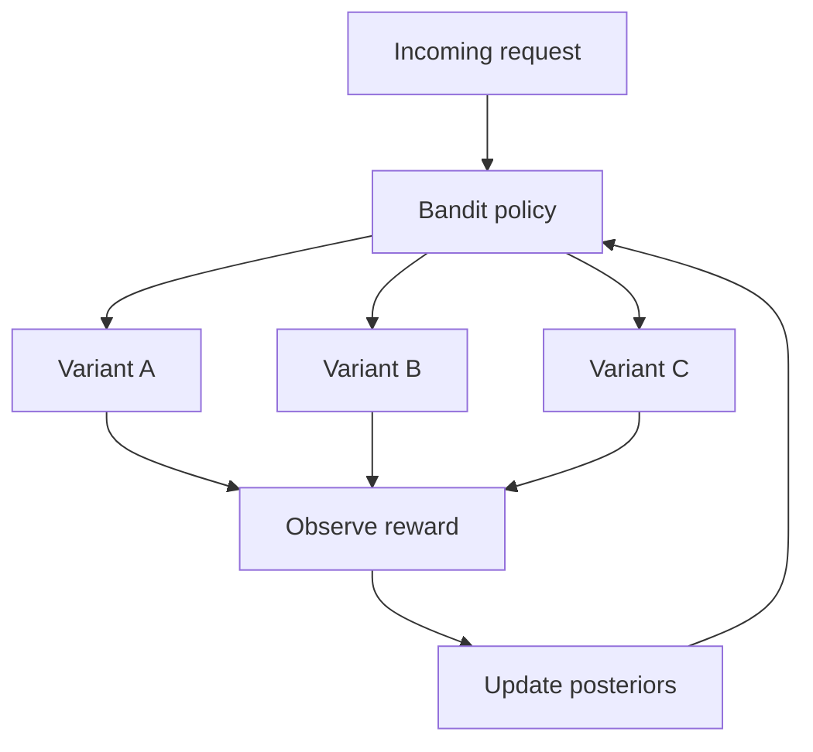

# Bayesian Bandit Experimentation

**Also known as:** Multi-Armed Bandit for Prompt Variants, Bandit-Based Agent Rollout

**Category:** Governance & Observability  
**Status in practice:** emerging

## Intent

Replace fixed-split A/B tests between agent variants with a bandit that dynamically reallocates traffic toward better-performing variants based on observed reward, bounding regret from bad variants.

## Context

An agent team has multiple variants in play: two prompt templates, three model choices, two retrieval strategies. They want to learn which performs best on production traffic without exposing many users to the worse variants for the full length of a classical A/B test.

## Problem

A fixed 50/50 (or N-way uniform) split between variants pays regret on every losing variant for the entire experiment window. With multiple simultaneous variants the regret compounds. Worse, the experiment cannot be stopped early without invalidating the statistics; teams keep losing variants live for weeks because the rollout calendar said so. A static split is wrong as a learning policy when the team genuinely cares about user outcomes during the experiment.

## Forces

- Some variants are clearly worse early; continuing uniform allocation pays regret.
- Some variants need many trials to reveal their advantage; aggressive exploitation kills them.
- Reward signals (task success, user satisfaction, cost) arrive with delay and noise.
- Operators need to be able to read off 'which variant is winning' at any point.

## Applicability

**Use when**

- Multiple variants are live and reward can be observed online with reasonable delay.
- User-outcome regret on losing variants is a real cost.
- Operators want a live posterior rather than a fixed test window.

**Do not use when**

- Reward is unobservable or arrives only after weeks; bandit cannot learn.
- Variants must be tested at equal sample size for regulatory or scientific reasons.
- Allocation cannot be dynamic — only one variant can be in production at a time.

## Therefore

Therefore: route traffic to variants by a bandit policy that updates from observed reward, so allocation shifts toward winners as evidence accumulates and regret on losers is bounded.

## Solution

Treat each variant as a bandit arm. After each request, record the variant chosen and (when it arrives) the reward (task success, satisfaction, cost). A Thompson sampler or upper-confidence-bound policy decides allocation for the next request. Run for a budget of requests or until posterior separation crosses a threshold; promote the winner. Surface posterior means and credible intervals in the experiment dashboard.

## Example scenario

A support-agent team has four candidate prompt templates and two candidate models. They run all eight (template × model) combinations as bandit arms with Thompson sampling over downstream user-rating reward. By day three two arms have collected enough credible evidence to promote; the bandit allocates >70% of traffic to them and continues exploring the rest at low rate.

## Diagram

## Consequences

**Benefits**

- Regret on losing variants is bounded; allocation tracks evidence.
- Many simultaneous variants can be experimented over without combinatorial regret.
- Operators see a live posterior rather than waiting for a fixed window to close.

**Liabilities**

- Variants the bandit prunes early can be the slow-burn winners; tune exploration carefully.
- Delayed reward complicates the update; naive bandits over-allocate to fast-response variants.
- Stat-stoppage at posterior-separation introduces optional-stopping bias if undisciplined.

## What this pattern constrains

Variant allocation must not be a fixed-fraction split when reward can be observed online; the policy must update from observed reward and shift allocation accordingly.

## Known uses

- **Building Applications with AI Agents (Albada) — Bayesian Bandits in improvement loops** — *Available* — <https://www.oreilly.com/library/view/building-applications-with/9781098176495/>
- **OpenAI Evals and major-lab prompt-eval pipelines using bandit-based variant selection** — *Available*

## Related patterns

- *alternative-to* → [shadow-canary](shadow-canary.md) — Shadow is parallel; bandit reallocates live traffic.
- *uses* → [eval-harness](eval-harness.md)
- *complements* → [evaluator-optimizer](evaluator-optimizer.md)
- *complements* → [evaluation-driven-development](evaluation-driven-development.md)
- *specialises* → [exploration-exploitation](exploration-exploitation.md)
- *composes-with* → [prompt-variant-evaluation](prompt-variant-evaluation.md)
- *alternative-to* → [trust-and-reputation-routing](trust-and-reputation-routing.md)

## References

- (book) *Building Applications with AI Agents*, Michael Albada, 2025, <https://www.oreilly.com/library/view/building-applications-with/9781098176495/>

**Tags:** experimentation, bandit, evaluation
