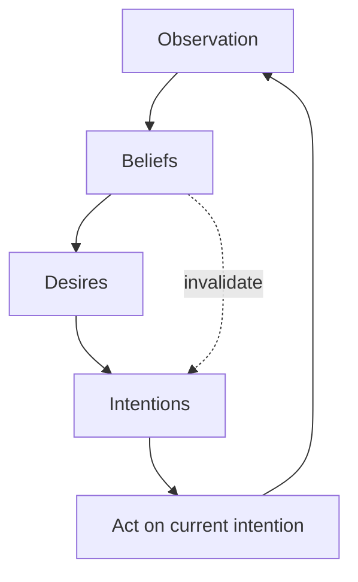

# BDI Agent

**Also known as:** Belief-Desire-Intention Agent, Rao-Georgeff Agent, PRS-Style Agent

**Category:** Cognition & Introspection  
**Status in practice:** mature

## Intent

Agent maintains explicit Beliefs about the world, Desires (goals), and Intentions (committed plans), and reasons by reconciling the three.

## Context

An LLM agent runs across many model calls, observes the world through tool outputs, has goals it accumulates and abandons, and commits to multi-step plans. By default all of this lives implicitly in the prompt context: the agent's beliefs, goals, and commitments are tangled in one prose blob the next prompt assembles.

## Problem

Implicit BDI is brittle. The agent loses track of which beliefs are current vs stale, which goals are still active vs satisfied, and which intentions it has committed to vs merely entertained. A new prompt can silently abandon a committed plan because the commitment was not represented as a typed thing. Without explicit BDI structures the agent has no vocabulary for 'I currently believe X, my goal is Y, and I am pursuing plan Z' that survives across prompts.

## Forces

- Beliefs change as observations arrive; staleness must be representable.
- Desires (goals) can be in conflict; the agent needs a rule for which to pursue.
- Intentions (committed plans) should not be silently abandoned.
- Updates to beliefs may invalidate intentions; the reconciliation step is non-trivial.

## Applicability

**Use when**

- Long-running agent across many prompts where commitments must persist.
- Goal conflicts and goal abandonment are common and need explicit treatment.
- Operators need a vocabulary for the agent's beliefs, goals, and plans.

**Do not use when**

- Short single-turn agent where BDI machinery is overkill.
- Goals and commitments are externally tracked (ticket system, workflow engine).
- Engineering capacity cannot keep typed stores in sync with the prompt.

## Therefore

Therefore: represent the agent's mental state as three typed stores — Beliefs, Desires, Intentions — and reconcile them on each tick, so commitments persist across prompts and the agent has explicit language for what it believes, wants, and is doing.

## Solution

Maintain three typed stores: Beliefs (propositions about the world with currency timestamps), Desires (active goals with priorities), Intentions (committed plans with status and rationale). On each tick the agent (a) updates Beliefs from new observations, (b) re-evaluates Desires given new Beliefs, (c) checks Intentions for continued viability (still consistent with Beliefs and aligned with Desires), and (d) commits new Intentions or abandons existing ones explicitly. Each transition writes a trace entry. Distinct from a plain scratchpad: BDI structures are typed.

## Example scenario

A long-running ops agent maintains Beliefs (current cluster state, last-known costs), Desires (keep p95 latency under 200ms, keep monthly cost under $X), and Intentions (currently scaling out replica set 3). When a new observation arrives showing replica set 3 already scaled, the agent reconciles: belief updates, Intention is satisfied and retired with rationale, Desires re-evaluated, new Intention possibly committed.

## Diagram

## Consequences

**Benefits**

- Commitments survive across prompts because Intentions are first-class.
- Stale beliefs become surfaceable rather than hidden in prose.
- Goal abandonment becomes an explicit move with a rationale.

**Liabilities**

- Three stores plus reconciliation is heavy machinery for simple agents.
- BDI gives no help with how to set priorities — the conflict-resolution rule still needs design.
- Typed stores can drift away from what the prompt actually shows the model.

## What this pattern constrains

The agent's mental state must not be entirely implicit in the prompt blob; Beliefs, Desires, and Intentions are typed stores that the agent reconciles on each tick.

## Known uses

- **Classical BDI architectures (PRS, JACK, Jason)** — *Available* — <https://en.wikipedia.org/wiki/Belief%E2%80%93desire%E2%80%93intention_software_model>
- **Multiagent Systems (Weiss, MIT Press) — BDI chapter** — *Available* — <https://mitpress.mit.edu/9780262731317/multiagent-systems/>
- **LLM-agent reimplementations exposing typed beliefs/goals/intentions** — *Available*

## Related patterns

- *complements* → [commitment-tracking](commitment-tracking.md)
- *complements* → [hypothesis-tracking](hypothesis-tracking.md)
- *complements* → [goal-decomposition](goal-decomposition.md)
- *complements* → [world-model-as-tool](world-model-as-tool.md)
- *alternative-to* → [scratchpad](scratchpad.md)
- *complements* → [plan-and-execute](plan-and-execute.md)
- *composes-with* → [joint-commitment-team](joint-commitment-team.md)

## References

- (book) *Multiagent Systems, 2nd ed.*, Gerhard Weiss (ed.), 2013, <https://mitpress.mit.edu/9780262731317/multiagent-systems/>
- (doc) *Belief-desire-intention software model*, <https://en.wikipedia.org/wiki/Belief%E2%80%93desire%E2%80%93intention_software_model>

**Tags:** cognition, bdi, architecture
