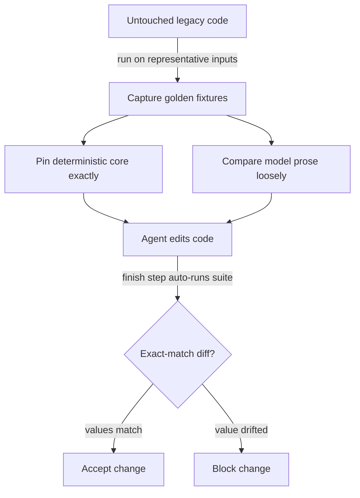

# Behavior-Pinning Test Before Agent Edit

**Also known as:** Characterization Test Before Refactor, Golden-Pin Regression Gate, Pin-Before-Edit

**Category:** Verification & Reflection  
**Status in practice:** emerging

## Intent

Capture the current behaviour of agent-touchable code as golden characterization tests before an agent edits it, with load-bearing values computed deterministically and only prose left to the model, run as a regression gate.

## Context

A coding or skill agent is about to refactor or extend a body of legacy code whose existing behaviour encodes business rules that nobody has written down. The rules live in the code itself: a pricing tier boundary, a rounding convention, an aggregation order. The agent reads the code, infers what it can, and rewrites it, but the inferred intent is not the same as the actual behaviour, and a clean refactor can quietly change a hidden invariant that no human notices until production.

## Problem

Letting an agent edit undocumented code is risky because there is no recorded statement of what the code currently does, so a refactor has nothing to be checked against. Hand-written tests after the fact tend to encode what the model thinks the code should do, not what it did, and a suite written by the same model that wrote the change inherits the model's blind spots. The team needs a baseline that fixes the existing behaviour exactly, separates the values that must not move from the explanations that may, and fails the moment an edit drifts.

## Forces

- The current behaviour is the only available specification, yet it is uncodified and an edit can silently overwrite it.
- A numeric result computed by a deterministic function is checkable to the digit, while a model-written explanation of that result is inherently variable.
- Tests authored after the edit risk codifying the edit's behaviour rather than the original; the baseline must be frozen before the agent touches anything.
- Pinning every observable detail is brittle and slows the team; pinning too little lets a load-bearing rule slip through unguarded.

## Therefore

Therefore: before the agent edits, record the existing outputs as golden characterization tests; assert the deterministic core exactly while comparing model-written prose loosely; and run the suite as a mandatory gate on every agent change.

## Solution

Run the legacy code against representative inputs and capture its outputs as golden fixtures while the code is still untouched, so the baseline reflects what the code does rather than what anyone believes it should do. Partition each captured output: the load-bearing values, such as totals, tier boundaries, and rounding, are produced by deterministic components and asserted for exact equality, while any model-written narration that explains or annotates the result is compared loosely or excluded from the gate. Wire the suite into the agent's loop so that finishing an edit triggers the characterization tests automatically, detected from policy keywords rather than left to the agent's discretion, and treat any exact-match failure as a blocked change. Once the refactor is proven behaviour-preserving, the golden values may be updated deliberately by a human when a rule is meant to change.

## Structure

```
Untouched legacy code --run on representative inputs--> Golden fixtures (deterministic core pinned exactly + prose compared loosely) --gate--> Agent edit --auto-run on finish--> exact-match diff blocks the change
```

## Diagram



*Behaviour is pinned before the edit; the agent's finish step auto-runs the suite, and any drift in a deterministic value blocks the change.*

## Example scenario

A team asks a coding agent to refactor a tangled invoice module that nobody fully understands. Before the agent starts, they run the module on a hundred saved invoices and freeze the resulting totals and tax figures as golden tests. The agent rewrites the module; on finish, the tests run automatically. One invoice now totals a cent less because the agent reordered a rounding step, so the gate fails and the change is rejected before it ever reaches production.

## Consequences

**Benefits**

- A silent change to an undocumented business rule shows up as a failing exact-match assertion instead of a production incident.
- Separating the deterministic core from model-written prose keeps the gate stable: it fails on a wrong number, not on reworded narration.
- The pinned suite doubles as the missing specification, recording what the legacy code actually did at the moment of the edit.

**Liabilities**

- Characterization tests freeze current behaviour including its bugs, so a genuine fix trips the gate and the golden values must be updated by hand.
- Capturing fixtures for code with external dependencies or non-determinism needs seams and stubs before the behaviour can be pinned.
- Over-pinning incidental output makes the suite brittle and noisy, eroding trust in the gate.

## Failure modes

- Pinning after the edit — the baseline records the changed behaviour, so the gate can never catch the drift it was meant to catch.
- Asserting prose exactly — a reworded model explanation fails the gate even though every load-bearing value is unchanged.
- Sparse coverage — the captured inputs miss the branch that holds the hidden rule, so the rule changes without any test noticing.

## What this pattern constrains

An agent edit cannot be accepted until the pre-edit characterization suite passes; the deterministic load-bearing values must match the pinned baseline exactly, and changing a golden value requires a deliberate human update rather than a model rewrite.

## Applicability

**Use when**

- An agent is about to edit legacy code whose behaviour is undocumented but encodes real business rules.
- Outputs contain load-bearing numeric or structured values that a deterministic component can compute and assert exactly.
- The change is meant to preserve behaviour (a refactor or extension), so the existing outputs are the correct baseline.

**Do not use when**

- The task is greenfield code with no existing behaviour to capture.
- The change is deliberately meant to alter the rules, so freezing the current outputs would only fight the intended change.
- Outputs are inherently non-deterministic and cannot be made repeatable even with seams or stubs, leaving nothing to pin exactly.

## Components

- Fixture capturer — runs the untouched legacy code on representative inputs and records its outputs as golden fixtures
- Deterministic core — the functions that compute load-bearing values (totals, boundaries, rounding) which are asserted for exact equality
- Prose comparator — compares model-written narration loosely or excludes it from the gate so wording changes do not fail the suite
- Regression gate — the mandatory check that runs the characterization suite on every agent edit and blocks on any exact-match failure
- Finish-step trigger — policy-keyword detection on the agent's completion step that forces the suite to run rather than leaving it to the agent

## Tools

- Test runner (for example Jest or pytest) — executes the characterization suite and reports exact-match diffs
- Snapshot/golden-fixture store — holds the pinned outputs captured before the edit
- Agent harness keyword hook — detects the completion step and forces the regression gate to run

## Evaluation metrics

- Silent-behaviour-change catch rate — fraction of value-altering edits caught by the gate before merge
- False-fail rate from prose — gate failures caused by reworded narration rather than a changed value, which should trend to zero
- Pinned-branch coverage — share of behaviour-bearing branches exercised by the captured fixtures
- Baseline-update frequency — how often golden values are deliberately changed by a human, signalling intended rule changes versus accidental drift

## Known uses

- **[Yeogi Eottae (GC Company) AI coding-agent harness](https://techblog.gccompany.co.kr/ai-%EC%BD%94%EB%94%A9-%EC%97%90%EC%9D%B4%EC%A0%84%ED%8A%B8%EC%97%90%EA%B2%8C-%EC%82%AC%EA%B3%A0-%EA%B3%BC%EC%A0%95%EC%9D%84-%EC%84%A4%EA%B3%84%ED%95%98%EB%8B%A4-9c7325e4655d)** _available_ — Engineering blog describes capturing existing behaviour as Jest tests before the agent edits, then auto-detecting policy keywords on a /done step to force the tests to run as a gate.
- **[CloudBro AI-assisted refactoring guidance](https://cloudbro.ai)** _available_ — Korean practitioner write-up advocating pinning legacy behaviour with characterization tests before letting an assistant refactor.

## Related patterns

- _complements_ **Silent Hypotheses in Generated Code** — That anti-pattern is the disease — a hidden premise ships unguarded; pinning the existing behaviour as exact golden tests before the edit is the cure side, catching the silent mutation at the gate.
- _complements_ **Eval as Contract** — Eval-as-contract treats the suite as the release gate going forward; this pattern seeds that contract with a behaviour-preserving baseline frozen before the agent touches the code.
- _alternative-to_ **Eval Harness** — An eval harness scores held-out quality against expected outputs to track improvement; this pattern instead freezes the code's own current outputs as the must-match baseline before an edit, with no notion of better, only unchanged.
- _complements_ **Deterministic-LLM Sandwich** — The sandwich brackets each runtime call with deterministic checks; here the same deterministic-versus-model partition is applied at authoring time so pinned values are exact and model prose is compared loosely.

## References

- [Working Effectively with Legacy Code](https://www.oreilly.com/library/view/working-effectively-with/0131177052/) — Michael C. Feathers, 2004
- [Characterization Tests](https://michaelfeathers.silvrback.com/characterization-testing) — Michael C. Feathers, 2011
