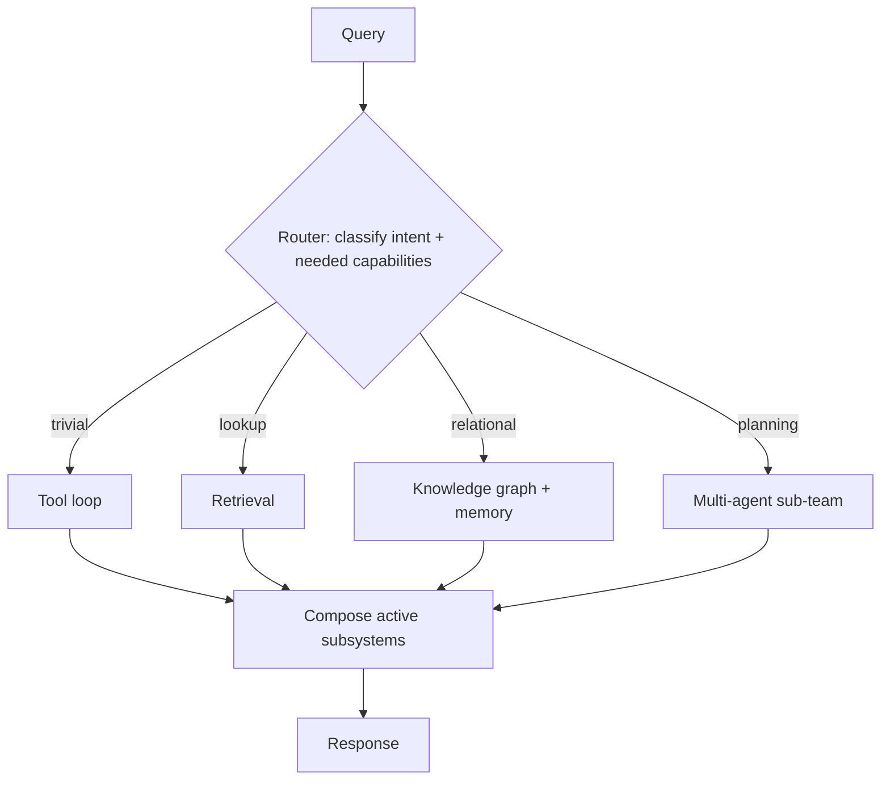

# Behavior-Space Architecture

**Also known as:** Behaviour-Space Architecture, Query-Selected Subsystem Routing

**Category:** Routing & Composition  
**Status in practice:** emerging

## Intent

Treat a deployed agent as a space of behaviors over a pool of subsystems and let a router pick, per query, the minimal disjoint subset that query needs, so the effective architecture emerges per query.

## Context

A team assembles an agent from several heavyweight subsystems: a plain tool loop, a retrieval-augmented pipeline, a knowledge graph, a multi-agent sub-team, a cache, and tiered memory. Most production traffic is mixed: a greeting needs none of them, a lookup needs only retrieval, an audit query needs the graph and memory, and a planning request needs the sub-team. Wiring every query through the full stack is the default, and it is the source of latency, cost, and brittleness.

## Problem

A single fixed pipeline forces every request through every subsystem it bundles, which pays for retrieval, graph traversal, and multi-agent fan-out even when a query needs none of them. Each extra layer is a feature and a failure surface at once, so a maximal architecture maximises both spend and the ways a simple query can break. The system needs a way to spend only the subsystems a given query actually requires.

## Forces

- A richer subsystem pool answers more query types, but invoking the whole pool per query multiplies latency, cost, and the number of components that can fail.
- The most-tuned subsystem is rarely the most-invoked one, so optimisation effort and routing decisions are usually misaligned.
- A deterministic per-query selector is inspectable and testable, but it must be kept correct as subsystems are added or retired or it routes to the wrong subset.

## Therefore

Therefore: design a deterministic router that maps each query to the minimal disjoint subset of subsystems it needs, treat the deliverable as that space of behaviors rather than one wired pipeline, and add a subsystem only once a query class actually routes through it.

## Solution

Model the agent as a pool of independent subsystems and a router rather than a wired graph of layers. For each incoming query the router classifies intent and required capabilities, then activates the minimal subset of subsystems that query needs and bypasses the rest; a trivial query may activate the bare loop alone, a complex one a retrieval-plus-graph-plus-memory subset. The subsets are disjoint and non-nested across query classes, so the architecture that actually runs is a property that emerges query by query instead of a shape chosen once at build time. Design effort concentrates on the routing heuristics and their evaluation, and a new subsystem is built only when a query class is shown to route through it, so the pool grows on demand rather than upfront.

## Structure

```
Query --> Router (classify intent + capabilities) --> activate minimal disjoint subset {loop | RAG | knowledge-graph | multi-agent | cache | memory} --> compose active subsystems --> Response
```

## Diagram



*The router activates the minimal disjoint subset of subsystems per query; the effective architecture emerges query by query.*

## Example scenario

An enterprise support agent fronts a tool loop, a vector retriever, a knowledge graph of entitlements, and a planning sub-team. A user typing 'thanks' activates the bare loop and nothing else. 'What's my plan limit?' activates retrieval alone. 'Was my account ever over its quota, and what changed?' activates the graph plus memory. 'Draft a migration plan for my workspace' activates the planning sub-team. No query ever runs the full stack, and a new subsystem is added only when a recurring query class needs one.

## Consequences

**Benefits**

- A simple query pays only for the subsystems it activates, so common cheap traffic stops subsidising the cost and latency of rarely-needed heavy layers.
- Each query class exercises a small, named subset, which shrinks the failure surface and makes a failed query trace back to one active subsystem.
- The subsystem pool grows only when a query class demands it, so unused layers are never built or maintained.

**Liabilities**

- Routing quality becomes the dominant determinant of system quality, so a mis-tuned router degrades every query class at once.
- Maintaining correct disjoint subsets as subsystems are added or retired is ongoing work, and a stale mapping silently routes to the wrong subset.
- A heterogeneous pool of subsystems is harder to observe and reason about end to end than a single fixed pipeline.

## Failure modes

- Over-activation — the router defaults to a maximal subset, restoring the full-pipeline cost the pattern exists to avoid.
- Under-activation — the router omits a subsystem a query needed, returning a confidently wrong or incomplete answer.
- Layer worship — effort is poured into the most visible subsystem while the router that decides when it runs is left unimproved.

## What this pattern constrains

A subsystem runs for a query only when the router selects it; no subsystem may self-activate or be invoked outside the router's per-query decision, and a layer must not be added to the pool before a query class routes through it.

## Applicability

**Use when**

- Production traffic is mixed, so different query classes need genuinely different and largely disjoint capabilities.
- Heavyweight subsystems (retrieval, knowledge graph, multi-agent) are expensive or slow enough that running them on every query is wasteful.
- Routing decisions can be made deterministic, inspectable, and evaluated against labelled query classes.

**Do not use when**

- Almost every query needs the same subsystems, so a single fixed pipeline is simpler and the router adds only overhead.
- Query intent cannot be classified reliably enough to pick the right subset, so misrouting would dominate the savings.
- The subsystem pool is small and cheap, so activating all of it costs less than building and maintaining the router.

## Components

- Subsystem pool — the independent capabilities the agent can draw on (tool loop, retrieval, knowledge graph, multi-agent sub-team, cache, tiered memory)
- Router — classifies each query's intent and required capabilities and selects the minimal disjoint subset of subsystems to activate
- Capability map — the maintained mapping from query class to the subset of subsystems it requires
- Composer — wires the activated subsystems for the current query and assembles their outputs into one response
- Router evaluation harness — scores routing decisions against labelled query classes so the selector stays correct as the pool changes

## Tools

- Intent classifier — labels each query so the router can pick a subset
- Retrieval pipeline — the activatable RAG subsystem in the pool
- Knowledge graph store — the activatable relational subsystem in the pool
- Multi-agent runtime — the activatable planning or decomposition subsystem in the pool
- Tracing and cost accounting — records which subsets ran so routing can be measured and tuned

## Evaluation metrics

- Mean active-subset size per query — how much of the pool a typical query avoids
- Routing accuracy — fraction of queries activating exactly the subset their query class needs (under- and over-activation rates)
- Cost and latency per query vs a full-pipeline baseline — the spend the routing reclaims
- Failure localisation rate — fraction of failed queries traced to a single active subsystem

## Known uses

- **[Tom's Hardware production-agent analysis](https://www.tomshw.it/business/agente-ai-non-ha-forma-percorsi-sp)** _available_ — Field account of enterprise agents built as a router over a pool of subsystems (plain loop, RAG, knowledge graph, multi-agent, cache, memory), where the effective agent emerges query by query and design effort moves to the router.

## Related patterns

- _complements_ **Complexity-Based Routing** — Complexity routing binds a query to a model tier by difficulty; behavior-space routing binds it to a subset of architectural subsystems. They stack: difficulty picks the model, capability need picks the subsystems.
- _alternative-to_ **Dynamic Topology Routing** — Topology routing rewires links between agents inside an all-multi-agent system; behavior-space routing selects which kinds of subsystem participate at all, and may activate zero agents.
- _complements_ **Modular RAG** — Modular RAG rearranges modules inside the retrieval subsystem; behavior-space routing decides whether the retrieval subsystem is on the path for a query in the first place.
- _alternative-to_ **Orchestrator-Workers** — Orchestrator-workers decomposes a task within one fixed architecture; behavior-space routing decides which architectures exist for a query before any decomposition.

## References

- [L'agente AI non ha una forma: ha dei percorsi](https://www.tomshw.it/business/agente-ai-non-ha-forma-percorsi-sp) — 2026
- [Adaptive-RAG: Learning to Adapt Retrieval-Augmented Large Language Models through Question Complexity](https://arxiv.org/abs/2403.14403) — Soyeong Jeong, Jinheon Baek, Sukmin Cho, Sung Ju Hwang, Jong C. Park, 2024
- [Doing More with Less: A Survey on Routing Strategies for Resource Optimisation in Large Language Model-Based Systems](https://arxiv.org/abs/2502.00409) — 2025
