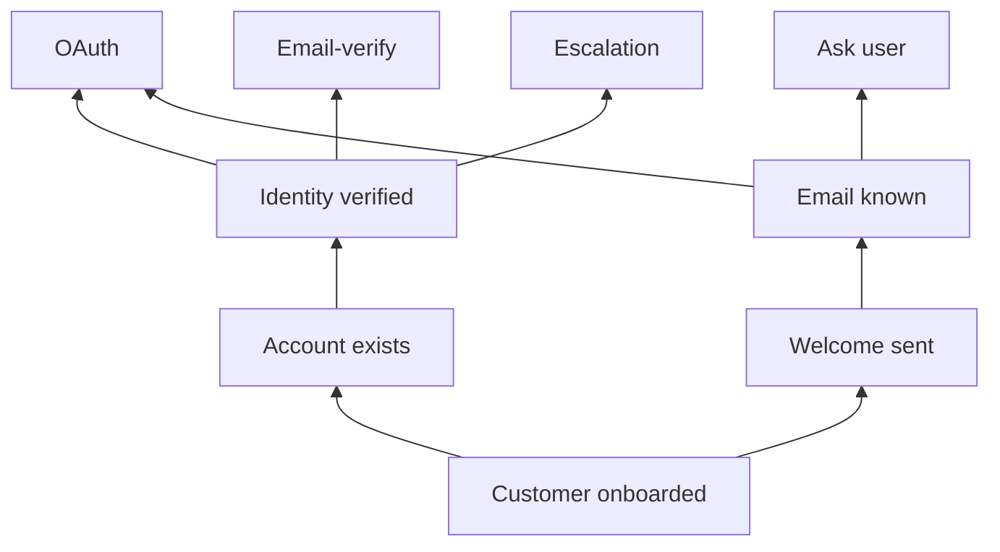

# Behavior Tree Back Chaining

**Also known as:** Goal-Driven BT Construction, Postcondition-Driven Tree

**Category:** Planning & Control Flow  
**Status in practice:** experimental

## Intent

Construct an agent's behavior tree starting from the desired goal condition and recursively adding child nodes whose post-conditions satisfy each parent's pre-conditions.

## Context

A team is authoring a [[agentic-behavior-tree]] for a complex task. Authoring it forward — guess at the root, then the children, then leaves — leads to trees that look plausible but do not actually achieve the goal because pre-conditions of interior nodes are not satisfied by the children chosen.

## Problem

Forward authoring confuses the question 'what tasks belong in this sub-tree' with 'do those tasks produce the conditions the parent needs'. Designers end up with trees that demo well on the happy path but fail when sub-task pre-conditions are not met. Without a construction discipline that asks 'what post-condition must hold for the parent to succeed, and what tasks produce it', trees grow as decorative tracings of the designer's intuition rather than principled goal-driven structures.

## Forces

- Goal post-conditions are usually the most stable artifact in the task spec.
- Each node has a pre-condition (what must hold for it to run) and a post-condition (what it produces).
- Children must satisfy the parent's pre-condition; this constraint should drive authoring.
- Mechanical back-chaining produces broad shallow trees; manual pruning is needed.

## Applicability

**Use when**

- Authoring a behavior tree for a task with expressible pre/post-conditions.
- Forward-authored trees have been failing because pre-conditions were missed.
- The team values construction discipline over speed of first draft.

**Do not use when**

- Pre/post-conditions cannot be expressed cleanly for the task domain.
- Tree is small enough that forward intuition is fine.
- Mechanical back-chaining produces an unmanageably wide tree the team cannot prune.

## Therefore

Therefore: start at the desired goal condition and recursively add child nodes whose post-conditions satisfy each parent's pre-conditions, so the tree is constructed by what's required rather than by what's intuitive.

## Solution

Author the tree from the root downward by asking, for each new node, 'what pre-conditions must hold for this to succeed, and what tasks produce those pre-conditions?'. Each task added becomes a child whose own pre-conditions trigger another round. Recurse until pre-conditions are satisfied by the starting state. Mechanical back-chaining yields broad trees; designers prune to the cases the agent will realistically encounter. The discipline ensures every node's children are there because they produce something the parent needs.

## Example scenario

Goal: customer is onboarded. Pre-condition: account exists and welcome sent. Producers: account-setup task (needs identity verified) and welcome-send task (needs email known). Back-chain identity verified → OAuth or email-verify or escalation. Back-chain email known → OAuth, OAuth response, or ask-user. The resulting tree's leaves are exactly the starting-state-satisfiable tasks; everything in between was added because something above needed it.

## Diagram

## Consequences

**Benefits**

- Trees that demonstrably achieve the goal because pre-conditions are satisfied by construction.
- Surfaces missing tasks: a pre-condition with no producer is an obvious gap.
- Trees evolve cleanly: new edge cases add a producer for a missing pre-condition.

**Liabilities**

- Pre-conditions and post-conditions must be expressible — many real tasks have fuzzy conditions.
- Mechanical back-chaining produces wide trees that need pruning judgment.
- Authoring discipline costs up-front time vs intuition-driven sketching.

## What this pattern constrains

The behavior tree must not be authored only forward by intuition; every interior node's children must be present because their post-conditions satisfy the parent's pre-conditions.

## Known uses

- **AI Agents in Action (Lanham) — Building ABTs with back chaining (Chapter 6.5)** — *Available* — <https://livebook.manning.com/book/ai-agents-in-action/chapter-6>
- **Robotics/game-AI BT design literature** — *Available*

## Related patterns

- *complements* → [agentic-behavior-tree](agentic-behavior-tree.md)
- *alternative-to* → [plan-and-execute](plan-and-execute.md)
- *complements* → [goal-decomposition](goal-decomposition.md)
- *complements* → [hierarchical-agents](hierarchical-agents.md)

## References

- (book) *AI Agents in Action*, Micheal Lanham, 2025, <https://www.manning.com/books/ai-agents-in-action>

**Tags:** planning, behavior-tree, construction
