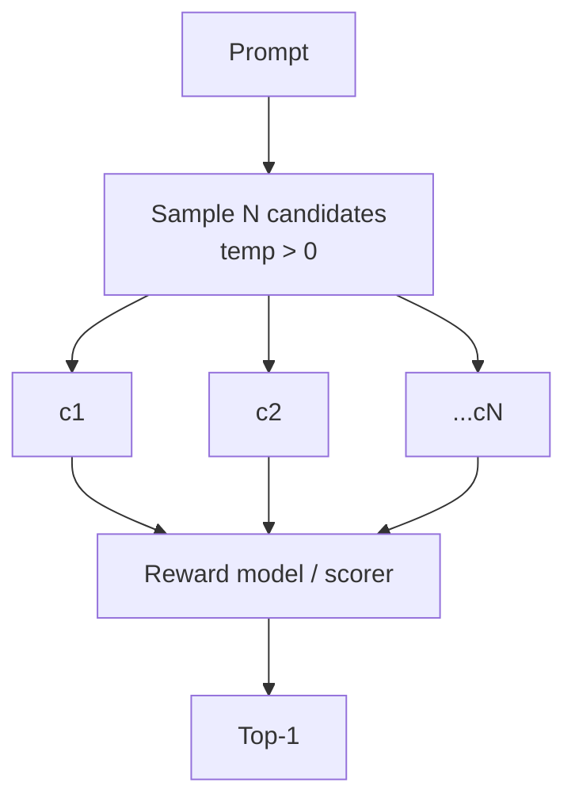

# Best-of-N Sampling

**Also known as:** BoN, Reranking, BoNBoN Alignment

**Category:** Verification & Reflection  
**Status in practice:** emerging

## Intent

Sample N candidate outputs and select the highest-ranked by a reward model or scorer.

## Context

A team runs a large language model on a task where the quality of any single output varies noticeably from sample to sample, such as a code-review summary, a translation, or a customer reply. They have a way to rank candidate outputs against each other, either a trained reward model that scores responses or a rule-based scorer that approximates one. Inference cost is high enough to matter but not so high that running the model a few extra times for the same prompt is prohibitive.

## Problem

A single sample drawn from the model at low temperature is often acceptable but rarely the best the model can produce, and on any given prompt the team has no way to tell whether they got a good draw or a mediocre one. Increasing temperature on a single sample raises variance without raising the floor: sometimes the result is better and sometimes worse, and the team ships whichever one happens to come out. Without a selection step that compares several candidates, the model's own decoding choice is the only filter on quality.

## Forces

- N candidates cost N inferences.
- Reward-model quality bounds achievable improvement.
- Diversity across candidates is needed; identical samples defeat the pattern.

## Therefore

Therefore: draw N diverse samples in parallel and let a separate scorer pick the winner, so that selection pressure rather than a single greedy decode determines what ships.

## Solution

Generate N candidates with non-zero temperature. Score each with a reward model or rule-based scorer. Return the top-1 (or top-K). BoNBoN alignment fine-tunes a model to mimic the BoN distribution directly, eliminating per-inference sampling cost.

## Example scenario

A code-review assistant generates a one-paragraph summary for each pull request, and roughly one in five reads awkwardly. The team enables Best-of-N: for each PR, the model samples five candidate summaries with temperature 0.7, and a small reward model trained on past human-edited summaries picks the highest-rated one to display. Token cost goes up about five times for that step, but the rate of summaries that reviewers feel compelled to rewrite drops sharply.

## Diagram

## Consequences

**Benefits**

- Quality lift without retraining the base model.
- Trade-off knob: increase N for more quality, fewer for less cost.

**Liabilities**

- Cost scales with N.
- Reward hacking: candidates can game a flawed scorer.

## What this pattern constrains

The chosen output must be from the candidate set; no synthesis across candidates.

## Applicability

**Use when**

- A scorer or reward model exists that ranks candidates better than the generator picks them.
- Quality lift from selecting the best of N samples justifies the N-fold inference cost.
- Sampling temperature can be raised enough to produce meaningfully diverse candidates.

**Do not use when**

- No reliable scorer is available to pick among candidates.
- Inference cost or latency cannot absorb a multiplicative sampling factor.
- Candidates collapse to near-duplicates regardless of temperature, so the best-of-N gain is illusory.

## Known uses

- **RLHF training pipelines** — *Available*
- **[Sparrot](https://marco-nissen.com/sparrot/)** — *Available* — The eval path samples N candidates for selected tasks, scores them via internal reward models, and returns the best — distinct from running the whole loop N times.

## Related patterns

- *alternative-to* → [self-consistency](self-consistency.md)
- *alternative-to* → [evaluator-optimizer](evaluator-optimizer.md)
- *specialises* → [parallelization](parallelization.md)
- *specialises* → [test-time-compute-scaling](test-time-compute-scaling.md)
- *used-by* → [process-reward-model](process-reward-model.md)
- *used-by* → [rest-em](rest-em.md)
- *complements* → [automatic-workflow-search](automatic-workflow-search.md)

## References

- (paper) Gui, Gârbacea, Veitch, *BoNBoN Alignment for Large Language Models and the Sweetness of Best-of-n Sampling*, 2024, <https://arxiv.org/abs/2406.00832>

**Tags:** sampling, reward, alignment
